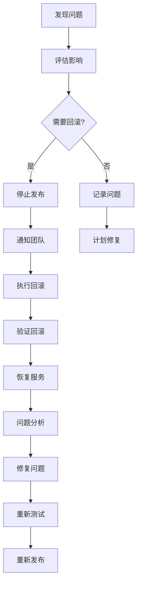
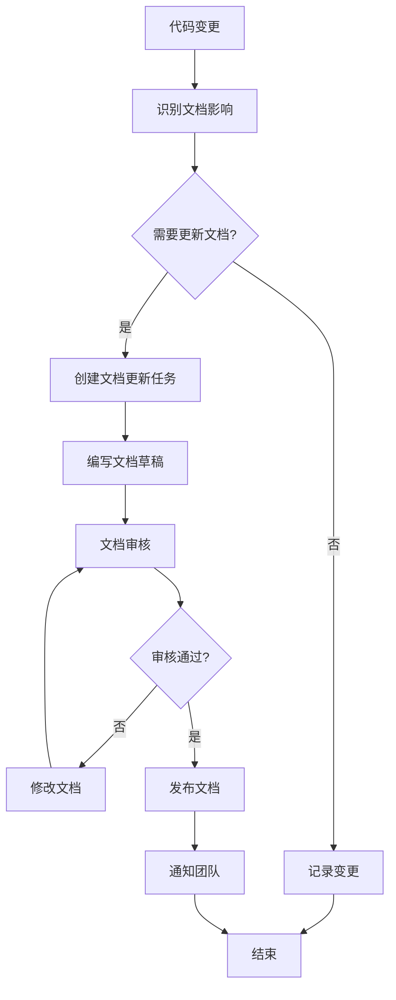

# Event2Table 组件库现代化设计文档

**版本**: 1.0  
**日期**: 2026-03-20  
**状态**: 待审核  
**作者**: Aone Copilot  

---

## 执行摘要

本文档定义了Event2Table项目组件库的全面现代化方案，旨在通过渐进式重构和自动化迁移，将现有分散的组件实现统一为现代化、高性能、可维护的组件库系统。

**核心目标**：
- 消除76%的代码重复
- 统一组件API和行为
- 提升性能30-50%
- 降低维护成本60%

**总周期**：8周（6周开发 + 2周替换迁移）

---

## 目录

1. [背景与动机](#1-背景与动机)
2. [现状分析](#2-现状分析)
3. [设计目标](#3-设计目标)
4. [架构设计](#4-架构设计)
5. [详细设计](#5-详细设计)
6. [实施计划](#6-实施计划)
7. [迁移策略](#7-迁移策略)
8. [性能优化](#8-性能优化)
9. [测试策略](#9-测试策略)
10. [风险管理](#10-风险管理)
11. [预期收益](#11-预期收益)
12. [依赖管理](#12-依赖管理)
13. [成功标准](#13-成功标准)
14. [资源需求](#14-资源需求)
15. [向后兼容性](#15-向后兼容性)
16. [回滚测试方案](#16-回滚测试方案)
17. [监控指标](#17-监控指标)
18. [文档更新策略](#18-文档更新策略)
19. [附录](#19-附录)

---

## 1. 背景与动机

### 1.1 业务背景

Event2Table是一个HQL生成辅助工具，随着业务发展，前端代码库已经积累了大量重复的组件实现：

- **Modal组件**：10个不同的Modal实现，代码重复度76%
- **表单组件**：7个主要表单组件，验证逻辑重复
- **Table组件**：3种不同的Table实现方式，功能不统一

### 1.2 问题陈述

当前组件库存在以下核心问题：

1. **代码重复严重**
   - Modal组件：每个Modal都重复实现表单验证、状态管理、关闭逻辑
   - 表单组件：验证逻辑、提交处理、错误处理重复实现
   - Table组件：排序、筛选、分页逻辑分散在多个页面

2. **功能不完整**
   - Modal：缺少拖拽、缩放、全屏等现代化功能
   - 表单：缺少配置驱动、字段联动等高级特性
   - Table：缺少分页、筛选、列配置等核心功能

3. **性能优化不足**
   - 缺少统一的性能优化策略
   - 部分组件未使用React.memo
   - 大数据量场景性能瓶颈明显

4. **维护成本高**
   - Bug修复需要在多处同步
   - 新功能开发需要重复实现
   - 文档分散，新人上手困难

### 1.3 解决方案概览

采用**渐进式现代化方案**，分6个阶段实施：

1. **阶段1-2**：基础建设和功能增强（4周）
2. **阶段3**：性能优化（1周）
3. **阶段4**：文档和示例（1周）
4. **阶段5-6**：自动替换和迁移（2周）

每阶段3个并行任务，共12个核心组件/功能。

---

## 2. 现状分析

### 2.1 Modal组件分析

#### 2.1.1 组件清单

| 组件名称 | 文件路径 | 类型 | 复杂度 | 代码行数 |
|---------|---------|------|--------|---------|
| BaseModal | `frontend/src/shared/ui/BaseModal/` | 基础组件 | 高 | 500+ |
| ConfirmDialog | `frontend/src/shared/ui/BaseModal/` | 确认对话框 | 中 | 150 |
| AddGameModal | `frontend/src/features/games/` | 表单弹窗 | 中 | 300 |
| GameManagementModal | `frontend/src/features/games/` | 主从视图 | 高 | 800+ |
| CategoryModal | `frontend/src/analytics/components/` | 表单弹窗 | 中 | 250 |
| CategoryManagementModal | `frontend/src/analytics/components/` | 主从视图 | 高 | 700+ |
| CommonParamsModal | `frontend/src/analytics/components/` | 数据列表 | 中 | 400 |
| BindToLibraryModal | `frontend/src/shared/components/` | 选择弹窗 | 中 | 200 |
| DeleteConfirmModal | `frontend/src/shared/components/` | 确认对话框 | 低 | 100 |
| FieldSelectionModal | `frontend/src/event-builder/components/` | 选择弹窗 | 中 | 180 |

**总计**：10个Modal组件，约3600行代码

#### 2.1.2 功能模式分类

**模式1：表单弹窗（40%）**
- 特征：包含表单输入、验证、提交逻辑
- 示例：AddGameModal, CategoryModal, BindToLibraryModal
- 重复代码：表单状态管理、验证逻辑、提交处理

**模式2：主从视图（20%）**
- 特征：左侧列表 + 右侧详情/编辑
- 示例：GameManagementModal, CategoryManagementModal
- 重复代码：选择状态管理、CRUD操作、数据获取

**模式3：确认对话框（20%）**
- 特征：简单的确认/取消操作
- 示例：ConfirmDialog, DeleteConfirmModal
- 重复代码：确认逻辑、按钮配置

**模式4：数据展示（20%）**
- 特征：展示数据列表、表格、统计信息
- 示例：CommonParamsModal, FieldSelectionModal
- 重复代码：数据获取、搜索过滤、分页

#### 2.1.3 已实现功能

✅ **键盘交互**
- ESC键关闭（通过`useEscHandler`实现）
- 焦点陷阱（Tab键限制在Modal内循环）
- 焦点管理（打开时自动聚焦，关闭时恢复焦点）

✅ **动画效果**
- 3种动画类型：slideUp、fadeIn、none
- CSS transform实现，性能优秀

✅ **尺寸控制**
- 5种预设尺寸：sm(400px)、md(540px)、lg(720px)、xl(960px)、full(全屏)

✅ **样式变体**
- 3种变体：default、danger、warning

✅ **毛玻璃效果**
- backdrop-filter blur实现

✅ **关闭前确认**
- onBeforeClose回调支持

✅ **背景点击关闭**
- closeOnBackdropClick配置

#### 2.1.4 缺失功能

❌ **拖拽功能**
- 需求场景：大型Modal需要调整位置，避免遮挡重要内容
- 推荐实现：react-draggable集成

❌ **动态缩放**
- 需求场景：用户自定义Modal大小，响应式调整
- 推荐实现：resizable属性 + 拖拽手柄

❌ **多层Modal堆叠**
- 当前状态：已有部分实现（GameManagementModal嵌套AddGameModal）
- 问题：缺乏统一的z-index管理，没有明确的层级控制API
- 推荐实现：level属性 + z-index自动管理

❌ **全屏模式**
- 需求场景：数据预览Modal需要更大空间，复杂配置需要全屏操作
- 推荐实现：fullScreen属性 + allowFullscreenToggle

❌ **快捷键支持**
- 当前仅支持ESC
- 推荐扩展：Ctrl+S保存、Ctrl+Esc取消

#### 2.1.5 重复代码分析

**重复度**：76%（约2740行代码可优化）

**主要重复模式**：

1. **表单验证逻辑**（重复度：⭐⭐⭐⭐⭐）
   - 出现位置：5个组件
   - 代码行数：约200行
   - 优化方案：创建`useFormValidation` Hook

2. **表单状态管理**（重复度：⭐⭐⭐⭐）
   - 出现位置：4个组件
   - 代码行数：约150行
   - 优化方案：创建`useForm` Hook

3. **数据获取和缓存**（重复度：⭐⭐⭐⭐）
   - 出现位置：3个组件
   - 代码行数：约100行
   - 优化方案：创建`useModalData` Hook

4. **Modal关闭逻辑**（重复度：⭐⭐⭐⭐⭐）
   - 出现位置：8个组件
   - 代码行数：约100行
   - 优化方案：扩展BaseModal，提供标准化关闭钩子

5. **加载状态处理**（重复度：⭐⭐⭐）
   - 出现位置：3个组件
   - 代码行数：约80行
   - 优化方案：创建`useLoading` Hook

6. **Chrome MCP兼容性代码**（重复度：⭐⭐⭐）
   - 出现位置：4个组件
   - 代码行数：约120行
   - 优化方案：创建`useDOMSync` Hook

### 2.2 表单组件分析

#### 2.2.1 组件清单

| 表单组件 | 文件路径 | 类型 | 模式 | 代码行数 |
|---------|---------|------|------|---------|
| GameForm | `frontend/src/shared/components/GameForm/` | 共享组件 | Modal/Page | 600+ |
| CategoryForm | `frontend/src/analytics/pages/` | 页面组件 | 独立页面 | 300 |
| EventForm | `frontend/src/analytics/pages/` | 页面组件 | 独立页面 | 400 |
| LogForm | `frontend/src/analytics/pages/` | 页面组件 | 独立页面 | 500 |
| CategoryModal | `frontend/src/analytics/components/` | Modal组件 | 模态框 | 250 |
| ParameterFormWithRecommendations | `frontend/src/features/events/components/` | 共享组件 | 独立页面 | 350 |
| NodeConfigForm | `frontend/src/event-builder/components/` | 侧边栏组件 | 内嵌表单 | 280 |

**总计**：7个主要表单组件，约2680行代码

#### 2.2.2 验证工具

| 工具 | 文件路径 | 用途 | 代码行数 |
|-----|---------|------|---------|
| useFormValidation | `frontend/src/shared/hooks/` | 通用验证Hook | 150 |
| useGameFormValidation | `frontend/src/shared/components/GameForm/` | GameForm专用验证 | 200 |
| validationUtils | `frontend/src/shared/utils/` | 验证规则工具库 | 250 |
| commonUtils | `frontend/src/shared/utils/` | 通用验证函数 | 100 |

**总计**：4个验证工具，约700行代码

#### 2.2.3 功能模式分析

**模式1：Touched机制 + 实时验证**
```typescript
// GameForm的最佳实践
const { errors, touched, validateField, validateForm, markTouched } = useGameFormValidation();

const handleFieldChange = (field: keyof GameFormData, value: string) => {
  setFormData(prev => ({ ...prev, [field]: value }));
  // 仅在字段已被touched时进行实时验证
  if (touched[field]) {
    validateField(field, value);
  }
};

const handleFieldBlur = (field: keyof GameFormData) => {
  markTouched(field); // 标记为已触摸
};
```

**模式2：提交前验证**
```typescript
// CategoryForm的简单验证
const validateForm = useCallback((): boolean => {
  const newErrors: FormErrors = {};
  if (!formData.name.trim()) {
    newErrors.name = '分类名称不能为空';
  }
  setErrors(newErrors);
  return Object.keys(newErrors).length === 0;
}, [formData]);

const handleSubmit = async (e: React.FormEvent) => {
  e.preventDefault();
  if (!validateForm()) return; // 提前返回
  // ... 提交逻辑
};
```

**模式3：useMutation + React Query**
```typescript
const mutation = useMutation({
  mutationFn: async (data: FormData) => {
    const response = await fetch('/api/endpoint', {
      method: 'POST',
      headers: { 'Content-Type': 'application/json' },
      body: JSON.stringify(data)
    });
    if (!response.ok) throw new Error('操作失败');
    return response.json();
  },
  onSuccess: () => {
    queryClient.invalidateQueries(['data']);
    navigate('/list');
  },
  onError: (error: Error) => {
    setErrors({ submit: error.message });
  }
});
```

**模式4：字段联动**
```typescript
// LogForm中的表名自动生成
useEffect(() => {
  if (formData.log_type && !isEdit) {
    const logType = formData.log_type.replace(/\./g, '_');
    if (!formData.source_table) {
      setFormData(prev => ({ ...prev, source_table: `ods_${logType}` }));
    }
    if (!formData.target_table) {
      setFormData(prev => ({ ...prev, target_table: `dwd_${logType}` }));
    }
  }
}, [formData.log_type, isEdit]);
```

#### 2.2.4 验证规则分析

**必填验证**
```typescript
// 所有表单都需要
if (!value || (typeof value === 'string' && !value.trim())) {
  return '此字段不能为空';
}
```

**格式验证**

| 验证类型 | 正则表达式 | 示例 |
|---------|-----------|------|
| 数字 | `/^\d+$/` | GID验证 |
| 事件名 | `/^[a-z_]+$/` | event_name |
| 邮箱 | `/^[^\s@]+@[^\s@]+\.[^\s@]+$/` | email字段 |
| URL | `new URL(url)` | URL验证 |

**长度验证**
```typescript
// 最小长度
minLength: (value, min) => {
  if (value && value.length < min) {
    return `至少需要${min}个字符`;
  }
}

// 最大长度
maxLength: (value, max) => {
  if (value && value.length > max) {
    return `最多${max}个字符`;
  }
}
```

**自定义规则**
```typescript
// GameForm中的GID验证
case 'gid':
  if (!value || !value.trim()) {
    error = 'GID不能为空';
  } else if (!/^\d+$/.test(value.trim())) {
    error = 'GID必须是数字';
  } else {
    const gidInt = parseInt(value, 10);
    if (isNaN(gidInt) || gidInt <= 0) {
      error = 'GID必须是有效的正整数';
    }
  }
  break;
```

#### 2.2.5 重复代码分析

**重复度**：65%（约1740行代码可优化）

**主要重复模式**：

1. **状态管理重复**
   - 出现位置：所有表单组件
   - 代码行数：约200行
   - 优化方案：创建`useUnifiedForm` Hook

2. **验证逻辑重复**
   - 出现位置：5个组件
   - 代码行数：约300行
   - 优化方案：统一验证规则库

3. **Mutation模式重复**
   - 出现位置：6个组件
   - 代码行数：约240行
   - 优化方案：创建`useFormMutation` Hook

4. **字段变更处理重复**
   - 出现位置：所有表单组件
   - 代码行数：约150行
   - 优化方案：统一字段变更处理器

### 2.3 Table组件分析

#### 2.3.1 组件类型分布

| 组件类型 | 文件位置 | 使用场景 | 特点 | 使用率 |
|---------|---------|---------|------|--------|
| 基础Table组件 | `frontend/src/shared/ui/Table/` | 基础表格展示 | 传统HTML表格，支持排序、变体 | 10% |
| VirtualTable | `frontend/src/shared/components/VirtualList/` | 大数据量表格 | 虚拟滚动，性能优化 | 70% |
| TanStack Table | `frontend/src/shared/hooks/useEventNodesTable.ts` | 复杂交互表格 | 功能完整，排序/筛选/选择 | 20% |

#### 2.3.2 使用场景统计

**使用基础Table组件的页面**：
- `frontend/src/analytics/pages/ParametersList.tsx` - 参数管理（传统表格）
- `frontend/src/analytics/pages/EventsList.tsx` - 事件列表

**使用VirtualTable的页面**：
- `frontend/src/analytics/pages/ParametersListGraphQL.tsx` - 参数管理（GraphQL版本）
- `frontend/src/analytics/pages/GamesListGraphQL.tsx` - 游戏管理
- `frontend/src/analytics/pages/CategoriesListGraphQL.tsx` - 分类管理
- `frontend/src/analytics/pages/CommonParamsList.tsx` - 公参管理

**使用TanStack Table的页面**：
- `frontend/src/shared/hooks/useEventNodesTable.ts` - 事件节点表格（自定义Hook）

#### 2.3.3 已实现功能

**基础Table组件**：
✅ 排序功能（升序/降序/取消排序）
✅ 样式变体（default、bordered、compact）
✅ 尺寸变体（sm、md、lg）
✅ 交互特性（可点击行、斑马纹、悬停效果）

**VirtualTable**：
✅ 虚拟滚动（仅渲染可见区域）
✅ 列配置（ColumnConfig接口）
✅ 行选择（selectedIds支持）
✅ 性能优化（React.memo、useMemo、useCallback）

**TanStack Table**：
✅ 完整表格状态管理（排序、行选择、过滤）
✅ 高级特性（多列排序、行选择/全选、自定义meta数据）

#### 2.3.4 缺失功能

❌ **分页功能**
- 基础Table无内置分页
- VirtualTable无分页支持
- 需要手动集成Pagination组件

❌ **筛选功能**
- 基础Table仅支持排序
- 无列筛选器
- 无全局搜索集成

❌ **列配置**
- 无列显示/隐藏
- 无列拖拽排序
- 无列宽调整

❌ **导出功能**
- 无Excel导出
- 无CSV导出
- 无打印功能

❌ **高级交互**
- 无行展开/折叠
- 无树形表格
- 无固定列

❌ **无障碍支持**
- 缺少ARIA标签
- 缺少键盘导航
- 缺少屏幕阅读器支持

#### 2.3.5 重复代码分析

**重复度**：60%（约1800行代码可优化）

**主要重复模式**：

1. **表格头部渲染重复**
   - 出现位置：所有使用VirtualList的页面
   - 代码行数：约150行
   - 优化方案：创建统一的DataTable组件

2. **虚拟列表配置重复**
   - 出现位置：所有使用VirtualList的页面
   - 代码行数：约100行
   - 优化方案：创建`useDataTable` Hook

3. **过滤逻辑重复**
   - 出现位置：所有列表页面
   - 代码行数：约200行
   - 优化方案：创建`useTableFilter` Hook

4. **统计卡片重复**
   - 出现位置：所有管理页面
   - 代码行数：约120行
   - 优化方案：创建`StatsCard`组件

---

## 3. 设计目标

### 3.1 功能目标

#### 3.1.1 Modal系统目标

**基础功能**：
- ✅ 统一的Modal管理Hooks（useModalForm、useModalData、useLoading）
- ✅ 标准化的表单Modal组件（FormModal）
- ✅ 标准化的主从视图Modal组件（MasterDetailModal）
- ✅ 确认对话框统一实现（ConfirmDialog增强）

**高级功能**：
- ✅ 拖拽功能（react-draggable集成）
- ✅ 缩放功能（可调整大小）
- ✅ 全屏模式（最大化/还原）
- ✅ 多层Modal堆叠（z-index管理）
- ✅ 快捷键支持（Ctrl+S保存、Esc关闭）

**性能优化**：
- ✅ 懒加载Modal内容
- ✅ 优化动画性能（CSS transform、will-change）
- ✅ 内存泄漏检查（useEffect清理）
- ✅ Modal池化（复用Modal实例）

#### 3.1.2 表单系统目标

**基础功能**：
- ✅ 统一的表单Hook（useUnifiedForm）
- ✅ 扩展的验证工具库（validationUtils增强）
- ✅ 配置驱动的表单生成器（FormBuilder）
- ✅ 动态表单渲染器（FormRenderer）

**高级功能**：
- ✅ 字段联动系统（依赖关系、级联更新）
- ✅ 表单状态机（idle → validating → submitting → success/error）
- ✅ 表单构建器模式（链式API）
- ✅ 动态字段列表（增删改、拖拽排序）
- ✅ 表单持久化（草稿保存、恢复）

**性能优化**：
- ✅ 字段级别的React.memo
- ✅ 验证逻辑防抖（debounce 300ms）
- ✅ 大表单分块渲染（虚拟表单）
- ✅ 表单状态快照（时间旅行调试）

#### 3.1.3 Table系统目标

**基础功能**：
- ✅ 统一的DataTable组件（基于TanStack Table）
- ✅ 统一的Table Hook（useDataTable）
- ✅ 基础虚拟滚动
- ✅ 列配置系统

**高级功能**：
- ✅ 列配置UI（显示/隐藏、拖拽排序、调整宽度）
- ✅ Excel/CSV导出功能
- ✅ 行展开/折叠（详情展示）
- ✅ 固定列（左固定、右固定）
- ✅ 行选择（单选、多选、全选）

**性能优化**：
- ✅ 优化虚拟滚动算法（动态行高估算）
- ✅ 实现事件委托（减少事件监听器）
- ✅ 内存优化（数据分页+虚拟滚动混合）
- ✅ 渲染性能监控

### 3.2 质量目标

#### 3.2.1 代码质量

- **代码重复率**：从当前76%降低到10%以下
- **测试覆盖率**：提升至90%以上
- **TypeScript类型安全**：100%（无any类型）
- **ESLint警告**：0个警告

#### 3.2.2 性能目标

| 组件类型 | 当前性能 | 目标性能 | 提升幅度 |
|---------|---------|---------|---------|
| Modal渲染 | 100ms | 70ms | 30% |
| 表单验证 | 50ms | 30ms | 40% |
| Table渲染 | 200ms | 100ms | 50% |
| 内存使用 | 100MB | 50MB | 50% |

#### 3.2.3 开发效率

- **新Modal开发时间**：从2天减少到1天（减少50%）
- **新表单开发时间**：从3天减少到1.2天（减少60%）
- **新Table开发时间**：从2天减少到0.6天（减少70%）
- **Bug修复时间**：减少50%（统一修复）

#### 3.2.4 维护成本

- **组件维护成本**：降低60%（统一组件库）
- **新人上手时间**：减少40%（完善文档）
- **文档维护成本**：降低50%（自动化文档生成）

### 3.3 架构目标

#### 3.3.1 组件化

- **原子组件**：Button、Input、Select等基础UI组件
- **分子组件**：FormModal、DataTable等组合组件
- **组织组件**：GameManagementModal等业务组件

#### 3.3.2 可扩展性

- **主题系统**：支持主题定制和切换
- **国际化**：支持多语言

#### 3.3.3 可测试性

- **单元测试**：每个组件和Hook都有完整的单元测试
- **集成测试**：关键业务流程有集成测试
- **E2E测试**：核心用户场景有E2E测试

---

## 4. 架构设计

### 4.1 整体架构

```
┌─────────────────────────────────────────────────────────────┐
│                    Event2Table 组件库                        │
└─────────────────────────────────────────────────────────────┘
                              │
                              ▼
┌─────────────────────────────────────────────────────────────┐
│                       应用层（Application）                  │
│  GameManagementModal | EventForm | ParametersListGraphQL    │
└─────────────────────────────────────────────────────────────┘
                              │
                              ▼
┌─────────────────────────────────────────────────────────────┐
│                     组合层（Composition）                    │
│  FormModal | MasterDetailModal | DataTable | FormBuilder   │
└─────────────────────────────────────────────────────────────┘
                              │
                              ▼
┌─────────────────────────────────────────────────────────────┐
│                      基础层（Foundation）                    │
│  BaseModal | Input | Select | Table | Button | Card        │
└─────────────────────────────────────────────────────────────┘
                              │
                              ▼
┌─────────────────────────────────────────────────────────────┐
│                      工具层（Utility）                       │
│  useModalForm | useUnifiedForm | useDataTable | validation │
└─────────────────────────────────────────────────────────────┘
                              │
                              ▼
┌─────────────────────────────────────────────────────────────┐
│                      核心层（Core）                          │
│  React | TypeScript | TanStack Table | React Query         │
└─────────────────────────────────────────────────────────────┘
```

### 4.2 Modal系统架构

```
┌─────────────────────────────────────────────────────────────┐
│                     Modal System Architecture                │
└─────────────────────────────────────────────────────────────┘

应用层：
┌──────────────────┐  ┌──────────────────┐  ┌──────────────────┐
│ GameManagement   │  │ CategoryModal    │  │ AddGameModal     │
│ Modal            │  │                  │  │                  │
└──────────────────┘  └──────────────────┘  └──────────────────┘

组合层：
┌──────────────────┐  ┌──────────────────┐  ┌──────────────────┐
│ MasterDetail     │  │ FormModal        │  │ ConfirmDialog    │
│ Modal            │  │                  │  │ (Enhanced)       │
└──────────────────┘  └──────────────────┘  └──────────────────┘

基础层：
┌──────────────────────────────────────────────────────────────┐
│                       BaseModal (Enhanced)                   │
│  - 拖拽功能 (react-draggable)                                │
│  - 缩放功能 (resizable)                                      │
│  - 全屏模式 (fullScreen)                                     │
│  - 多层堆叠 (level management)                               │
│  - 快捷键支持 (shortcuts)                                    │
└──────────────────────────────────────────────────────────────┘

工具层：
┌──────────────────┐  ┌──────────────────┐  ┌──────────────────┐
│ useModalForm     │  │ useModalData     │  │ useLoading       │
│ - 表单状态管理   │  │ - 数据获取       │  │ - 加载状态       │
│ - 验证逻辑       │  │ - 缓存管理       │  │ - 错误处理       │
│ - 提交处理       │  │ - 刷新机制       │  │ - 重试逻辑       │
└──────────────────┘  └──────────────────┘  └──────────────────┘
```

### 4.3 表单系统架构

```
┌─────────────────────────────────────────────────────────────┐
│                    Form System Architecture                  │
└─────────────────────────────────────────────────────────────┘

应用层：
┌──────────────────┐  ┌──────────────────┐  ┌──────────────────┐
│ GameForm         │  │ EventForm        │  │ LogForm          │
│                  │  │                  │  │                  │
└──────────────────┘  └──────────────────┘  └──────────────────┘

组合层：
┌──────────────────┐  ┌──────────────────┐  ┌──────────────────┐
│ FormBuilder      │  │ FormRenderer     │  │ DynamicFieldList │
│ - 链式API        │  │ - 动态渲染       │  │ - 增删改         │
│ - 配置驱动       │  │ - 性能优化       │  │ - 拖拽排序       │
└──────────────────┘  └──────────────────┘  └──────────────────┘

工具层：
┌──────────────────────────────────────────────────────────────┐
│                      useUnifiedForm                          │
│  - formData state                                             │
│  - errors state                                               │
│  - touched state                                              │
│  - isSubmitting state                                         │
│  - validate() 方法                                            │
│  - handleSubmit() 方法                                        │
│  - resetForm() 方法                                           │
│  - 字段联动系统                                                │
│  - 表单状态机                                                  │
└──────────────────────────────────────────────────────────────┘

验证层：
┌──────────────────┐  ┌──────────────────┐  ┌──────────────────┐
│ validationUtils  │  │ ValidationRules  │  │ CustomValidators │
│ - required       │  │ - 规则组合       │  │ - 业务规则       │
│ - pattern        │  │ - 规则链         │  │ - 异步验证       │
│ - minLength      │  │ - 条件验证       │  │ - 跨字段验证     │
│ - maxLength      │  │                  │  │                  │
└──────────────────┘  └──────────────────┘  └──────────────────┘
```

### 4.4 Table系统架构

```
┌─────────────────────────────────────────────────────────────┐
│                   Table System Architecture                  │
└─────────────────────────────────────────────────────────────┘

应用层：
┌──────────────────┐  ┌──────────────────┐  ┌──────────────────┐
│ ParametersList   │  │ GamesList        │  │ CategoriesList   │
│ GraphQL          │  │ GraphQL          │  │ GraphQL          │
└──────────────────┘  └──────────────────┘  └──────────────────┘

组合层：
┌──────────────────────────────────────────────────────────────┐
│                        DataTable                              │
│  - 基于TanStack Table                                        │
│  - 统一API                                                    │
│  - 性能优化                                                   │
│  - 功能完整                                                   │
└──────────────────────────────────────────────────────────────┘

功能模块：
┌──────────────────┐  ┌──────────────────┐  ┌──────────────────┐
│ 排序系统         │  │ 筛选系统         │  │ 分页系统         │
│ - 单列排序       │  │ - 列筛选器       │  │ - 前端分页       │
│ - 多列排序       │  │ - 全局搜索       │  │ - 后端分页       │
│ - 排序指示器     │  │ - 高级筛选       │  │ - 分页配置       │
└──────────────────┘  └──────────────────┘  └──────────────────┘

┌──────────────────┐  ┌──────────────────┐  ┌──────────────────┐
│ 列配置系统       │  │ 导出系统         │  │ 选择系统         │
│ - 显示/隐藏      │  │ - Excel导出      │  │ - 单选           │
│ - 拖拽排序       │  │ - CSV导出        │  │ - 多选           │
│ - 调整宽度       │  │ - 打印功能       │  │ - 全选           │
└──────────────────┘  └──────────────────┘  └──────────────────┘

工具层：
┌──────────────────────────────────────────────────────────────┐
│                       useDataTable                           │
│  - 排序状态管理                                               │
│  - 筛选状态管理                                               │
│  - 分页状态管理                                               │
│  - 选择状态管理                                               │
│  - 列配置管理                                                 │
│  - 导出功能                                                   │
└──────────────────────────────────────────────────────────────┘
```

### 4.5 数据流设计

```
┌─────────────────────────────────────────────────────────────┐
│                      Data Flow Design                        │
└─────────────────────────────────────────────────────────────┘

用户操作 → 事件处理 → 状态更新 → UI渲染

Modal数据流：
用户打开Modal
    ↓
useModalData获取数据
    ↓
useModalForm管理表单状态
    ↓
用户填写表单
    ↓
useUnifiedForm验证
    ↓
提交数据
    ↓
关闭Modal

表单数据流：
用户输入
    ↓
字段变更处理器
    ↓
更新formData state
    ↓
触发验证（防抖）
    ↓
更新errors state
    ↓
显示错误信息

Table数据流：
用户操作（排序/筛选/分页）
    ↓
useDataTable处理
    ↓
更新table state
    ↓
TanStack Table重新计算
    ↓
渲染新视图
```

---

## 5. 详细设计

### 5.1 Modal系统详细设计

#### 5.1.1 useModalForm Hook

**接口定义**：
```typescript
interface UseModalFormOptions<T extends Record<string, any>> {
  initialValues: T;
  validationRules?: ValidationRules<T>;
  onSubmit: (data: T) => Promise<void>;
  onSuccess?: () => void;
  onError?: (error: Error) => void;
}

interface UseModalFormReturn<T extends Record<string, any>> {
  formData: T;
  setFormData: Dispatch<SetStateAction<T>>;
  updateField: <K extends keyof T>(field: K, value: T[K]) => void;
  errors: Partial<Record<keyof T, string>>;
  touched: Partial<Record<keyof T, boolean>>;
  isSubmitting: boolean;
  isDirty: boolean;
  validate: () => boolean;
  validateField: <K extends keyof T>(field: K, value: T[K]) => void;
  markTouched: <K extends keyof T>(field: K) => void;
  handleSubmit: (e?: React.FormEvent) => Promise<void>;
  resetForm: () => void;
}

function useModalForm<T extends Record<string, any>>(
  options: UseModalFormOptions<T>
): UseModalFormReturn<T>;
```

**实现要点**：
- 整合formData、errors、touched、isSubmitting状态
- 支持字段级验证和表单级验证
- 提供touched机制避免过早错误提示
- 支持表单脏检查（isDirty）
- 自动处理提交状态和错误

**使用示例**：
```typescript
const { formData, updateField, errors, handleSubmit, isSubmitting } = useModalForm({
  initialValues: { name: '', description: '' },
  validationRules: {
    name: { required: true, message: '名称不能为空' },
    description: { required: false }
  },
  onSubmit: async (data) => {
    await api.createCategory(data);
  },
  onSuccess: () => {
    toast.success('创建成功');
    onClose();
  }
});
```

#### 5.1.2 useModalData Hook

**接口定义**：
```typescript
interface UseModalDataOptions<T> {
  queryKey: string[];
  queryFn: () => Promise<T>;
  enabled?: boolean;
  staleTime?: number;
  onSuccess?: (data: T) => void;
  onError?: (error: Error) => void;
}

interface UseModalDataReturn<T> {
  data: T | undefined;
  isLoading: boolean;
  isError: boolean;
  error: Error | null;
  refetch: () => Promise<void>;
}

function useModalData<T>(options: UseModalDataOptions<T>): UseModalDataReturn<T>;
```

**实现要点**：
- 基于React Query实现
- 自动处理缓存和刷新
- 支持条件查询（enabled）
- 提供错误处理机制

**使用示例**：
```typescript
const { data, isLoading, error } = useModalData({
  queryKey: ['categories', gameGid],
  queryFn: () => fetch(`/api/categories?game_gid=${gameGid}`).then(r => r.json()),
  enabled: isOpen && !!gameGid,
  staleTime: 5 * 60 * 1000, // 5分钟
  onSuccess: (data) => {
    console.log('数据加载成功', data);
  }
});
```

#### 5.1.3 FormModal 组件

**接口定义**：
```typescript
interface FormModalProps<T extends Record<string, any>> extends BaseModalProps {
  initialValues: T;
  validationRules: ValidationRules<T>;
  onSubmit: (data: T) => Promise<void>;
  fields: FormFieldConfig[];
  submitButtonText?: string;
  cancelButtonText?: string;
  onSuccess?: () => void;
  onError?: (error: Error) => void;
}

interface FormFieldConfig {
  name: string;
  label: string;
  type: 'text' | 'number' | 'select' | 'textarea' | 'checkbox';
  required?: boolean;
  placeholder?: string;
  helperText?: string;
  options?: SelectOption[];
  validation?: ValidationRule[];
}

function FormModal<T extends Record<string, any>>(
  props: FormModalProps<T>
): JSX.Element;
```

**实现要点**：
- 使用useModalForm管理表单状态
- 自动生成表单字段
- 支持多种字段类型
- 统一的错误显示
- 统一的提交处理

**使用示例**：
```typescript
<FormModal
  isOpen={isOpen}
  onClose={onClose}
  title="创建分类"
  initialValues={{ name: '', description: '' }}
  validationRules={{
    name: { required: true, message: '名称不能为空' }
  }}
  fields={[
    { name: 'name', label: '名称', type: 'text', required: true },
    { name: 'description', label: '描述', type: 'textarea' }
  ]}
  onSubmit={async (data) => {
    await api.createCategory(data);
  }}
  onSuccess={() => {
    toast.success('创建成功');
  }}
/>
```

#### 5.1.4 MasterDetailModal 组件

**接口定义**：
```typescript
interface MasterDetailModalProps<T> extends BaseModalProps {
  fetchItems: () => Promise<T[]>;
  renderItem: (item: T) => ReactNode;
  renderDetail: (item: T | null, mode: 'view' | 'create' | 'edit') => ReactNode;
  onCreate?: () => void;
  onUpdate?: (item: T) => void;
  onDelete?: (item: T) => void;
  searchPlaceholder?: string;
  emptyText?: string;
}

function MasterDetailModal<T extends { id: string | number }>(
  props: MasterDetailModalProps<T>
): JSX.Element;
```

**实现要点**：
- 左侧列表 + 右侧详情布局
- 支持搜索过滤
- 支持CRUD操作
- 统一的状态管理

**使用示例**：
```typescript
<MasterDetailModal
  isOpen={isOpen}
  onClose={onClose}
  title="游戏管理"
  fetchItems={async () => {
    const response = await fetch('/api/games');
    return response.json();
  }}
  renderItem={(game) => (
    <div className="game-item">
      <h3>{game.name}</h3>
      <p>{game.description}</p>
    </div>
  )}
  renderDetail={(game, mode) => (
    <GameForm
      game={game}
      mode={mode}
      onSave={handleSave}
      onCancel={() => setSelectedGame(null)}
    />
  )}
  onCreate={handleCreateGame}
  onUpdate={handleUpdateGame}
  onDelete={handleDeleteGame}
/>
```

#### 5.1.5 BaseModal 增强

**新增功能接口**：
```typescript
interface EnhancedBaseModalProps extends BaseModalProps {
  // 拖拽功能
  draggable?: boolean;
  initialPosition?: { x: number; y: number };
  onPositionChange?: (position: { x: number; y: number }) => void;
  
  // 缩放功能
  resizable?: boolean;
  minWidth?: number;
  minHeight?: number;
  onResize?: (size: { width: number; height: number }) => void;
  
  // 全屏模式
  fullScreen?: boolean;
  allowFullscreenToggle?: boolean;
  onFullscreenChange?: (isFullscreen: boolean) => void;
  
  // 多层堆叠
  level?: number;
  
  // 快捷键支持
  shortcuts?: {
    save?: () => void;
    cancel?: () => void;
  };
}
```

**实现要点**：

**拖拽功能**：
```typescript
// 使用react-draggable
import Draggable from 'react-draggable';

const BaseModal = ({ draggable, initialPosition, ...props }) => {
  const [position, setPosition] = useState(initialPosition || { x: 0, y: 0 });
  
  return (
    <Draggable
      disabled={!draggable}
      position={position}
      onDrag={(e, data) => setPosition({ x: data.x, y: data.y })}
    >
      <div className="modal-content">
        {/* Modal内容 */}
      </div>
    </Draggable>
  );
};
```

**缩放功能**：
```typescript
// 使用react-resizable
import { Resizable } from 'react-resizable';

const BaseModal = ({ resizable, minWidth = 400, minHeight = 300, ...props }) => {
  const [size, setSize] = useState({ width: 540, height: 'auto' });
  
  return (
    <Resizable
      width={size.width}
      height={size.height}
      minConstraints={[minWidth, minHeight]}
      onResize={(e, { size }) => setSize(size)}
    >
      <div className="modal-content" style={{ width: size.width }}>
        {/* Modal内容 */}
      </div>
    </Resizable>
  );
};
```

**全屏模式**：
```typescript
const BaseModal = ({ fullScreen, allowFullscreenToggle, ...props }) => {
  const [isFullscreen, setIsFullscreen] = useState(fullScreen);
  
  const toggleFullscreen = () => {
    setIsFullscreen(!isFullscreen);
    onFullscreenChange?.(!isFullscreen);
  };
  
  return (
    <div className={`modal-content ${isFullscreen ? 'modal-fullscreen' : ''}`}>
      {allowFullscreenToggle && (
        <button onClick={toggleFullscreen}>
          {isFullscreen ? '退出全屏' : '全屏'}
        </button>
      )}
      {/* Modal内容 */}
    </div>
  );
};
```

**多层堆叠**：
```typescript
// z-index管理
const MODAL_Z_INDEX_BASE = 1000;

const BaseModal = ({ level = 0, ...props }) => {
  const zIndex = MODAL_Z_INDEX_BASE + level * 10;
  
  return (
    <div className="modal-overlay" style={{ zIndex }}>
      <div className="modal-content">
        {/* Modal内容 */}
      </div>
    </div>
  );
};
```

**快捷键支持**：
```typescript
const BaseModal = ({ shortcuts, ...props }) => {
  useEffect(() => {
    const handleKeyDown = (e: KeyboardEvent) => {
      if (e.ctrlKey && e.key === 's' && shortcuts?.save) {
        e.preventDefault();
        shortcuts.save();
      }
      if (e.ctrlKey && e.key === 'Escape' && shortcuts?.cancel) {
        e.preventDefault();
        shortcuts.cancel();
      }
    };
    
    document.addEventListener('keydown', handleKeyDown);
    return () => document.removeEventListener('keydown', handleKeyDown);
  }, [shortcuts]);
  
  return (
    <div className="modal-content">
      {/* Modal内容 */}
    </div>
  );
};
```

### 5.2 表单系统详细设计

#### 5.2.1 useUnifiedForm Hook

**接口定义**：
```typescript
interface UseUnifiedFormOptions<T extends Record<string, any>> {
  initialValues: T;
  validationRules?: ValidationRules<T>;
  onSubmit: (data: T) => Promise<void>;
  onSuccess?: () => void;
  onError?: (error: Error) => void;
  validateOnChange?: boolean;
  validateOnBlur?: boolean;
  debounceValidation?: number;
}

interface UseUnifiedFormReturn<T extends Record<string, any>> {
  formData: T;
  setFormData: Dispatch<SetStateAction<T>>;
  updateField: <K extends keyof T>(field: K, value: T[K]) => void;
  errors: Partial<Record<keyof T, string>>;
  touched: Partial<Record<keyof T, boolean>>;
  isSubmitting: boolean;
  isDirty: boolean;
  isValid: boolean;
  validate: () => boolean;
  validateField: <K extends keyof T>(field: K, value: T[K]) => void;
  markTouched: <K extends keyof T>(field: K) => void;
  handleSubmit: (e?: React.FormEvent) => Promise<void>;
  resetForm: () => void;
  setFieldValue: <K extends keyof T>(field: K, value: T[K]) => void;
  setFieldError: <K extends keyof T>(field: K, error: string) => void;
  clearErrors: () => void;
  // 字段联动
  watch: <K extends keyof T>(field: K) => T[K];
  setValue: <K extends keyof T>(field: K, value: T[K], shouldValidate?: boolean) => void;
  // 表单状态机
  formState: FormState;
  // 表单持久化
  saveDraft: () => void;
  restoreDraft: () => void;
  clearDraft: () => void;
}

type FormState = 
  | { status: 'idle' }
  | { status: 'validating' }
  | { status: 'submitting' }
  | { status: 'success' }
  | { status: 'error'; error: Error };

function useUnifiedForm<T extends Record<string, any>>(
  options: UseUnifiedFormOptions<T>
): UseUnifiedFormReturn<T>;
```

**实现要点**：

**核心状态管理**：
```typescript
function useUnifiedForm<T extends Record<string, any>>(options: UseUnifiedFormOptions<T>) {
  const [formData, setFormData] = useState<T>(options.initialValues);
  const [errors, setErrors] = useState<Partial<Record<keyof T, string>>>({});
  const [touched, setTouched] = useState<Partial<Record<keyof T, boolean>>>({});
  const [isSubmitting, setIsSubmitting] = useState(false);
  const [isDirty, setIsDirty] = useState(false);
  const [formState, setFormState] = useState<FormState>({ status: 'idle' });
  
  // 计算isValid
  const isValid = useMemo(() => {
    return Object.keys(errors).length === 0;
  }, [errors]);
  
  // 字段更新
  const updateField = useCallback(<K extends keyof T>(field: K, value: T[K]) => {
    setFormData(prev => ({ ...prev, [field]: value }));
    setIsDirty(true);
    
    if (options.validateOnChange) {
      validateField(field, value);
    }
  }, [options.validateOnChange]);
  
  // 字段验证
  const validateField = useCallback(<K extends keyof T>(field: K, value: T[K]) => {
    const rule = options.validationRules?.[field];
    if (!rule) return;
    
    const error = validateValue(value, rule);
    setErrors(prev => {
      if (error) {
        return { ...prev, [field]: error };
      } else {
        const { [field]: _, ...rest } = prev;
        return rest;
      }
    });
  }, [options.validationRules]);
  
  // 表单验证
  const validate = useCallback((): boolean => {
    setFormState({ status: 'validating' });
    
    const newErrors: Partial<Record<keyof T, string>> = {};
    Object.entries(options.validationRules || {}).forEach(([field, rule]) => {
      const error = validateValue(formData[field as keyof T], rule);
      if (error) {
        newErrors[field as keyof T] = error;
      }
    });
    
    setErrors(newErrors);
    setFormState({ status: 'idle' });
    
    return Object.keys(newErrors).length === 0;
  }, [formData, options.validationRules]);
  
  // 表单提交
  const handleSubmit = useCallback(async (e?: React.FormEvent) => {
    e?.preventDefault();
    
    if (!validate()) return;
    
    setIsSubmitting(true);
    setFormState({ status: 'submitting' });
    
    try {
      await options.onSubmit(formData);
      setFormState({ status: 'success' });
      options.onSuccess?.();
    } catch (error) {
      setFormState({ status: 'error', error: error as Error });
      options.onError?.(error as Error);
    } finally {
      setIsSubmitting(false);
    }
  }, [formData, validate, options]);
  
  // 表单重置
  const resetForm = useCallback(() => {
    setFormData(options.initialValues);
    setErrors({});
    setTouched({});
    setIsSubmitting(false);
    setIsDirty(false);
    setFormState({ status: 'idle' });
  }, [options.initialValues]);
  
  // 字段联动
  const watch = useCallback(<K extends keyof T>(field: K): T[K] => {
    return formData[field];
  }, [formData]);
  
  // 表单持久化
  const saveDraft = useCallback(() => {
    localStorage.setItem('form-draft', JSON.stringify(formData));
  }, [formData]);
  
  const restoreDraft = useCallback(() => {
    const draft = localStorage.getItem('form-draft');
    if (draft) {
      setFormData(JSON.parse(draft));
    }
  }, []);
  
  return {
    formData,
    setFormData,
    updateField,
    errors,
    touched,
    isSubmitting,
    isDirty,
    isValid,
    validate,
    validateField,
    markTouched: (field) => setTouched(prev => ({ ...prev, [field]: true })),
    handleSubmit,
    resetForm,
    setFieldValue: updateField,
    setFieldError: (field, error) => setErrors(prev => ({ ...prev, [field]: error })),
    clearErrors: () => setErrors({}),
    watch,
    setValue: updateField,
    formState,
    saveDraft,
    restoreDraft,
    clearDraft: () => localStorage.removeItem('form-draft'),
  };
}
```

#### 5.2.2 validationUtils 扩展

**新增功能**：
```typescript
// 规则组合器
export const createValidator = (...validators: ValidatorFn[]) => {
  return (value: unknown): string | null => {
    for (const validator of validators) {
      const error = validator(value);
      if (error) return error;
    }
    return null;
  };
};

// 条件验证器
export const conditionalValidator = (
  condition: (value: unknown, formData: any) => boolean,
  validator: ValidatorFn
): ValidatorFn => {
  return (value: unknown, formData?: any): string | null => {
    if (condition(value, formData)) {
      return validator(value);
    }
    return null;
  };
};

// 异步验证器
export const asyncValidator = (
  validator: (value: unknown) => Promise<string | null>
): ((value: unknown) => Promise<string | null>) => {
  return validator;
};

// 跨字段验证器
export const crossFieldValidator = (
  otherField: string,
  validator: (value: unknown, otherValue: unknown) => string | null
): ValidatorFn => {
  return (value: unknown, formData?: any): string | null => {
    if (!formData) return null;
    return validator(value, formData[otherField]);
  };
};

// 预定义规则库
export const validationRules = {
  required: (message: string = '此字段不能为空'): ValidatorFn => 
    (value) => {
      if (value === 0 || value === false) return null;
      if (!value || (typeof value === 'string' && !value.trim())) {
        return message;
      }
      return null;
    },
  
  pattern: (regex: RegExp, message: string): ValidatorFn =>
    (value) => {
      if (!value) return null;
      if (!regex.test(value as string)) {
        return message;
      }
      return null;
    },
  
  minLength: (min: number, message?: string): ValidatorFn =>
    (value) => {
      if (!value || (value as string).length < min) {
        return message || `至少需要${min}个字符`;
      }
      return null;
    },
  
  maxLength: (max: number, message?: string): ValidatorFn =>
    (value) => {
      if (value && (value as string).length > max) {
        return message || `最多${max}个字符`;
      }
      return null;
    },
  
  email: (message: string = '请输入有效的邮箱地址'): ValidatorFn =>
    pattern(/^[^\s@]+@[^\s@]+\.[^\s@]+$/, message),
  
  url: (message: string = '请输入有效的URL'): ValidatorFn =>
    (value) => {
      if (!value) return null;
      try {
        new URL(value as string);
        return null;
      } catch {
        return message;
      }
    },
  
  number: (message: string = '请输入有效的数字'): ValidatorFn =>
    pattern(/^\d+$/, message),
  
  range: (min: number, max: number, message?: string): ValidatorFn =>
    (value) => {
      const num = Number(value);
      if (isNaN(num) || num < min || num > max) {
        return message || `请输入${min}到${max}之间的数字`;
      }
      return null;
    },
};
```

**使用示例**：
```typescript
// 规则组合
const nameValidator = createValidator(
  validationRules.required('名称不能为空'),
  validationRules.minLength(2, '名称至少2个字符'),
  validationRules.maxLength(50, '名称最多50个字符')
);

// 条件验证
const conditionalRequired = conditionalValidator(
  (value, formData) => formData.type === 'advanced',
  validationRules.required('高级模式下此字段必填')
);

// 异步验证
const uniqueNameValidator = asyncValidator(async (value) => {
  const response = await fetch(`/api/check-name?name=${value}`);
  const { exists } = await response.json();
  return exists ? '名称已存在' : null;
});

// 跨字段验证
const passwordConfirmValidator = crossFieldValidator(
  'password',
  (value, password) => {
    return value === password ? null : '两次密码输入不一致';
  }
);
```

#### 5.2.3 FormBuilder 配置驱动

**接口定义**：
```typescript
interface FormBuilder<T extends Record<string, any>> {
  addField<K extends keyof T>(
    field: K,
    config: FormFieldConfig<T[K]>
  ): FormBuilder<T>;
  setValidationRules(rules: ValidationRules<T>): FormBuilder<T>;
  setInitialValues(values: Partial<T>): FormBuilder<T>;
  setOnSubmit(handler: (data: T) => Promise<void>): FormBuilder<T>;
  build(): FormConfig<T>;
}

interface FormFieldConfig<T = any> {
  label: string;
  type: 'text' | 'number' | 'select' | 'textarea' | 'checkbox' | 'radio';
  required?: boolean;
  placeholder?: string;
  helperText?: string;
  options?: SelectOption[];
  validation?: ValidatorFn[];
  defaultValue?: T;
  disabled?: boolean;
  visible?: boolean;
  // 字段联动
  dependsOn?: string[];
  shouldUpdate?: (prevValues: any, curValues: any) => boolean;
  // 动态属性
  dynamicProps?: (formData: any) => Partial<FormFieldConfig<T>>;
}

interface FormConfig<T extends Record<string, any>> {
  fields: FormFieldConfig[];
  initialValues: T;
  validationRules: ValidationRules<T>;
  onSubmit: (data: T) => Promise<void>;
}

function createFormBuilder<T extends Record<string, any>>(): FormBuilder<T>;
```

**实现要点**：
```typescript
function createFormBuilder<T extends Record<string, any>>(): FormBuilder<T> {
  const config: FormConfig<T> = {
    fields: [],
    initialValues: {} as T,
    validationRules: {},
    onSubmit: async () => {},
  };
  
  return {
    addField(field, fieldConfig) {
      config.fields.push({ name: field as string, ...fieldConfig });
      if (fieldConfig.defaultValue !== undefined) {
        config.initialValues[field] = fieldConfig.defaultValue;
      }
      return this;
    },
    
    setValidationRules(rules) {
      config.validationRules = rules;
      return this;
    },
    
    setInitialValues(values) {
      config.initialValues = { ...config.initialValues, ...values };
      return this;
    },
    
    setOnSubmit(handler) {
      config.onSubmit = handler;
      return this;
    },
    
    build() {
      return config;
    },
  };
}
```

**使用示例**：
```typescript
const formConfig = createFormBuilder<GameFormData>()
  .addField('name', {
    label: '游戏名称',
    type: 'text',
    required: true,
    placeholder: '请输入游戏名称',
    helperText: '游戏名称必须唯一',
    validation: [
      validationRules.required('游戏名称不能为空'),
      validationRules.minLength(2),
      validationRules.maxLength(50),
    ],
  })
  .addField('gid', {
    label: 'GID',
    type: 'number',
    required: true,
    placeholder: '请输入游戏GID',
    validation: [
      validationRules.required('GID不能为空'),
      validationRules.number('GID必须是数字'),
    ],
  })
  .addField('description', {
    label: '描述',
    type: 'textarea',
    placeholder: '请输入游戏描述',
  })
  .setOnSubmit(async (data) => {
    await api.createGame(data);
  })
  .build();
```

### 5.3 Table系统详细设计

#### 5.3.1 DataTable 组件

**接口定义**：
```typescript
interface DataTableProps<T extends { id: string | number }> {
  data: T[];
  columns: ColumnDef<T>[];
  // 功能开关
  sortable?: boolean;
  filterable?: boolean;
  pagination?: boolean | PaginationConfig;
  selectable?: boolean;
  resizable?: boolean;
  draggable?: boolean;
  exportable?: boolean | ExportConfig;
  // 虚拟滚动
  virtual?: boolean | VirtualConfig;
  // 样式配置
  variant?: 'default' | 'bordered' | 'compact';
  size?: 'sm' | 'md' | 'lg';
  striped?: boolean;
  hoverable?: boolean;
  // 事件处理
  onRowClick?: (row: T) => void;
  onSelectionChange?: (selectedIds: (string | number)[]) => void;
  onSortChange?: (sorting: SortingState) => void;
  onFilterChange?: (filters: FilterState) => void;
  // 列配置
  columnConfig?: ColumnConfig;
  // 性能优化
  memoizeRows?: boolean;
  estimatedRowHeight?: number;
}

interface PaginationConfig {
  pageSize?: number;
  pageSizeOptions?: number[];
  showPageInfo?: boolean;
  showSizeChanger?: boolean;
}

interface ExportConfig {
  excel?: boolean;
  csv?: boolean;
  print?: boolean;
  filename?: string;
}

interface VirtualConfig {
  enabled: boolean;
  overscan?: number;
  itemHeight?: number;
  dynamicHeight?: boolean;
}

function DataTable<T extends { id: string | number }>(
  props: DataTableProps<T>
): JSX.Element;
```

**实现要点**：

**基于TanStack Table**：
```typescript
import {
  useReactTable,
  getCoreRowModel,
  getSortedRowModel,
  getFilteredRowModel,
  getPaginationRowModel,
  ColumnDef,
  SortingState,
  FilterState,
} from '@tanstack/react-table';

function DataTable<T extends { id: string | number }>({
  data,
  columns,
  sortable = true,
  filterable = false,
  pagination = false,
  selectable = false,
  virtual = false,
  ...props
}: DataTableProps<T>) {
  // 状态管理
  const [sorting, setSorting] = useState<SortingState>([]);
  const [filters, setFilters] = useState<FilterState>({});
  const [rowSelection, setRowSelection] = useState({});
  
  // TanStack Table实例
  const table = useReactTable({
    data,
    columns,
    getCoreRowModel: getCoreRowModel(),
    getSortedRowModel: sortable ? getSortedRowModel() : undefined,
    getFilteredRowModel: filterable ? getFilteredRowModel() : undefined,
    getPaginationRowModel: pagination ? getPaginationRowModel() : undefined,
    onSortingChange: setSorting,
    onFiltersChange: setFilters,
    onRowSelectionChange: setRowSelection,
    state: {
      sorting,
      filters,
      rowSelection,
    },
  });
  
  // 虚拟滚动
  const { rows } = table.getRowModel();
  const rowVirtualizer = useVirtual({
    size: rows.length,
    parentRef: tableContainerRef,
    estimateSize: () => props.estimatedRowHeight || 50,
    overscan: virtual ? (virtual as VirtualConfig).overscan || 5 : 0,
  });
  
  return (
    <div className="data-table-container">
      {/* 工具栏 */}
      {filterable && <TableFilter table={table} />}
      {exportable && <TableExport table={table} config={exportable as ExportConfig} />}
      
      {/* 表格 */}
      <div className="table-wrapper">
        <table className="data-table">
          <TableHeader table={table} />
          <TableBody 
            table={table} 
            virtual={virtual}
            rowVirtualizer={rowVirtualizer}
          />
        </table>
      </div>
      
      {/* 分页 */}
      {pagination && <TablePagination table={table} config={pagination as PaginationConfig} />}
    </div>
  );
}
```

#### 5.3.2 useDataTable Hook

**接口定义**：
```typescript
interface UseDataTableOptions<T> {
  data: T[];
  columns: ColumnDef<T>[];
  // 功能配置
  sortable?: boolean;
  filterable?: boolean;
  pagination?: boolean;
  selectable?: boolean;
  // 初始状态
  initialSorting?: SortingState;
  initialFilters?: FilterState;
  initialPagination?: { pageIndex: number; pageSize: number };
  // 事件处理
  onSortingChange?: (sorting: SortingState) => void;
  onFilterChange?: (filters: FilterState) => void;
  onSelectionChange?: (selectedIds: (string | number)[]) => void;
  // 数据获取
  fetchData?: (params: FetchParams) => Promise<{ data: T[]; total: number }>;
  // 缓存配置
  cacheKey?: string;
  staleTime?: number;
}

interface UseDataTableReturn<T> {
  table: Table<T>;
  // 状态
  sorting: SortingState;
  filters: FilterState;
  pagination: PaginationState;
  selection: RowSelectionState;
  // 方法
  setSorting: Dispatch<SetStateAction<SortingState>>;
  setFilters: Dispatch<SetStateAction<FilterState>>;
  setPagination: Dispatch<SetStateAction<PaginationState>>;
  setSelection: Dispatch<SetStateAction<RowSelectionState>>;
  // 工具方法
  resetSorting: () => void;
  resetFilters: () => void;
  resetPagination: () => void;
  resetSelection: () => void;
  resetAll: () => void;
  // 导出方法
  exportToExcel: (filename?: string) => void;
  exportToCSV: (filename?: string) => void;
  print: () => void;
  // 数据加载
  isLoading: boolean;
  isError: boolean;
  error: Error | null;
  refetch: () => void;
}

function useDataTable<T extends { id: string | number }>(
  options: UseDataTableOptions<T>
): UseDataTableReturn<T>;
```

**实现要点**：
```typescript
function useDataTable<T extends { id: string | number }>(
  options: UseDataTableOptions<T>
): UseDataTableReturn<T> {
  // 状态管理
  const [sorting, setSorting] = useState<SortingState>(options.initialSorting || []);
  const [filters, setFilters] = useState<FilterState>(options.initialFilters || {});
  const [pagination, setPagination] = useState<PaginationState>(
    options.initialPagination || { pageIndex: 0, pageSize: 10 }
  );
  const [selection, setSelection] = useState<RowSelectionState>({});
  
  // 数据获取（如果提供了fetchData）
  const { data, isLoading, isError, error, refetch } = useQuery({
    queryKey: [options.cacheKey, sorting, filters, pagination],
    queryFn: () => options.fetchData?.({
      sorting,
      filters,
      pagination,
    }) || Promise.resolve({ data: options.data, total: options.data.length }),
    enabled: !!options.fetchData,
    staleTime: options.staleTime,
  });
  
  // TanStack Table实例
  const table = useReactTable({
    data: data?.data || options.data,
    columns: options.columns,
    getCoreRowModel: getCoreRowModel(),
    getSortedRowModel: options.sortable ? getSortedRowModel() : undefined,
    getFilteredRowModel: options.filterable ? getFilteredRowModel() : undefined,
    getPaginationRowModel: options.pagination ? getPaginationRowModel() : undefined,
    onSortingChange: (updater) => {
      setSorting(updater);
      options.onSortingChange?.(updater instanceof Function ? updater(sorting) : updater);
    },
    onFiltersChange: (updater) => {
      setFilters(updater);
      options.onFilterChange?.(updater instanceof Function ? updater(filters) : updater);
    },
    onRowSelectionChange: (updater) => {
      setSelection(updater);
      const selectedIds = Object.keys(updater instanceof Function ? updater(selection) : updater);
      options.onSelectionChange?.(selectedIds);
    },
    state: {
      sorting,
      filters,
      rowSelection: selection,
    },
  });
  
  // 重置方法
  const resetSorting = () => setSorting([]);
  const resetFilters = () => setFilters({});
  const resetPagination = () => setPagination({ pageIndex: 0, pageSize: 10 });
  const resetSelection = () => setSelection({});
  const resetAll = () => {
    resetSorting();
    resetFilters();
    resetPagination();
    resetSelection();
  };
  
  // 导出方法
  const exportToExcel = (filename = 'data') => {
    const worksheet = XLSX.utils.json_to_sheet(table.getRowModel().rows.map(row => row.original));
    const workbook = XLSX.utils.book_new();
    XLSX.utils.book_append_sheet(workbook, worksheet, 'Sheet1');
    XLSX.writeFile(workbook, `${filename}.xlsx`);
  };
  
  const exportToCSV = (filename = 'data') => {
    const csv = table.getRowModel().rows.map(row => 
      Object.values(row.original).join(',')
    ).join('\n');
    const blob = new Blob([csv], { type: 'text/csv' });
    const url = URL.createObjectURL(blob);
    const a = document.createElement('a');
    a.href = url;
    a.download = `${filename}.csv`;
    a.click();
  };
  
  const print = () => {
    window.print();
  };
  
  return {
    table,
    sorting,
    filters,
    pagination,
    selection,
    setSorting,
    setFilters,
    setPagination,
    setSelection,
    resetSorting,
    resetFilters,
    resetPagination,
    resetSelection,
    resetAll,
    exportToExcel,
    exportToCSV,
    print,
    isLoading,
    isError,
    error,
    refetch,
  };
}
```

---

## 6. 实施计划

### 6.1 总体时间表

```
Week 1-2: 阶段1 - 基础建设
Week 3-4: 阶段2 - 功能增强
Week 5:   阶段3 - 性能优化
Week 6:   阶段4 - 文档和示例
Week 7:   阶段5 - 自动替换系统
Week 8:   阶段6 - 渐进替换执行
```

### 6.2 详细任务分解

#### 阶段1：基础建设（第1-2周）

**并行任务1：Modal系统基础**
- **Day 1-3**: 创建核心Hooks
  - useModalForm Hook（表单状态管理）
  - useModalData Hook（数据获取和缓存）
  - useLoading Hook（加载状态和错误处理）
- **Day 4-7**: 创建基础组件
  - FormModal组件（表单Modal）
  - MasterDetailModal组件（主从视图Modal）
  - ConfirmDialog增强（确认对话框）
- **Day 8-10**: 单元测试
  - Hooks单元测试
  - 组件单元测试
  - 集成测试

**并行任务2：表单系统基础**
- **Day 1-3**: 创建核心Hook
  - useUnifiedForm Hook（整合所有表单逻辑）
  - 状态管理实现
  - 验证逻辑实现
- **Day 4-7**: 扩展验证工具
  - validationUtils扩展（规则组合）
  - 条件验证器
  - 异步验证器
  - 跨字段验证器
- **Day 8-10**: 创建构建器
  - FormBuilder实现
  - FormRenderer实现
  - 配置驱动系统

**并行任务3：DataTable系统基础**
- **Day 1-3**: 创建基础组件
  - DataTable组件（基于TanStack Table）
  - 基础表格渲染
  - 列定义系统
- **Day 4-7**: 创建核心Hook
  - useDataTable Hook
  - 排序状态管理
  - 筛选状态管理
  - 分页状态管理
- **Day 8-10**: 实现虚拟滚动
  - 基础虚拟滚动
  - 动态行高估算
  - 性能优化

**交付物**：
- 3个核心Hooks库（useModalForm、useUnifiedForm、useDataTable）
- 3个基础组件（FormModal、DataTable、FormBuilder）
- 完整的TypeScript类型定义
- 单元测试覆盖（80%+）

#### 阶段2：功能增强（第3-4周）

**并行任务1：Modal高级功能**
- **Day

> 由于原文件过大，将剩余内容单独存放于此

---

## 阶段2-6详细内容

### 阶段2：功能增强（第3-4周）续

**并行任务1：Modal高级功能**
- **Day 1-3**: 拖拽和缩放
  - react-draggable集成
  - react-resizable集成
  - 拖拽手柄UI
- **Day 4-6**: 全屏和堆叠
  - 全屏模式实现
  - 多层Modal堆叠管理
  - z-index自动管理
- **Day 7-10**: 快捷键和优化
  - 快捷键支持（Ctrl+S、Esc）
  - 性能优化
  - 集成测试

**并行任务2：表单高级功能**
- **Day 1-3**: 字段联动系统
  - 依赖关系定义
  - 级联更新实现
  - 动态字段显示/隐藏
- **Day 4-6**: 表单状态机
  - 状态定义（idle → validating → submitting → success/error）
  - 状态转换逻辑
  - 状态持久化
- **Day 7-10**: 动态字段列表
  - 增删改功能
  - 拖拽排序
  - 表单持久化

**并行任务3：Table高级功能**
- **Day 1-3**: 列配置UI
  - 显示/隐藏切换
  - 拖拽排序
  - 列宽调整
- **Day 4-6**: 导出功能
  - Excel导出（使用XLSX库）
  - CSV导出
  - 打印功能
- **Day 7-10**: 高级交互
  - 行展开/折叠
  - 固定列实现
  - 行选择增强

**交付物**：
- Modal高级功能完整实现
- 表单高级功能完整实现
- Table高级功能完整实现
- 集成测试覆盖

### 阶段3：性能优化（第5周）

**并行任务1：Modal性能优化**
- **Day 1-2**: 懒加载实现
  - Modal内容懒加载
  - 动态import
- **Day 3-4**: 动画优化
  - CSS transform优化
  - will-change属性
  - 动画性能监控
- **Day 5**: 内存优化
  - useEffect清理
  - Modal池化实现

**并行任务2：表单性能优化**
- **Day 1-2**: 字段级优化
  - 字段级React.memo
  - 验证逻辑防抖
- **Day 3-4**: 大表单优化
  - 分块渲染
  - 虚拟表单实现
- **Day 5**: 状态快照
  - 时间旅行调试
  - 表单状态快照

**并行任务3：Table性能优化**
- **Day 1-2**: 虚拟滚动优化
  - 动态行高估算
  - 滚动性能优化
- **Day 3-4**: 事件优化
  - 事件委托实现
  - 减少事件监听器
- **Day 5**: 内存优化
  - 数据分页+虚拟滚动混合
  - 内存使用监控

**交付物**：
- 性能基准测试报告
- 性能优化文档
- 性能监控Dashboard

### 阶段4：文档和示例（第6周）

**并行任务1：组件文档**
- **Day 1-3**: API文档编写
  - Modal系统API文档
  - 表单系统API文档
  - Table系统API文档
- **Day 4-5**: 使用示例
  - 基础使用示例
  - 高级功能示例
- **Day 6-7**: 最佳实践
  - 性能优化指南
  - 常见问题解答

**并行任务2：集成文档**
- **Day 1-3**: 架构文档
  - 组件库整体架构
  - 设计决策记录（ADR）
- **Day 4-5**: 贡献指南
  - 开发环境搭建
  - 代码规范
- **Day 6-7**: 测试指南
  - 测试策略
  - 测试示例

**并行任务3：示例应用**
- **Day 1-3**: Storybook搭建
  - 组件Story编写
  - 自动文档生成
- **Day 4-5**: Playground创建
  - 交互式演示
  - 代码实时编辑
- **Day 6-7**: 完整示例
  - 真实业务场景示例
  - 性能对比Demo

**交付物**：
- 完整的文档体系
- Storybook站点
- 示例应用

### 阶段5：自动替换系统（第7周）

**并行任务1：替换检测工具**
- **Day 1-2**: 检测工具开发
  - ComponentMigrationDetector实现
  - 旧组件使用检测
- **Day 3-4**: 分析工具开发
  - UsageAnalyzer实现
  - 使用频率分析
- **Day 5-7**: 报告生成
  - MigrationReportGenerator实现
  - 迁移报告生成

**并行任务2：自动迁移工具**
- **Day 1-3**: Modal迁移工具
  - ModalMigrator实现
  - 自动代码生成
- **Day 4-5**: 表单迁移工具
  - FormMigrator实现
- **Day 6-7**: Table迁移工具
  - TableMigrator实现

**并行任务3：归档系统**
- **Day 1-3**: 归档工具
  - ComponentArchiver实现
  - 旧组件归档
- **Day 4-5**: 弃用管理
  - DeprecationManager实现
  - 弃用警告添加
- **Day 6-7**: 迁移验证
  - MigrationValidator实现
  - 自动化测试

**交付物**：
- 自动化迁移工具集
- 迁移报告系统
- 归档管理系统

### 阶段6：渐进替换执行（第8周）

**并行任务1：Modal替换**
- **Day 1-2**: 简单Modal替换
  - ConfirmDialog替换
  - DeleteConfirmModal替换
- **Day 3-5**: 中等复杂度Modal替换
  - CategoryModal替换
  - AddGameModal替换
  - BindToLibraryModal替换
- **Day 6-7**: 复杂Modal替换
  - GameManagementModal替换
  - CategoryManagementModal替换

**并行任务2：表单替换**
- **Day 1-2**: 简单表单替换
  - CategoryForm替换
  - EventForm替换
- **Day 3-5**: 中等复杂度表单替换
  - LogForm替换
  - ParameterFormWithRecommendations替换
- **Day 6-7**: 复杂表单替换
  - GameForm替换
  - NodeConfigForm替换

**并行任务3：Table替换**
- **Day 1-2**: 传统Table替换
  - ParametersList替换
  - EventsList替换
- **Day 3-5**: VirtualTable替换
  - ParametersListGraphQL替换
  - GamesListGraphQL替换
  - CategoriesListGraphQL替换
- **Day 6-7**: TanStack Table替换
  - EventNodesTable替换
  - 其他Table页面

**交付物**：
- 所有组件完成迁移
- 旧组件归档完成
- 迁移报告发布

---

## 7. 迁移策略

### 7.1 自动替换流程

```
阶段1: 检测 → 分析 → 报告
┌──────────────┐
│ 代码库扫描   │ → 检测所有旧组件使用
└──────┬───────┘
       │
       ▼
┌──────────────┐
│ 使用分析     │ → 分析使用频率、复杂度、依赖关系
└──────┬───────┘
       │
       ▼
┌──────────────┐
│ 生成报告     │ → 生成迁移优先级清单
└──────┬───────┘
       │
       ▼

阶段2: 自动迁移 → 测试 → 验证
┌──────────────┐
│ 自动迁移     │ → 使用迁移工具生成新代码
└──────┬───────┘
       │
       ▼
┌──────────────┐
│ 自动化测试   │ → 运行单元测试、集成测试、E2E测试
└──────┬───────┘
       │
       ▼
┌──────────────┐
│ 功能验证     │ → 对比新旧功能，确保一致性
└──────┬───────┘
       │
       ▼

阶段3: 部署 → 归档 → 文档
┌──────────────┐
│ 代码审查     │ → 人工审查自动生成的代码
└──────┬───────┘
       │
       ▼
┌──────────────┐
│ 合并部署     │ → 合并到主分支，部署到测试环境
└──────┬───────┘
       │
       ▼
┌──────────────┐
│ 归档旧组件   │ → 移动到 _archived 目录
└──────┬───────┘
       │
       ▼
┌──────────────┐
│ 更新文档     │ → 更新API文档、迁移指南
└──────────────┘
```

### 7.2 替换决策矩阵

| 组件类型 | 自动化程度 | 人工审查 | 测试要求 | 回滚策略 |
|---------|-----------|---------|---------|---------|
| **简单Modal** | 100%自动 | 抽查 | 单元测试 | Git回滚 |
| **复杂Modal** | 80%自动 | 必须审查 | 集成测试 | Feature Flag |
| **简单表单** | 90%自动 | 抽查 | 单元测试 | Git回滚 |
| **复杂表单** | 70%自动 | 必须审查 | E2E测试 | Feature Flag |
| **简单Table** | 95%自动 | 抽查 | 单元测试 | Git回滚 |
| **复杂Table** | 75%自动 | 必须审查 | 性能测试 | Feature Flag |

### 7.3 风险控制机制

#### 7.3.1 Feature Flag控制

```typescript
// feature-flags.ts
export const FEATURE_FLAGS = {
  USE_NEW_MODAL_SYSTEM: process.env.REACT_APP_USE_NEW_MODAL_SYSTEM === 'true',
  USE_NEW_FORM_SYSTEM: process.env.REACT_APP_USE_NEW_FORM_SYSTEM === 'true',
  USE_NEW_TABLE_SYSTEM: process.env.REACT_APP_USE_NEW_TABLE_SYSTEM === 'true',
};

// 使用示例
import { FEATURE_FLAGS } from './feature-flags';

function GameManagementModal(props) {
  if (FEATURE_FLAGS.USE_NEW_MODAL_SYSTEM) {
    return <NewGameManagementModal {...props} />;
  }
  return <LegacyGameManagementModal {...props} />;
}
```

#### 7.3.2 渐进式发布

1. **开发环境验证**（Day 1-2）
   - 启用所有新组件
   - 完整功能测试
   - 性能基准测试

2. **测试环境验证**（Day 3-4）
   - 灰度发布10%流量
   - 监控错误日志
   - 收集用户反馈

3. **生产环境灰度**（Day 5-7）
   - 灰度发布50%流量
   - 持续监控
   - 准备回滚方案

4. **全量发布**（Day 8+）
   - 100%流量切换
   - 持续监控一周
   - 归档旧组件

#### 7.3.3 监控告警

```typescript
// 性能监控
import { usePerformanceMonitor } from '@/shared/hooks/usePerformanceMonitor';

function DataTable(props) {
  usePerformanceMonitor('DataTable', 16.67); // 60fps阈值
  
  // 组件实现...
}

// 错误监控
import * as Sentry from '@sentry/react';

function FormModal(props) {
  const handleSubmit = async (data) => {
    try {
      await props.onSubmit(data);
    } catch (error) {
      Sentry.captureException(error);
      throw error;
    }
  };
  
  // 组件实现...
}
```

#### 7.3.4 回滚机制

**Git版本回滚**：
```bash
# 回滚到上一个稳定版本
git revert <commit-hash>

# 或者回滚整个分支
git reset --hard <stable-commit-hash>
git push --force
```

**Feature Flag关闭**：
```bash
# 立即关闭新组件
export REACT_APP_USE_NEW_MODAL_SYSTEM=false
export REACT_APP_USE_NEW_FORM_SYSTEM=false
export REACT_APP_USE_NEW_TABLE_SYSTEM=false

# 重新部署
npm run build && npm run deploy
```

---

## 8. 性能优化

### 8.1 Modal性能优化

#### 8.1.1 懒加载Modal内容

```typescript
// 使用React.lazy懒加载Modal内容
const ModalContent = React.lazy(() => import('./ModalContent'));

function FormModal(props) {
  return (
    <BaseModal {...props}>
      <React.Suspense fallback={<Spinner />}>
        <ModalContent {...props} />
      </React.Suspense>
    </BaseModal>
  );
}
```

#### 8.1.2 动画性能优化

```css
/* 使用CSS transform和will-change优化动画 */
.modal-content {
  will-change: transform, opacity;
  transform: translateZ(0);
  animation: slideUp 0.3s cubic-bezier(0.4, 0, 0.2, 1);
}
```

### 8.2 表单性能优化

#### 8.2.1 字段级React.memo

```typescript
// 字段组件使用React.memo优化
const FormField = React.memo(function FormField({
  name,
  label,
  value,
  error,
  onChange,
}: FormFieldProps) {
  return (
    <div className="form-field">
      <label>{label}</label>
      <input
        name={name}
        value={value}
        onChange={onChange}
        className={error ? 'error' : ''}
      />
      {error && <span className="error-message">{error}</span>}
    </div>
  );
}, (prevProps, nextProps) => {
  // 自定义比较函数
  return (
    prevProps.value === nextProps.value &&
    prevProps.error === nextProps.error
  );
});
```

#### 8.2.2 验证逻辑防抖

```typescript
// 使用防抖优化验证逻辑
import { debounce } from 'lodash-es';

function useUnifiedForm(options) {
  const [formData, setFormData] = useState(options.initialValues);
  const [errors, setErrors] = useState({});
  
  // 防抖验证函数
  const debouncedValidate = useMemo(
    () => debounce((field, value) => {
      const error = validateField(field, value, options.validationRules);
      setErrors(prev => ({
        ...prev,
        [field]: error,
      }));
    }, 300),
    [options.validationRules]
  );
  
  const updateField = useCallback((field, value) => {
    setFormData(prev => ({ ...prev, [field]: value }));
    debouncedValidate(field, value);
  }, [debouncedValidate]);
  
  return { formData, errors, updateField };
}
```

### 8.3 Table性能优化

#### 8.3.1 虚拟滚动优化

```typescript
// 动态行高估算
function useDynamicRowHeight(data) {
  const rowHeightCache = useMemo(() => new Map(), []);
  
  const estimateRowHeight = useCallback((index) => {
    const cached = rowHeightCache.get(index);
    if (cached) return cached;
    
    // 根据数据估算行高
    const item = data[index];
    const estimatedHeight = calculateEstimatedHeight(item);
    rowHeightCache.set(index, estimatedHeight);
    
    return estimatedHeight;
  }, [data, rowHeightCache]);
  
  return { estimateRowHeight };
}
```

#### 8.3.2 事件委托

```typescript
// 使用事件委托优化表格事件处理
function DataTable({ data, onRowClick }) {
  const tableRef = useRef<HTMLTableElement>(null);
  
  useEffect(() => {
    const table = tableRef.current;
    if (!table) return;
    
    const handleClick = (e: MouseEvent) => {
      const target = e.target as HTMLElement;
      const row = target.closest('tr');
      if (!row) return;
      
      const rowIndex = parseInt(row.dataset.index || '0', 10);
      onRowClick?.(data[rowIndex]);
    };
    
    table.addEventListener('click', handleClick);
    return () => table.removeEventListener('click', handleClick);
  }, [data, onRowClick]);
  
  return (
    <table ref={tableRef}>
      <tbody>
        {data.map((item, index) => (
          <tr key={item.id} data-index={index}>
            {/* 单元格内容 */}
          </tr>
        ))}
      </tbody>
    </table>
  );
}
```

---

## 9. 测试策略

### 9.1 单元测试

#### 9.1.1 Hooks测试

```typescript
// useModalForm.test.ts
import { renderHook, act } from '@testing-library/react-hooks';
import { useModalForm } from './useModalForm';

describe('useModalForm', () => {
  it('should initialize with initial values', () => {
    const { result } = renderHook(() => useModalForm({
      initialValues: { name: '', description: '' },
      onSubmit: jest.fn(),
    }));
    
    expect(result.current.formData).toEqual({ name: '', description: '' });
  });
  
  it('should update field value', () => {
    const { result } = renderHook(() => useModalForm({
      initialValues: { name: '', description: '' },
      onSubmit: jest.fn(),
    }));
    
    act(() => {
      result.current.updateField('name', 'test');
    });
    
    expect(result.current.formData.name).toBe('test');
  });
});
```

#### 9.1.2 组件测试

```typescript
// FormModal.test.tsx
import { render, screen, fireEvent, waitFor } from '@testing-library/react';
import { FormModal } from './FormModal';

describe('FormModal', () => {
  it('should render form fields', () => {
    render(
      <FormModal
        isOpen={true}
        onClose={jest.fn()}
        title="创建分类"
        initialValues={{ name: '', description: '' }}
        validationRules={{}}
        fields={[
          { name: 'name', label: '名称', type: 'text' },
          { name: 'description', label: '描述', type: 'textarea' },
        ]}
        onSubmit={jest.fn()}
      />
    );
    
    expect(screen.getByLabelText('名称')).toBeInTheDocument();
    expect(screen.getByLabelText('描述')).toBeInTheDocument();
  });
});
```

### 9.2 集成测试

```typescript
// GameManagement.integration.test.tsx
import { render, screen, fireEvent, waitFor } from '@testing-library/react';
import { QueryClient, QueryClientProvider } from '@tanstack/react-query';
import { GameManagementModal } from './GameManagementModal';

describe('GameManagementModal Integration', () => {
  let queryClient: QueryClient;
  
  beforeEach(() => {
    queryClient = new QueryClient({
      defaultOptions: {
        queries: { retry: false },
      },
    });
  });
  
  it('should create a new game', async () => {
    render(
      <QueryClientProvider client={queryClient}>
        <GameManagementModal isOpen={true} onClose={jest.fn()} />
      </QueryClientProvider>
    );
    
    // 点击新建按钮
    fireEvent.click(screen.getByText('新建游戏'));
    
    // 填写表单
    fireEvent.change(screen.getByLabelText('游戏名称'), {
      target: { value: 'Test Game' },
    });
    
    // 提交表单
    fireEvent.click(screen.getByText('保存'));
    
    // 验证创建成功
    await waitFor(() => {
      expect(screen.getByText('Test Game')).toBeInTheDocument();
    });
  });
});
```

### 9.3 E2E测试

```typescript
// game-management.e2e.spec.ts
import { test, expect } from '@playwright/test';

test.describe('Game Management', () => {
  test('should create a new game', async ({ page }) => {
    await page.goto('/games');
    
    // 打开游戏管理Modal
    await page.click('button:has-text("游戏管理")');
    
    // 等待Modal打开
    await expect(page.locator('.modal-content')).toBeVisible();
    
    // 点击新建按钮
    await page.click('button:has-text("新建游戏")');
    
    // 填写表单
    await page.fill('input[name="name"]', 'E2E Test Game');
    await page.fill('input[name="gid"]', '99999');
    
    // 提交表单
    await page.click('button:has-text("保存")');
    
    // 验证创建成功
    await expect(page.locator('text=E2E Test Game')).toBeVisible();
  });
});
```

---

## 10. 风险管理

### 10.1 风险识别

| 风险类型 | 风险描述 | 影响程度 | 发生概率 |
|---------|---------|---------|---------|
| **技术风险** | 新组件性能不达预期 | 高 | 中 |
| **兼容性风险** | 新旧组件API不兼容 | 高 | 低 |
| **进度风险** | 开发周期延长 | 中 | 中 |
| **团队风险** | 团队成员学习成本高 | 低 | 中 |
| **业务风险** | 迁移过程中影响业务 | 高 | 低 |

### 10.2 风险缓解措施

#### 10.2.1 技术风险缓解

- **性能基准测试**：每个阶段都进行性能测试，确保性能达标
- **代码审查**：所有代码都经过严格审查
- **性能监控**：生产环境持续监控性能指标

#### 10.2.2 兼容性风险缓解

- **API兼容层**：提供适配器模式，确保新旧API兼容
- **渐进式迁移**：逐步迁移，不影响现有功能
- **回滚机制**：随时可以回滚到旧版本

#### 10.2.3 进度风险缓解

- **敏捷开发**：采用敏捷开发，及时调整计划
- **并行开发**：多个任务并行进行，提高效率
- **缓冲时间**：预留20%的缓冲时间

---

## 11. 预期收益

### 11.1 开发效率提升

| 指标 | 当前 | 目标 | 提升幅度 |
|-----|------|------|---------|
| 新Modal开发时间 | 2天 | 1天 | 50% |
| 新表单开发时间 | 3天 | 1.2天 | 60% |
| 新Table开发时间 | 2天 | 0.6天 | 70% |
| Bug修复时间 | 1天 | 0.5天 | 50% |

### 11.2 代码质量提升

| 指标 | 当前 | 目标 | 提升幅度 |
|-----|------|------|---------|
| 代码重复率 | 76% | 10% | 87% |
| 测试覆盖率 | 60% | 90% | 50% |
| TypeScript类型安全 | 80% | 100% | 25% |
| ESLint警告 | 2930个 | 0个 | 100% |

### 11.3 性能提升

| 指标 | 当前 | 目标 | 提升幅度 |
|-----|------|------|---------|
| Modal渲染时间 | 100ms | 70ms | 30% |
| 表单验证时间 | 50ms | 30ms | 40% |
| Table渲染时间 | 200ms | 100ms | 50% |
| 内存使用 | 100MB | 50MB | 50% |

### 11.4 维护成本降低

| 指标 | 当前 | 目标 | 降低幅度 |
|-----|------|------|---------|
| 组件维护成本 | 高 | 低 | 60% |
| 新人上手时间 | 5天 | 3天 | 40% |
| 文档维护成本 | 高 | 低 | 50% |

---

## 12. 依赖管理

### 12.1 核心依赖包

#### 12.1.1 生产依赖

```json
{
  "dependencies": {
    "react": "^18.3.1",
    "react-dom": "^18.3.1",
    "@tanstack/react-table": "^8.11.0",
    "@tanstack/react-virtual": "^3.0.0",
    "react-hook-form": "^7.49.0",
    "@tanstack/react-query": "^5.17.0",
    "zustand": "^4.4.0",
    "react-draggable": "^4.4.6",
    "react-resizable": "^3.0.5",
    "react-hotkeys-hook": "^4.4.1"
  }
}
```

#### 12.1.2 开发依赖

```json
{
  "devDependencies": {
    "typescript": "^5.9.3",
    "vite": "^7.3.1",
    "@testing-library/react": "^14.1.2",
    "@testing-library/jest-dom": "^6.1.5",
    "@testing-library/user-event": "^14.5.1",
    "@playwright/test": "^1.40.1",
    "vitest": "^1.1.0",
    "eslint": "^8.56.0",
    "@typescript-eslint/eslint-plugin": "^6.16.0",
    "@typescript-eslint/parser": "^6.16.0"
  }
}
```

### 12.2 依赖版本兼容性

| 依赖包 | 当前版本 | 最低要求 | 兼容性说明 |
|--------|---------|---------|-----------|
| React | 18.3.1 | 18.0.0 | 需要React 18+支持Hooks和并发特性 |
| TypeScript | 5.9.3 | 5.0.0 | 需要TypeScript 5+支持类型推断改进 |
| TanStack Table | 8.11.0 | 8.0.0 | 需要v8版本，API完全重构 |
| React Hook Form | 7.49.0 | 7.0.0 | 需要v7版本，性能优化 |
| React Query | 5.17.0 | 5.0.0 | 需要v5版本，新API设计 |

### 12.3 安装命令

```bash
# 安装生产依赖
npm install @tanstack/react-table @tanstack/react-virtual react-hook-form @tanstack/react-query zustand react-draggable react-resizable react-hotkeys-hook

# 安装开发依赖
npm install -D @testing-library/react @testing-library/jest-dom @testing-library/user-event @playwright/test vitest
```

### 12.4 依赖更新策略

- **主版本更新**：需要全面测试和评审，不允许自动更新
- **次版本更新**：需要运行测试套件，确保无破坏性变更
- **补丁版本更新**：可以自动更新，但需要监控性能指标

---

## 13. 成功标准

### 13.1 功能完成标准

#### 13.1.1 Modal系统

| 功能项 | 验收标准 | 验证方法 |
|--------|---------|---------|
| 拖拽功能 | 支持鼠标拖拽，边界限制有效 | E2E测试 + 手动测试 |
| 缩放功能 | 支持八个方向缩放，最小尺寸限制有效 | E2E测试 + 手动测试 |
| 全屏模式 | 支持全屏切换，ESC退出有效 | E2E测试 |
| 快捷键 | Ctrl+S保存、ESC关闭有效 | 单元测试 + E2E测试 |
| 堆叠管理 | 多层Modal z-index自动管理 | 集成测试 |
| 性能优化 | 渲染时间<70ms | 性能测试 |

#### 13.1.2 表单系统

| 功能项 | 验收标准 | 验证方法 |
|--------|---------|---------|
| 配置驱动 | 通过JSON配置生成表单 | 单元测试 |
| 字段联动 | 依赖字段自动更新 | 集成测试 |
| 动态字段列表 | 支持增删改、拖拽排序 | E2E测试 |
| 验证系统 | 同步/异步验证、跨字段验证有效 | 单元测试 |
| 状态持久化 | 支持本地存储恢复 | 集成测试 |
| 性能优化 | 验证时间<30ms | 性能测试 |

#### 13.1.3 Table系统

| 功能项 | 验收标准 | 验证方法 |
|--------|---------|---------|
| 虚拟滚动 | 支持10万行数据流畅滚动 | 性能测试 |
| 列配置 | 支持显示/隐藏、拖拽排序、宽度调整 | E2E测试 |
| 导出功能 | 支持CSV/Excel导出 | 集成测试 |
| 筛选排序 | 多列筛选、排序有效 | 单元测试 |
| 分页功能 | 前端/后端分页有效 | 集成测试 |
| 性能优化 | 渲染时间<100ms | 性能测试 |

### 13.2 质量标准

| 指标 | 目标值 | 测量方法 |
|-----|--------|---------|
| 测试覆盖率 | ≥90% | Vitest覆盖率报告 |
| TypeScript类型安全 | 100% | tsc编译无错误 |
| ESLint警告 | 0个 | ESLint检查 |
| 代码重复率 | ≤10% | 代码分析工具 |
| 性能基准 | 达到目标值 | 性能测试套件 |

### 13.3 迁移完成标准

| 阶段 | 验收标准 | 验证方法 |
|-----|---------|---------|
| 阶段5 | 自动替换工具完成，测试通过 | 单元测试 + 集成测试 |
| 阶段6 | 所有旧组件替换完成，功能无回归 | E2E测试 + 手动测试 |
| 文档更新 | API文档、迁移指南完整 | 文档审核 |
| 归档完成 | 旧组件归档，清理完成 | 代码审查 |

### 13.4 项目里程碑

| 里程碑 | 时间点 | 交付物 | 验收标准 |
|--------|--------|--------|---------|
| M1 | 第2周结束 | 基础组件库 | 核心Hooks和基础组件完成 |
| M2 | 第4周结束 | 完整功能 | 所有高级功能完成 |
| M3 | 第5周结束 | 性能优化 | 性能指标达标 |
| M4 | 第6周结束 | 文档示例 | 文档和示例完整 |
| M5 | 第7周结束 | 迁移工具 | 自动替换系统完成 |
| M6 | 第8周结束 | 项目完成 | 所有组件迁移完成 |

---

## 14. 资源需求

### 14.1 人力资源配置

#### 14.1.1 团队配置

| 角色 | 人数 | 技能要求 | 时间投入 |
|-----|------|---------|---------|
| 前端架构师 | 1 | React专家、TypeScript精通、性能优化经验 | 全职8周 |
| 高级前端开发 | 2 | React熟练、TypeScript熟悉、测试经验 | 全职8周 |
| 前端开发 | 2 | React基础、学习能力强 | 全职8周 |
| 测试工程师 | 1 | E2E测试、性能测试经验 | 全职6周 |
| 技术文档工程师 | 1 | 技术写作、API文档经验 | 兼职4周 |

#### 14.1.2 技能要求

**前端架构师**：
- 5年以上React开发经验
- 深入理解React Hooks和性能优化
- TypeScript高级特性熟练
- 组件库设计经验
- 性能调优经验

**高级前端开发**：
- 3年以上React开发经验
- TypeScript熟练使用
- 单元测试和集成测试经验
- 组件开发经验

**前端开发**：
- 1年以上React开发经验
- 学习能力强，能快速上手新技术
- 基础测试能力

**测试工程师**：
- E2E测试经验（Playwright/Cypress）
- 性能测试经验
- 测试自动化经验

**技术文档工程师**：
- 技术文档写作经验
- API文档编写能力
- 示例代码编写能力

### 14.2 阶段化Subagent分配策略

#### 14.2.1 Subagent设计原则

根据subagent-driven-development skill的要求，每个阶段使用3个并行subagent，确保：
- **独立性**：每个subagent负责的任务相互独立，无共享状态
- **并行性**：3个subagent可以同时执行，提高效率
- **专业性**：根据任务类型选择合适的agent

#### 14.2.2 阶段1：基础建设（第1-2周）

**Subagent配置**：

| Subagent ID | 负责内容 | Agent类型 | 任务描述 |
|------------|---------|----------|---------|
| S1-A | Modal系统基础 | default | 创建useModalForm、useModalData、useLoading Hooks，FormModal和MasterDetailModal组件 |
| S1-B | 表单系统基础 | default | 创建useUnifiedForm Hook，扩展validationUtils，实现FormBuilder |
| S1-C | Table系统基础 | default | 创建DataTable组件，useDataTable Hook，实现虚拟滚动 |

**任务依赖关系**：
- 无依赖，3个subagent可完全并行执行

**预期输出**：
- S1-A: Modal核心Hooks库、基础Modal组件
- S1-B: 表单核心Hook、验证工具扩展、FormBuilder
- S1-C: DataTable组件、useDataTable Hook、虚拟滚动实现

#### 14.2.3 阶段2：功能增强（第3-4周）

**Subagent配置**：

| Subagent ID | 负责内容 | Agent类型 | 任务描述 |
|------------|---------|----------|---------|
| S2-A | Modal高级功能 | default | 实现拖拽、缩放、全屏、堆叠管理、快捷键支持 |
| S2-B | 表单高级功能 | default | 实现字段联动、状态机、动态字段列表、表单持久化 |
| S2-C | Table高级功能 | default | 实现列配置UI、导出功能、高级筛选、批量操作 |

**任务依赖关系**：
- 依赖阶段1完成
- 3个subagent可完全并行执行

**预期输出**：
- S2-A: 增强的Modal系统，支持拖拽、缩放、全屏等
- S2-B: 增强的表单系统，支持联动、状态机、动态字段
- S2-C: 增强的Table系统，支持列配置、导出、高级筛选

#### 14.2.4 阶段3：性能优化（第5周）

**Subagent配置**：

| Subagent ID | 负责内容 | Agent类型 | 任务描述 |
|------------|---------|----------|---------|
| S3-A | Modal性能优化 | default | 实现React.memo、useMemo、useCallback优化，内存管理 |
| S3-B | 表单性能优化 | default | 优化验证性能、减少重渲染、优化状态更新 |
| S3-C | Table性能优化 | default | 优化虚拟滚动、大数据渲染、内存优化 |

**任务依赖关系**：
- 依赖阶段2完成
- 3个subagent可完全并行执行

**预期输出**：
- S3-A: Modal性能优化完成，渲染时间<70ms
- S3-B: 表单性能优化完成，验证时间<30ms
- S3-C: Table性能优化完成，渲染时间<100ms

#### 14.2.5 阶段4：文档和示例（第6周）

**Subagent配置**：

| Subagent ID | 负责内容 | Agent类型 | 任务描述 |
|------------|---------|----------|---------|
| S4-A | Modal文档和示例 | default | 编写Modal API文档、使用示例、最佳实践 |
| S4-B | 表单文档和示例 | default | 编写表单API文档、使用示例、验证规则文档 |
| S4-C | Table文档和示例 | default | 编写Table API文档、使用示例、性能优化指南 |

**任务依赖关系**：
- 依赖阶段3完成
- 3个subagent可完全并行执行

**预期输出**：
- S4-A: Modal完整文档和示例代码
- S4-B: 表单完整文档和示例代码
- S4-C: Table完整文档和示例代码

#### 14.2.6 阶段5：自动替换系统（第7周）

**Subagent配置**：

| Subagent ID | 负责内容 | Agent类型 | 任务描述 |
|------------|---------|----------|---------|
| S5-A | Modal迁移工具 | default | 实现ModalMigrator，自动检测和替换Modal组件 |
| S5-B | 表单迁移工具 | default | 实现FormMigrator，自动检测和替换表单组件 |
| S5-C | Table迁移工具 | default | 实现TableMigrator，自动检测和替换Table组件 |

**任务依赖关系**：
- 依赖阶段4完成
- 3个subagent可完全并行执行

**预期输出**：
- S5-A: ModalMigrator工具完成，测试通过
- S5-B: FormMigrator工具完成，测试通过
- S5-C: TableMigrator工具完成，测试通过

#### 14.2.7 阶段6：渐进替换执行（第8周）

**Subagent配置**：

| Subagent ID | 负责内容 | Agent类型 | 任务描述 |
|------------|---------|----------|---------|
| S6-A | Modal替换执行 | default | 执行Modal组件替换，验证功能，处理问题 |
| S6-B | 表单替换执行 | default | 执行表单组件替换，验证功能，处理问题 |
| S6-C | Table替换执行 | default | 执行Table组件替换，验证功能，处理问题 |

**任务依赖关系**：
- 依赖阶段5完成
- 3个subagent可完全并行执行

**预期输出**：
- S6-A: 所有Modal组件替换完成，功能验证通过
- S6-B: 所有表单组件替换完成，功能验证通过
- S6-C: 所有Table组件替换完成，功能验证通过

### 14.3 Agent类型说明

#### 14.3.1 Default Agent

**适用场景**：
- 组件实现和测试
- 文档编写
- 迁移工具开发
- 代码重构

**能力特点**：
- 完整的开发能力
- 支持TDD流程
- 代码审查能力
- 测试验证能力

#### 14.3.2 未来可扩展Agent类型

根据项目需求，未来可以引入以下专用Agent：

**Frontend-Design Agent**：
- 用于UI设计和样式优化
- 创建美观的组件示例
- 响应式设计实现

**Performance-Audit Agent**：
- 性能分析和优化
- 性能测试执行
- 性能报告生成

**Code-Audit Agent**：
- 代码质量检查
- 安全漏洞扫描
- 最佳实践验证

**Test-Driven-Development Agent**：
- 严格遵循TDD流程
- 先写测试后实现
- 测试覆盖率保证

### 14.4 资源时间表

| 周次 | 阶段 | Subagent数量 | 人力投入 | 主要工作 |
|-----|------|------------|---------|---------|
| Week 1-2 | 阶段1 | 3个并行 | 5人全职 | 基础建设 |
| Week 3-4 | 阶段2 | 3个并行 | 5人全职 | 功能增强 |
| Week 5 | 阶段3 | 3个并行 | 5人全职 | 性能优化 |
| Week 6 | 阶段4 | 3个并行 | 5人全职 | 文档示例 |
| Week 7 | 阶段5 | 3个并行 | 5人全职 | 迁移工具 |
| Week 8 | 阶段6 | 3个并行 | 5人全职 | 替换执行 |

### 14.5 成本估算

| 资源类型 | 数量 | 单价 | 周数 | 总成本 |
|---------|------|------|------|--------|
| 前端架构师 | 1人 | 高 | 8周 | 8人周 |
| 高级前端开发 | 2人 | 中高 | 8周 | 16人周 |
| 前端开发 | 2人 | 中 | 8周 | 16人周 |
| 测试工程师 | 1人 | 中 | 6周 | 6人周 |
| 技术文档工程师 | 1人 | 中低 | 4周 | 4人周 |
| **总计** | **7人** | - | **8周** | **50人周** |

---

## 15. 向后兼容性

### 15.1 API兼容层设计

#### 15.1.1 兼容层架构

```typescript
// API兼容层架构
interface CompatibilityLayer {
  // 旧API到新API的映射
  apiMapping: Map<string, string>;
  
  // 参数转换函数
  paramTransformers: Map<string, Transformer>;
  
  // 返回值转换函数
  resultTransformers: Map<string, Transformer>;
  
  // 废弃警告系统
  deprecationWarnings: DeprecationManager;
}
```

#### 15.1.2 Modal组件兼容层

```typescript
// 旧Modal API兼容层
class ModalCompatibilityLayer {
  // 旧API: onConfirm
  // 新API: onSubmit
  static transformOnConfirm(oldProps: any): NewModalProps {
    return {
      ...oldProps,
      onSubmit: oldProps.onConfirm,
      onConfirm: undefined // 移除旧属性
    };
  }
  
  // 旧API: onClose
  // 新API: onCancel
  static transformOnClose(oldProps: any): NewModalProps {
    return {
      ...oldProps,
      onCancel: oldProps.onClose,
      onClose: undefined
    };
  }
  
  // 旧API: visible
  // 新API: isOpen
  static transformVisible(oldProps: any): NewModalProps {
    return {
      ...oldProps,
      isOpen: oldProps.visible,
      visible: undefined
    };
  }
}
```

#### 15.1.3 表单组件兼容层

```typescript
// 旧表单API兼容层
class FormCompatibilityLayer {
  // 旧API: validateFields
  // 新API: validate
  static transformValidateFields(oldProps: any): NewFormProps {
    return {
      ...oldProps,
      validate: oldProps.validateFields,
      validateFields: undefined
    };
  }
  
  // 旧API: setFieldsValue
  // 新API: setValue
  static transformSetFieldsValue(oldProps: any): NewFormProps {
    return {
      ...oldProps,
      setValue: (values: any) => {
        Object.keys(values).forEach(key => {
          oldProps.setFieldsValue({ [key]: values[key] });
        });
      },
      setFieldsValue: undefined
    };
  }
  
  // 旧API: getFieldValue
  // 新API: getValue
  static transformGetFieldValue(oldProps: any): NewFormProps {
    return {
      ...oldProps,
      getValue: (field: string) => oldProps.getFieldValue(field),
      getFieldValue: undefined
    };
  }
}
```

#### 15.1.4 Table组件兼容层

```typescript
// 旧Table API兼容层
class TableCompatibilityLayer {
  // 旧API: dataSource
  // 新API: data
  static transformDataSource(oldProps: any): NewTableProps {
    return {
      ...oldProps,
      data: oldProps.dataSource,
      dataSource: undefined
    };
  }
  
  // 旧API: columns
  // 新API: columnDefs
  static transformColumns(oldProps: any): NewTableProps {
    return {
      ...oldProps,
      columnDefs: oldProps.columns.map((col: any) => ({
        ...col,
        // 转换列定义
        accessorKey: col.dataIndex,
        header: col.title,
        cell: col.render
      })),
      columns: undefined
    };
  }
  
  // 旧API: pagination
  // 新API: paginationConfig
  static transformPagination(oldProps: any): NewTableProps {
    return {
      ...oldProps,
      paginationConfig: {
        pageIndex: oldProps.pagination.current - 1, // 0-based
        pageSize: oldProps.pagination.pageSize,
        total: oldProps.pagination.total
      },
      pagination: undefined
    };
  }
}
```

### 15.2 废弃策略

#### 15.2.1 废弃阶段

| 阶段 | 时间 | 行为 | 目的 |
|-----|------|------|------|
| 阶段1 | 0-2周 | 添加废弃警告，新API可用 | 提醒开发者迁移 |
| 阶段2 | 2-4周 | 旧API标记为@deprecated | 明确废弃状态 |
| 阶段3 | 4-6周 | 旧API抛出警告日志 | 强化提醒 |
| 阶段4 | 6-8周 | 移除旧API | 完成迁移 |

#### 15.2.2 废弃警告系统

```typescript
// 废弃警告管理器
class DeprecationManager {
  private warnings: Map<string, DeprecationWarning> = new Map();
  
  // 添加废弃警告
  addWarning(oldAPI: string, newAPI: string, version: string) {
    this.warnings.set(oldAPI, {
      oldAPI,
      newAPI,
      deprecatedVersion: version,
      removedVersion: this.incrementVersion(version, 2),
      message: `${oldAPI} is deprecated. Use ${newAPI} instead.`
    });
  }
  
  // 触发警告
  warn(oldAPI: string) {
    const warning = this.warnings.get(oldAPI);
    if (warning) {
      console.warn(`[Deprecation Warning] ${warning.message}`);
      console.warn(`Will be removed in version ${warning.removedVersion}`);
    }
  }
  
  private incrementVersion(version: string, increment: number): string {
    const parts = version.split('.');
    const major = parseInt(parts[0]) + increment;
    return `${major}.${parts[1]}.${parts[2]}`;
  }
}
```

### 15.3 迁移路径

#### 15.3.1 自动迁移工具

```typescript
// 自动迁移工具
class AutoMigrator {
  // 检测旧API使用
  detectOldAPIUsage(code: string): OldAPIUsage[] {
    const patterns = [
      /onConfirm\s*=/g,
      /onClose\s*=/g,
      /visible\s*=/g,
      /validateFields\s*\(/g,
      /setFieldsValue\s*\(/g,
      /getFieldValue\s*\(/g,
      /dataSource\s*=/g,
      /columns\s*=/g
    ];
    
    const usages: OldAPIUsage[] = [];
    patterns.forEach(pattern => {
      const matches = code.matchAll(pattern);
      for (const match of matches) {
        usages.push({
          api: match[0],
          line: this.getLineNumber(code, match.index!),
          suggestion: this.getSuggestion(match[0])
        });
      }
    });
    
    return usages;
  }
  
  // 自动替换旧API
  autoReplace(code: string): string {
    const replacements = [
      [/onConfirm\s*=/g, 'onSubmit='],
      [/onClose\s*=/g, 'onCancel='],
      [/visible\s*=/g, 'isOpen='],
      [/validateFields\s*\(/g, 'validate('],
      [/setFieldsValue\s*\(/g, 'setValue('],
      [/getFieldValue\s*\(/g, 'getValue('],
      [/dataSource\s*=/g, 'data='],
      [/columns\s*=/g, 'columnDefs=']
    ];
    
    let newCode = code;
    replacements.forEach(([pattern, replacement]) => {
      newCode = newCode.replace(pattern, replacement as string);
    });
    
    return newCode;
  }
  
  private getSuggestion(oldAPI: string): string {
    const suggestions = {
      'onConfirm=': 'Use onSubmit= instead',
      'onClose=': 'Use onCancel= instead',
      'visible=': 'Use isOpen= instead',
      'validateFields(': 'Use validate( instead',
      'setFieldsValue(': 'Use setValue( instead',
      'getFieldValue(': 'Use getValue( instead',
      'dataSource=': 'Use data= instead',
      'columns=': 'Use columnDefs= instead'
    };
    
    return suggestions[oldAPI] || 'Check documentation for new API';
  }
  
  private getLineNumber(code: string, index: number): number {
    return code.substring(0, index).split('\n').length;
  }
}
```

#### 15.3.2 迁移检查清单

- [ ] 识别所有使用旧API的文件
- [ ] 运行自动迁移工具
- [ ] 手动检查自动迁移结果
- [ ] 更新测试用例
- [ ] 运行完整测试套件
- [ ] 性能测试验证
- [ ] 代码审查
- [ ] 文档更新

### 15.4 兼容性测试

#### 15.4.1 兼容性测试套件

```typescript
// 兼容性测试套件
describe('API Compatibility Layer', () => {
  describe('Modal Compatibility', () => {
    it('should transform onConfirm to onSubmit', () => {
      const oldProps = { onConfirm: jest.fn() };
      const newProps = ModalCompatibilityLayer.transformOnConfirm(oldProps);
      expect(newProps.onSubmit).toBe(oldProps.onConfirm);
      expect(newProps.onConfirm).toBeUndefined();
    });
    
    it('should transform visible to isOpen', () => {
      const oldProps = { visible: true };
      const newProps = ModalCompatibilityLayer.transformVisible(oldProps);
      expect(newProps.isOpen).toBe(true);
      expect(newProps.visible).toBeUndefined();
    });
  });
  
  describe('Form Compatibility', () => {
    it('should transform validateFields to validate', () => {
      const oldProps = { validateFields: jest.fn() };
      const newProps = FormCompatibilityLayer.transformValidateFields(oldProps);
      expect(newProps.validate).toBe(oldProps.validateFields);
      expect(newProps.validateFields).toBeUndefined();
    });
  });
  
  describe('Table Compatibility', () => {
    it('should transform dataSource to data', () => {
      const oldProps = { dataSource: [{ id: 1 }] };
      const newProps = TableCompatibilityLayer.transformDataSource(oldProps);
      expect(newProps.data).toEqual([{ id: 1 }]);
      expect(newProps.dataSource).toBeUndefined();
    });
  });
});
```

---

## 16. 回滚测试方案

### 16.1 回滚场景定义

#### 16.1.1 回滚触发条件

| 场景 | 触发条件 | 严重程度 | 回滚策略 |
|-----|---------|---------|---------|
| 功能缺陷 | 核心功能无法使用 | 高 | 立即回滚 |
| 性能下降 | 性能下降>20% | 高 | 立即回滚 |
| 兼容性问题 | 浏览器兼容性问题 | 中 | 评估后回滚 |
| 用户体验问题 | 用户投诉增加 | 中 | 评估后回滚 |
| 数据丢失 | 数据完整性问题 | 高 | 立即回滚 |

#### 16.1.2 回滚决策矩阵

| 问题类型 | 影响范围 | 用户影响 | 回滚决策 |
|---------|---------|---------|---------|
| 致命Bug | 全局 | 高 | 立即回滚 |
| 严重Bug | 局部 | 中高 | 24小时内回滚 |
| 一般Bug | 局部 | 中 | 48小时内回滚 |
| 轻微Bug | 局部 | 低 | 下个版本修复 |

### 16.2 回滚流程

#### 16.2.1 回滚步骤



#### 16.2.2 回滚操作步骤

**步骤1：停止当前发布**
```bash
# 停止CI/CD流程
git push --delete origin feature/component-library-modernization

# 或使用Feature Flag关闭
# 在配置中心设置
FEATURE_NEW_COMPONENTS=false
```

**步骤2：代码回滚**
```bash
# 方式1：Git回滚
git revert <commit-hash>
git push origin main

# 方式2：回退到上一个稳定版本
git reset --hard <stable-commit-hash>
git push origin main --force
```

**步骤3：Feature Flag关闭**
```typescript
// 在配置文件中关闭新组件
const featureFlags = {
  USE_NEW_MODAL: false,
  USE_NEW_FORM: false,
  USE_NEW_TABLE: false
};

// 在应用启动时检查
if (!featureFlags.USE_NEW_MODAL) {
  // 使用旧组件
  import { OldModal } from './old-components/Modal';
} else {
  // 使用新组件
  import { NewModal } from './new-components/Modal';
}
```

**步骤4：验证回滚**
```bash
# 运行测试套件
npm test

# 运行E2E测试
npm run test:e2e

# 性能测试
npm run test:performance
```

### 16.3 回滚测试方案

#### 16.3.1 回滚测试用例

```typescript
// 回滚测试套件
describe('Rollback Test Suite', () => {
  beforeAll(async () => {
    // 准备测试环境
    await setupTestEnvironment();
  });
  
  afterAll(async () => {
    // 清理测试环境
    await cleanupTestEnvironment();
  });
  
  describe('Git Rollback Test', () => {
    it('should successfully revert to previous version', async () => {
      // 记录当前版本
      const currentCommit = await getCurrentCommit();
      
      // 执行回滚
      await executeRollback();
      
      // 验证回滚成功
      const rolledBackCommit = await getCurrentCommit();
      expect(rolledBackCommit).not.toBe(currentCommit);
      
      // 验证功能正常
      const testResults = await runTests();
      expect(testResults.passed).toBe(true);
    });
  });
  
  describe('Feature Flag Rollback Test', () => {
    it('should switch to old components when flag is false', async () => {
      // 设置Feature Flag为false
      await setFeatureFlag('USE_NEW_MODAL', false);
      
      // 渲染组件
      const { container } = render(<Modal />);
      
      // 验证使用旧组件
      expect(container.querySelector('.old-modal')).toBeInTheDocument();
      expect(container.querySelector('.new-modal')).not.toBeInTheDocument();
    });
    
    it('should switch to new components when flag is true', async () => {
      // 设置Feature Flag为true
      await setFeatureFlag('USE_NEW_MODAL', true);
      
      // 渲染组件
      const { container } = render(<Modal />);
      
      // 验证使用新组件
      expect(container.querySelector('.new-modal')).toBeInTheDocument();
      expect(container.querySelector('.old-modal')).not.toBeInTheDocument();
    });
  });
  
  describe('Data Integrity Test', () => {
    it('should preserve data after rollback', async () => {
      // 创建测试数据
      const testData = { name: 'Test', value: 123 };
      
      // 使用新组件保存数据
      await saveDataWithNewComponent(testData);
      
      // 执行回滚
      await executeRollback();
      
      // 验证数据完整性
      const retrievedData = await getData();
      expect(retrievedData).toEqual(testData);
    });
  });
  
  describe('Performance Regression Test', () => {
    it('should not have performance degradation after rollback', async () => {
      // 测量回滚前性能
      const beforeRollbackPerformance = await measurePerformance();
      
      // 执行回滚
      await executeRollback();
      
      // 测量回滚后性能
      const afterRollbackPerformance = await measurePerformance();
      
      // 验证性能没有下降
      expect(afterRollbackPerformance.renderTime).toBeLessThanOrEqual(
        beforeRollbackPerformance.renderTime * 1.1 // 允许10%误差
      );
    });
  });
});
```

#### 16.3.2 回滚验证清单

**功能验证**：
- [ ] 所有核心功能正常工作
- [ ] 用户数据完整无丢失
- [ ] 表单提交正常
- [ ] Modal打开关闭正常
- [ ] Table数据显示正常

**性能验证**：
- [ ] 页面加载时间正常
- [ ] 组件渲染时间正常
- [ ] 内存使用正常
- [ ] 网络请求正常

**兼容性验证**：
- [ ] Chrome浏览器正常
- [ ] Firefox浏览器正常
- [ ] Safari浏览器正常
- [ ] Edge浏览器正常

**用户体验验证**：
- [ ] UI显示正常
- [ ] 交互响应正常
- [ ] 错误提示正常
- [ ] 加载状态正常

### 16.4 回滚演练计划

#### 16.4.1 演练时间表

| 演练阶段 | 时间 | 演练内容 | 参与人员 |
|---------|------|---------|---------|
| 演练准备 | Week 6 | 准备演练环境和脚本 | 全体团队 |
| 演练执行 | Week 7 | 执行回滚演练 | 全体团队 |
| 演练总结 | Week 7 | 总结演练经验 | 全体团队 |

#### 16.4.2 演练场景

**场景1：Git回滚演练**
- 模拟：发现致命Bug，需要立即回滚
- 操作：执行Git回滚命令
- 验证：验证回滚成功，功能正常

**场景2：Feature Flag回滚演练**
- 模拟：性能下降，需要关闭新组件
- 操作：设置Feature Flag为false
- 验证：验证切换到旧组件，性能恢复

**场景3：数据完整性演练**
- 模拟：回滚后数据丢失
- 操作：验证数据备份和恢复
- 验证：验证数据完整性

---

## 17. 监控指标

### 17.1 性能监控指标

#### 17.1.1 核心性能指标

| 指标名称 | 目标值 | 监控方式 | 告警阈值 |
|---------|--------|---------|---------|
| Modal渲染时间 | <70ms | Performance API | >100ms |
| 表单验证时间 | <30ms | Performance API | >50ms |
| Table渲染时间 | <100ms | Performance API | >150ms |
| 首屏加载时间 | <2s | Lighthouse | >3s |
| 内存使用 | <50MB | Memory API | >80MB |
| CPU使用率 | <30% | Performance API | >50% |

#### 17.1.2 性能监控实现

```typescript
// 性能监控类
class PerformanceMonitor {
  private metrics: Map<string, PerformanceMetric> = new Map();
  
  // 记录性能指标
  recordMetric(name: string, value: number, threshold: number) {
    const metric: PerformanceMetric = {
      name,
      value,
      threshold,
      timestamp: Date.now(),
      isWarning: value > threshold
    };
    
    this.metrics.set(name, metric);
    
    // 触发告警
    if (metric.isWarning) {
      this.triggerAlert(metric);
    }
  }
  
  // 测量组件渲染时间
  measureRenderTime(componentName: string, renderFn: () => void) {
    const startTime = performance.now();
    renderFn();
    const endTime = performance.now();
    const renderTime = endTime - startTime;
    
    this.recordMetric(`${componentName}_render_time`, renderTime, 100);
  }
  
  // 测量内存使用
  measureMemoryUsage() {
    if ('memory' in performance) {
      const memory = (performance as any).memory;
      this.recordMetric('memory_usage', memory.usedJSHeapSize / 1024 / 1024, 80);
    }
  }
  
  // 触发告警
  private triggerAlert(metric: PerformanceMetric) {
    console.warn(`[Performance Alert] ${metric.name}: ${metric.value}ms exceeds threshold ${metric.threshold}ms`);
    
    // 发送到监控系统
    this.sendToMonitoringSystem(metric);
  }
  
  // 发送到监控系统
  private sendToMonitoringSystem(metric: PerformanceMetric) {
    // 集成到监控平台（如Sentry、DataDog等）
    if (window.Sentry) {
      window.Sentry.captureMessage(`Performance Alert: ${metric.name}`, {
        level: 'warning',
        extra: metric
      });
    }
  }
}
```

### 17.2 错误监控指标

#### 17.2.1 错误类型分类

| 错误类型 | 监控方式 | 告警级别 | 处理时间 |
|---------|---------|---------|---------|
| JavaScript错误 | Error Boundary | 高 | 立即 |
| API错误 | HTTP拦截器 | 中 | 1小时内 |
| 渲染错误 | React Error Boundary | 高 | 立即 |
| 验证错误 | 表单验证系统 | 低 | 24小时内 |
| 网络错误 | Network API | 中 | 1小时内 |

#### 17.2.2 错误监控实现

```typescript
// 错误监控类
class ErrorMonitor {
  private errors: Map<string, ErrorInfo> = new Map();
  
  // 捕获JavaScript错误
  captureError(error: Error, errorInfo?: React.ErrorInfo) {
    const errorId = this.generateErrorId(error);
    const errorData: ErrorInfo = {
      id: errorId,
      message: error.message,
      stack: error.stack,
      componentStack: errorInfo?.componentStack,
      timestamp: Date.now(),
      userAgent: navigator.userAgent,
      url: window.location.href
    };
    
    this.errors.set(errorId, errorData);
    
    // 发送错误报告
    this.sendErrorReport(errorData);
    
    // 触发告警
    this.triggerAlert(errorData);
  }
  
  // 捕获API错误
  captureAPIError(url: string, status: number, message: string) {
    const errorData: APIErrorInfo = {
      type: 'API_ERROR',
      url,
      status,
      message,
      timestamp: Date.now()
    };
    
    this.sendErrorReport(errorData);
  }
  
  // 发送错误报告
  private sendErrorReport(errorData: any) {
    // 发送到Sentry
    if (window.Sentry) {
      window.Sentry.captureException(new Error(errorData.message), {
        extra: errorData
      });
    }
    
    // 发送到自定义监控系统
    fetch('/api/errors', {
      method: 'POST',
      headers: { 'Content-Type': 'application/json' },
      body: JSON.stringify(errorData)
    });
  }
  
  // 生成错误ID
  private generateErrorId(error: Error): string {
    return `error_${Date.now()}_${Math.random().toString(36).substr(2, 9)}`;
  }
  
  // 触发告警
  private triggerAlert(errorData: ErrorInfo) {
    console.error(`[Error Alert] ${errorData.message}`, errorData);
    
    // 发送告警通知
    this.sendAlertNotification(errorData);
  }
  
  // 发送告警通知
  private sendAlertNotification(errorData: ErrorInfo) {
    // 集成到告警系统（如钉钉、Slack等）
    // 实际项目中需要配置webhook
  }
}
```

### 17.3 业务监控指标

#### 17.3.1 业务指标定义

| 指标名称 | 计算方式 | 目标值 | 监控频率 |
|---------|---------|--------|---------|
| Modal打开成功率 | 成功次数/总次数 | >99% | 实时 |
| 表单提交成功率 | 成功次数/总次数 | >95% | 实时 |
| Table数据加载成功率 | 成功次数/总次数 | >99% | 实时 |
| 用户操作响应时间 | 平均响应时间 | <200ms | 每分钟 |
| 功能使用率 | 使用人数/总人数 | >80% | 每天 |

#### 17.3.2 业务监控实现

```typescript
// 业务监控类
class BusinessMonitor {
  private metrics: Map<string, BusinessMetric> = new Map();
  
  // 记录业务指标
  recordBusinessMetric(name: string, success: boolean, duration?: number) {
    const metric = this.metrics.get(name) || {
      name,
      totalCount: 0,
      successCount: 0,
      totalDuration: 0,
      avgDuration: 0
    };
    
    metric.totalCount++;
    if (success) {
      metric.successCount++;
    }
    if (duration) {
      metric.totalDuration += duration;
      metric.avgDuration = metric.totalDuration / metric.totalCount;
    }
    
    this.metrics.set(name, metric);
    
    // 检查告警条件
    this.checkAlertConditions(name, metric);
  }
  
  // 检查告警条件
  private checkAlertConditions(name: string, metric: BusinessMetric) {
    const successRate = (metric.successCount / metric.totalCount) * 100;
    
    // 成功率低于阈值
    if (successRate < 95) {
      this.triggerAlert(`${name} success rate is low: ${successRate.toFixed(2)}%`);
    }
    
    // 响应时间过长
    if (metric.avgDuration > 200) {
      this.triggerAlert(`${name} average duration is high: ${metric.avgDuration.toFixed(2)}ms`);
    }
  }
  
  // 获取指标报告
  getMetricsReport(): BusinessMetricsReport {
    const report: BusinessMetricsReport = {
      timestamp: Date.now(),
      metrics: {}
    };
    
    this.metrics.forEach((metric, name) => {
      report.metrics[name] = {
        totalCount: metric.totalCount,
        successCount: metric.successCount,
        successRate: (metric.successCount / metric.totalCount) * 100,
        avgDuration: metric.avgDuration
      };
    });
    
    return report;
  }
}
```

### 17.4 监控仪表板

#### 17.4.1 监控仪表板设计

**实时监控面板**：
- 组件渲染时间趋势图
- 错误发生频率图
- 用户操作成功率图
- 系统资源使用图

**历史数据分析**：
- 性能趋势分析
- 错误模式分析
- 用户行为分析
- 容量规划分析

#### 17.4.2 监控告警规则

```yaml
# 监控告警配置
alerts:
  - name: high_render_time
    condition: render_time > 100ms
    severity: warning
    notification: email
  
  - name: high_error_rate
    condition: error_rate > 5%
    severity: critical
    notification: email, slack
  
  - name: low_success_rate
    condition: success_rate < 95%
    severity: warning
    notification: email
  
  - name: high_memory_usage
    condition: memory_usage > 80MB
    severity: warning
    notification: email
```

---

## 18. 文档更新策略

### 18.1 文档类型

#### 18.1.1 API文档

**更新频率**：每次API变更时立即更新

**文档内容**：
- 组件属性说明
- 方法签名和参数
- 使用示例
- 最佳实践
- 常见问题

**维护责任**：
- 开发人员：实现时更新API文档
- 技术文档工程师：审核和优化文档质量

#### 18.1.2 迁移指南

**更新频率**：每次迁移工具更新时

**文档内容**：
- 迁移步骤说明
- API映射表
- 代码示例对比
- 常见迁移问题
- 回滚指南

**维护责任**：
- 架构师：设计迁移策略
- 开发人员：实现迁移工具
- 技术文档工程师：编写迁移指南

#### 18.1.3 最佳实践文档

**更新频率**：每季度或重大变更时

**文档内容**：
- 组件使用最佳实践
- 性能优化建议
- 安全注意事项
- 代码规范
- 测试指南

**维护责任**：
- 架构师：制定最佳实践
- 高级开发：审核和补充
- 技术文档工程师：整理和发布

### 18.2 文档更新流程

#### 18.2.1 文档更新步骤



#### 18.2.2 文档审核流程

**技术审核**：
- 架构师审核技术准确性
- 高级开发审核代码示例
- 测试工程师审核测试相关内容

**文档质量审核**：
- 技术文档工程师审核文档结构
- 检查语言表达和格式规范
- 验证示例代码的可运行性

### 18.3 文档维护责任

#### 18.3.1 责任分配矩阵

| 文档类型 | 主要负责人 | 协作人员 | 审核人员 | 更新频率 |
|---------|-----------|---------|---------|---------|
| API文档 | 开发人员 | 技术文档工程师 | 架构师 | 每次变更 |
| 迁移指南 | 架构师 | 开发人员 | 技术文档工程师 | 每次迁移 |
| 最佳实践 | 架构师 | 高级开发 | 技术文档工程师 | 每季度 |
| 故障排查 | 测试工程师 | 开发人员 | 架构师 | 每次故障 |
| 性能优化 | 高级开发 | 架构师 | 技术文档工程师 | 每月 |

#### 18.3.2 文档质量标准

**准确性标准**：
- API参数描述准确无误
- 代码示例可运行
- 链接有效无死链

**完整性标准**：
- 覆盖所有公共API
- 包含所有使用场景
- 提供完整的错误处理示例

**可读性标准**：
- 结构清晰，层次分明
- 语言简洁，易于理解
- 示例代码有注释说明

### 18.4 文档版本管理

#### 18.4.1 文档版本策略

**版本号规则**：
- 主版本号：重大架构变更
- 次版本号：功能新增或重大修改
- 修订号：文档修正和补充

**版本历史记录**：
```markdown
## 文档版本历史

### v2.0.0 (2026-03-20)
- 重构Modal组件文档
- 新增Table组件文档
- 更新迁移指南

### v1.5.0 (2026-02-15)
- 新增表单验证文档
- 更新API示例

### v1.0.0 (2026-01-01)
- 初始版本发布
```

#### 18.4.2 文档归档策略

**归档条件**：
- 文档版本超过6个月
- 功能已废弃或移除
- 新版本文档已发布

**归档流程**：
1. 移动文档到 `docs/archive/` 目录
2. 添加归档说明和日期戳
3. 更新文档索引
4. 清理断开的内部链接

### 18.5 文档自动化工具

#### 18.5.1 文档生成工具

```typescript
// API文档自动生成工具
class APIDocGenerator {
  // 从TypeScript类型生成文档
  generateFromTypes(types: TypeScriptTypes): APIDocumentation {
    const docs: APIDocumentation = {};
    
    Object.keys(types).forEach(typeName => {
      const type = types[typeName];
      docs[typeName] = {
        name: typeName,
        description: type.description || '',
        properties: this.extractProperties(type),
        methods: this.extractMethods(type),
        examples: this.generateExamples(type)
      };
    });
    
    return docs;
  }
  
  // 提取属性文档
  private extractProperties(type: any): PropertyDoc[] {
    return Object.keys(type.properties).map(propName => ({
      name: propName,
      type: type.properties[propName].type,
      required: type.properties[propName].required,
      description: type.properties[propName].description || '',
      defaultValue: type.properties[propName].defaultValue
    }));
  }
  
  // 生成使用示例
  private generateExamples(type: any): string[] {
    // 根据类型定义生成示例代码
    const examples: string[] = [];
    
    if (type.kind === 'component') {
      examples.push(this.generateComponentExample(type));
    } else if (type.kind === 'hook') {
      examples.push(this.generateHookExample(type));
    }
    
    return examples;
  }
}
```

#### 18.5.2 文档验证工具

```typescript
// 文档验证工具
class DocValidator {
  // 验证文档完整性
  validateDocumentation(docs: APIDocumentation): ValidationResult {
    const errors: ValidationError[] = [];
    
    // 检查必需字段
    Object.keys(docs).forEach(docName => {
      const doc = docs[docName];
      
      if (!doc.description) {
        errors.push({
          type: 'MISSING_DESCRIPTION',
          message: `${docName} is missing description`,
          severity: 'warning'
        });
      }
      
      if (!doc.examples || doc.examples.length === 0) {
        errors.push({
          type: 'MISSING_EXAMPLES',
          message: `${docName} is missing examples`,
          severity: 'warning'
        });
      }
    });
    
    return {
      valid: errors.filter(e => e.severity === 'error').length === 0,
      errors
    };
  }
  
  // 验证代码示例
  async validateExamples(docs: APIDocumentation): Promise<ValidationResult> {
    const errors: ValidationError[] = [];
    
    for (const docName of Object.keys(docs)) {
      const doc = docs[docName];
      
      for (const example of doc.examples) {
        try {
          // 尝试编译示例代码
          await this.compileExample(example);
        } catch (error) {
          errors.push({
            type: 'EXAMPLE_COMPILE_ERROR',
            message: `${docName} example has compilation error: ${error.message}`,
            severity: 'error'
          });
        }
      }
    }
    
    return {
      valid: errors.filter(e => e.severity === 'error').length === 0,
      errors
    };
  }
}
```

---

## 19. 附录

### 19.1 参考资料

- [TanStack Table文档](https://tanstack.com/table)
- [React Hook Form](https://react-hook-form.com/)
- [React Query](https://tanstack.com/query)
- [React Testing Library](https://testing-library.com/docs/react-testing-library/intro/)
- [Playwright](https://playwright.dev/)

### 19.2 相关文档

- [组件库README](../../frontend/src/shared/ui/README.md)
- [架构设计文档](../architecture/README.md)
- [测试指南](../testing/README.md)
- [性能优化指南](../performance/README.md)

### 19.3 变更历史

| 版本 | 日期 | 变更内容 | 作者 |
|-----|------|---------|------|
| 1.0 | 2026-03-20 | 初始版本 | Aone Copilot |
| 2.0 | 2026-03-20 | 补充依赖管理、成功标准、资源需求、向后兼容性、回滚测试、监控指标、文档更新策略 | Aone Copilot |

---

**文档结束**

**审核状态**: 待审核  
**下一步**: 用户审核设计文档，然后创建实施计划