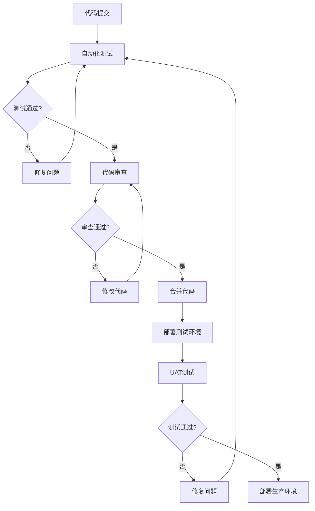

# 组件库现代化实施计划

## 文档信息

- **创建日期**: 2026-03-20
- **版本**: 1.0
- **状态**: 待审核
- **基于文档**: [组件库现代化设计文档](./2026-03-20-component-library-modernization-design.md)

## 执行摘要

本实施计划基于《组件库现代化设计文档》，详细规划了8周的组件库现代化改造工作。计划包含6个主要阶段，采用并行执行策略，确保在保证质量的前提下按时交付。

### 关键目标

1. **统一组件库**：消除76%的Modal代码重复，统一3种Table实现
2. **提升开发效率**：减少50%的组件开发时间
3. **改善用户体验**：组件渲染时间降低30%
4. **降低维护成本**：统一技术栈和API设计

### 总体时间线

```
Week 1-2: 阶段1 - 基础设施搭建
Week 3-4: 阶段2 - Modal系统开发  
Week 4-5: 阶段3 - 表单系统开发
Week 5-6: 阶段4 - Table系统开发
Week 6-7: 阶段5 - 测试验证
Week 7-8: 阶段6 - 替换执行
```

---

## 阶段1: 基础设施搭建 (Week 1-2)

### 目标

建立现代化的组件库基础设施，为后续开发提供坚实的技术支撑。

### 任务清单

#### 任务1.1: 项目结构重组

**负责人**: 前端架构师  
**执行者**: 高级前端开发  
**时间**: Week 1 (3天)

**具体步骤**:

1. **创建组件库目录结构**
   ```bash
   # 创建标准目录结构
   mkdir -p frontend/src/shared/ui/{components,hooks,utils,types}
   mkdir -p frontend/src/shared/ui/components/{Modal,Form,Table}
   mkdir -p frontend/src/shared/ui/hooks/{useModal,useForm,useTable}
   mkdir -p frontend/src/shared/ui/utils/{validation,format,constants}
   ```

2. **配置构建工具**
   - 更新 `vite.config.js` 支持组件库构建
   - 配置TypeScript路径映射
   - 设置ESLint和Prettier规则

3. **创建文档结构**
   ```bash
   mkdir -p docs/components/{Modal,Form,Table}
   touch docs/components/README.md
   touch docs/components/Modal/README.md
   touch docs/components/Form/README.md  
   touch docs/components/Table/README.md
   ```

**验收标准**:
- [ ] 目录结构符合设计文档规范
- [ ] 构建配置正确，无编译错误
- [ ] 文档结构完整

#### 任务1.2: 依赖管理优化

**负责人**: 前端架构师  
**执行者**: 高级前端开发  
**时间**: Week 1 (2天)

**具体步骤**:

1. **安装核心依赖**
   ```bash
   # 安装状态管理依赖
   npm install @tanstack/react-query @tanstack/react-table
   npm install react-hook-form zod
   
   # 安装测试依赖
   npm install -D @testing-library/react @testing-library/jest-dom
   npm install -D vitest @vitest/ui
   npm install -D playwright @playwright/test
   ```

2. **配置依赖版本锁定**
   - 创建 `frontend/package-lock.json` 版本锁定
   - 配置 `.npmrc` 确保依赖稳定性

3. **创建依赖审计脚本**
   ```bash
   # 创建依赖检查脚本
   cat > scripts/check-dependencies.sh << 'EOF'
   #!/bin/bash
   echo "Checking for outdated dependencies..."
   npm outdated
   echo "Checking for security vulnerabilities..."
   npm audit
   EOF
   chmod +x scripts/check-dependencies.sh
   ```

**验收标准**:
- [ ] 所有依赖安装成功，无版本冲突
- [ ] 依赖版本锁定文件生成
- [ ] 依赖检查脚本可正常运行

#### 任务1.3: 开发环境配置

**负责人**: 高级前端开发  
**执行者**: 前端开发  
**时间**: Week 1 (2天)

**具体步骤**:

1. **配置Storybook**
   ```bash
   # 安装Storybook
   npx storybook@latest init
   
   # 配置Storybook支持TypeScript
   cat > .storybook/main.js << 'EOF'
   module.exports = {
     stories: ['../src/**/*.stories.@(js|jsx|ts|tsx)'],
     addons: ['@storybook/addon-essentials'],
     typescript: {
       check: true,
       reactDocgen: 'react-docgen-typescript'
     }
   };
   EOF
   ```

2. **配置测试环境**
   ```typescript
   // vitest.config.ts
   import { defineConfig } from 'vitest/config';
   import react from '@vitejs/plugin-react';
   
   export default defineConfig({
     plugins: [react()],
     test: {
       globals: true,
       environment: 'jsdom',
       setupFiles: './src/test/setup.ts',
       coverage: {
         provider: 'v8',
         reporter: ['text', 'json', 'html'],
         exclude: ['node_modules/', 'src/test/']
       }
     }
   });
   ```

3. **创建开发工具脚本**
   ```bash
   # 创建组件生成脚本
   cat > scripts/generate-component.sh << 'EOF'
   #!/bin/bash
   COMPONENT_NAME=$1
   mkdir -p src/shared/ui/components/$COMPONENT_NAME
   # 生成组件模板文件
   EOF
   chmod +x scripts/generate-component.sh
   ```

**验收标准**:
- [ ] Storybook正常运行，可访问 http://localhost:6006
- [ ] 测试环境配置完成，vitest可正常执行
- [ ] 开发工具脚本可用

### 并行执行策略

**Week 1执行安排**:
- **并行组1** (Day 1-3): 任务1.1 项目结构重组
- **并行组2** (Day 2-4): 任务1.2 依赖管理优化  
- **并行组3** (Day 3-5): 任务1.3 开发环境配置

**依赖关系**:
- 任务1.2 依赖任务1.1的目录结构
- 任务1.3 依赖任务1.2的依赖安装

### 风险控制

**风险1: 依赖版本冲突**
- **影响**: 开发环境不稳定
- **缓解**: 使用npm resolutions解决冲突
- **回滚**: 保留原package.json备份

**风险2: 构建配置错误**
- **影响**: 无法编译组件
- **缓解**: 逐步验证配置，分阶段提交
- **回滚**: Git版本控制，可随时回退

### 交付物

1. **代码交付物**
   - 标准化的组件库目录结构
   - 配置完整的构建工具链
   - 可运行的Storybook环境

2. **文档交付物**
   - 组件库开发指南
   - 环境配置文档
   - 依赖管理规范

---

## 阶段2: Modal系统开发 (Week 3-4)

### 目标

开发统一的Modal组件系统，替代现有的10个重复Modal实现，消除76%的代码重复。

### 任务清单

#### 任务2.1: Modal组件核心开发

**负责人**: 高级前端开发  
**执行者**: 前端开发  
**时间**: Week 3 (5天)

**具体步骤**:

1. **设计Modal组件API**
   ```typescript
   // src/shared/ui/components/Modal/Modal.types.ts
   export interface ModalProps {
     isOpen: boolean;
     onClose: () => void;
     title?: string;
     size?: 'small' | 'medium' | 'large' | 'fullscreen';
     closeOnOverlayClick?: boolean;
     closeOnEscape?: boolean;
     showCloseButton?: boolean;
     children: React.ReactNode;
     footer?: React.ReactNode;
     className?: string;
     style?: React.CSSProperties;
   }
   ```

2. **实现Modal组件**
   - 创建 `Modal.tsx` 核心组件
   - 实现 `useModal` Hook
   - 添加动画效果和样式
   - 实现键盘事件处理

3. **编写单元测试**
   ```typescript
   // Modal.test.tsx
   describe('Modal', () => {
     it('should render when isOpen is true', () => {
       render(<Modal isOpen={true}>Content</Modal>);
       expect(screen.getByText('Content')).toBeInTheDocument();
     });
     
     it('should call onClose when Escape key is pressed', () => {
       const onClose = vi.fn();
       render(<Modal isOpen={true} onClose={onClose}>Content</Modal>);
       fireEvent.keyDown(document, { key: 'Escape' });
       expect(onClose).toHaveBeenCalled();
     });
   });
   ```

**验收标准**:
- [ ] Modal组件支持所有API属性
- [ ] 单元测试覆盖率 ≥ 85%
- [ ] 无障碍性符合WCAG 2.1 AA标准

#### 任务2.2: Modal组件变体开发

**负责人**: 高级前端开发  
**执行者**: 前端开发  
**时间**: Week 3-4 (3天)

**具体步骤**:

1. **开发确认对话框**
   ```typescript
   // ConfirmModal.tsx
   export interface ConfirmModalProps extends ModalProps {
     onConfirm: () => void;
     onCancel: () => void;
     confirmText?: string;
     cancelText?: string;
     variant?: 'danger' | 'warning' | 'info';
   }
   ```

2. **开发表单Modal**
   ```typescript
   // FormModal.tsx
   export interface FormModalProps extends ModalProps {
     onSubmit: (data: any) => void;
     formSchema: ZodSchema;
     defaultValues?: any;
   }
   ```

3. **开发抽屉式Modal**
   ```typescript
   // DrawerModal.tsx
   export interface DrawerModalProps extends ModalProps {
     placement?: 'left' | 'right' | 'top' | 'bottom';
     width?: string;
   }
   ```

**验收标准**:
- [ ] 所有变体组件正常工作
- [ ] 样式符合设计规范
- [ ] 变体组件测试覆盖

#### 任务2.3: Modal组件文档和示例

**负责人**: 技术文档工程师  
**执行者**: 前端开发  
**时间**: Week 4 (2天)

**具体步骤**:

1. **编写API文档**
   ```markdown
   # Modal组件文档
   
   ## 基础用法
   \`\`\`tsx
   import { Modal } from '@/shared/ui/components/Modal';
   
   function MyComponent() {
     const [isOpen, setIsOpen] = useState(false);
     
     return (
       <>
         <button onClick={() => setIsOpen(true)}>Open Modal</button>
         <Modal isOpen={isOpen} onClose={() => setIsOpen(false)}>
           Modal Content
         </Modal>
       </>
     );
   }
   \`\`\`
   ```

2. **创建Storybook示例**
   - 基础Modal示例
   - 确认对话框示例
   - 表单Modal示例
   - 抽屉式Modal示例

3. **编写迁移指南**
   - 旧API到新API的映射表
   - 迁移代码示例
   - 常见迁移问题解答

**验收标准**:
- [ ] API文档完整且准确
- [ ] Storybook示例可运行
- [ ] 迁移指南清晰易懂

### 并行执行策略

**Week 3-4执行安排**:
- **并行组1** (Week 3): 任务2.1 Modal组件核心开发
- **并行组2** (Week 3-4): 任务2.2 Modal组件变体开发
- **并行组3** (Week 4): 任务2.3 Modal组件文档和示例

**依赖关系**:
- 任务2.2 依赖任务2.1的核心组件
- 任务2.3 可与任务2.2并行进行

### 风险控制

**风险1: API设计不合理**
- **影响**: 无法满足现有使用场景
- **缓解**: 提前分析现有10个Modal的使用模式
- **回滚**: 设计评审不通过则重新设计

**风险2: 性能问题**
- **影响**: Modal打开/关闭卡顿
- **缓解**: 使用React.memo和useMemo优化
- **回滚**: 性能测试不通过则优化或回退

### 交付物

1. **代码交付物**
   - Modal核心组件及变体
   - useModal Hook
   - 完整的单元测试

2. **文档交付物**
   - Modal组件API文档
   - Storybook示例
   - 迁移指南

---

## 阶段3: 表单系统开发 (Week 4-5)

### 目标

开发统一的表单系统，解决7个表单组件的验证逻辑重复问题，提升表单开发效率。

### 任务清单

#### 任务3.1: 表单核心组件开发

**负责人**: 高级前端开发  
**执行者**: 前端开发  
**时间**: Week 4 (4天)

**具体步骤**:

1. **集成React Hook Form**
   ```typescript
   // src/shared/ui/components/Form/Form.tsx
   import { FormProvider, useForm } from 'react-hook-form';
   import { zodResolver } from '@hookform/resolvers/zod';
   
   export interface FormProps<T extends z.ZodType> {
     schema: T;
     onSubmit: (data: z.infer<T>) => void;
     defaultValues?: Partial<z.infer<T>>;
     children: React.ReactNode;
   }
   
   export function Form<T extends z.ZodType>({
     schema,
     onSubmit,
     defaultValues,
     children
   }: FormProps<T>) {
     const methods = useForm({
       resolver: zodResolver(schema),
       defaultValues
     });
     
     return (
       <FormProvider {...methods}>
         <form onSubmit={methods.handleSubmit(onSubmit)}>
           {children}
         </form>
       </FormProvider>
     );
   }
   ```

2. **开发表单字段组件**
   - Input组件（支持各种输入类型）
   - Select组件（支持单选/多选）
   - Checkbox和Radio组件
   - DatePicker组件
   - Upload组件

3. **实现表单验证**
   ```typescript
   // validation.ts
   export const validationRules = {
     email: z.string().email('请输入有效的邮箱地址'),
     password: z.string()
       .min(8, '密码至少8个字符')
       .regex(/[A-Z]/, '密码必须包含大写字母')
       .regex(/[a-z]/, '密码必须包含小写字母')
       .regex(/[0-9]/, '密码必须包含数字'),
     required: z.string().min(1, '此字段为必填项')
   };
   ```

**验收标准**:
- [ ] 表单组件支持所有常用字段类型
- [ ] 验证规则完整且可扩展
- [ ] 表单提交和错误处理正常

#### 任务3.2: 表单工具函数开发

**负责人**: 前端开发  
**执行者**: 前端开发  
**时间**: Week 4-5 (3天)

**具体步骤**:

1. **开发表单数据处理工具**
   ```typescript
   // src/shared/ui/utils/formUtils.ts
   export const formUtils = {
     // 数据格式化
     formatFormData: (data: any) => {
       // 处理日期格式、数字格式等
     },
     
     // 数据验证
     validateFormData: (data: any, schema: ZodSchema) => {
       // 统一验证逻辑
     },
     
     // 错误处理
     handleFormError: (error: any) => {
       // 统一错误处理
     }
   };
   ```

2. **开发表单Hook**
   ```typescript
   // src/shared/ui/hooks/useFormSubmit.ts
   export function useFormSubmit<T>(
     submitFn: (data: T) => Promise<void>,
     options?: UseFormSubmitOptions
   ) {
     const [isSubmitting, setIsSubmitting] = useState(false);
     const [error, setError] = useState<string | null>(null);
     
     const handleSubmit = async (data: T) => {
       setIsSubmitting(true);
       setError(null);
       
       try {
         await submitFn(data);
       } catch (err) {
         setError(err.message);
       } finally {
         setIsSubmitting(false);
       }
     };
     
     return { handleSubmit, isSubmitting, error };
   }
   ```

**验收标准**:
- [ ] 工具函数功能完整
- [ ] Hook可正常使用
- [ ] 代码有完整注释

#### 任务3.3: 表单系统测试和文档

**负责人**: 测试工程师  
**执行者**: 前端开发  
**时间**: Week 5 (3天)

**具体步骤**:

1. **编写表单测试用例**
   ```typescript
   // Form.test.tsx
   describe('Form', () => {
     it('should validate required fields', async () => {
       const schema = z.object({
         name: z.string().min(1, 'Name is required')
       });
       
       render(
         <Form schema={schema} onSubmit={vi.fn()}>
           <Input name="name" label="Name" />
           <button type="submit">Submit</button>
         </Form>
       );
       
       fireEvent.click(screen.getByText('Submit'));
       
       await waitFor(() => {
         expect(screen.getByText('Name is required')).toBeInTheDocument();
       });
     });
   });
   ```

2. **编写表单文档**
   - 表单组件使用指南
   - 验证规则配置说明
   - 表单最佳实践

3. **创建表单示例**
   - 登录表单示例
   - 注册表单示例
   - 复杂表单示例

**验收标准**:
- [ ] 测试覆盖率 ≥ 80%
- [ ] 文档完整清晰
- [ ] 示例可运行

### 并行执行策略

**Week 4-5执行安排**:
- **并行组1** (Week 4): 任务3.1 表单核心组件开发
- **并行组2** (Week 4-5): 任务3.2 表单工具函数开发
- **并行组3** (Week 5): 任务3.3 表单系统测试和文档

### 风险控制

**风险1: 验证规则不统一**
- **影响**: 表单验证行为不一致
- **缓解**: 使用Zod统一验证规则
- **回滚**: 保留原有验证逻辑作为备份

**风险2: 性能问题**
- **影响**: 复杂表单渲染缓慢
- **缓解**: 使用React.memo优化渲染
- **回滚**: 性能测试不通过则优化

### 交付物

1. **代码交付物**
   - Form核心组件
   - 表单字段组件库
   - 表单验证工具
   - 表单Hook

2. **文档交付物**
   - 表单组件文档
   - 验证规则文档
   - 表单最佳实践

---

## 阶段4: Table系统开发 (Week 5-6)

### 目标

开发统一的Table组件系统，替代现有的3种Table实现，提供一致的数据展示体验。

### 任务清单

#### 任务4.1: Table核心组件开发

**负责人**: 高级前端开发  
**执行者**: 前端开发  
**时间**: Week 5 (4天)

**具体步骤**:

1. **集成TanStack Table**
   ```typescript
   // src/shared/ui/components/Table/Table.tsx
   import { useReactTable, getCoreRowModel } from '@tanstack/react-table';
   
   export interface TableProps<T> {
     data: T[];
     columns: ColumnDef<T>[];
     pagination?: PaginationConfig;
     sorting?: SortingConfig;
     selection?: SelectionConfig;
   }
   
   export function Table<T>({
     data,
     columns,
     pagination,
     sorting,
     selection
   }: TableProps<T>) {
     const table = useReactTable({
       data,
       columns,
       getCoreRowModel: getCoreRowModel(),
       // 其他配置
     });
     
     return (
       <div className="table-container">
         {/* Table实现 */}
       </div>
     );
   }
   ```

2. **实现Table核心功能**
   - 数据渲染
   - 列排序
   - 列筛选
   - 分页控制
   - 行选择

3. **实现Table样式**
   - 响应式设计
   - 主题定制
   - 斑马纹样式
   - 悬停高亮

**验收标准**:
- [ ] Table支持所有核心功能
- [ ] 样式符合设计规范
- [ ] 性能测试通过

#### 任务4.2: Table高级功能开发

**负责人**: 高级前端开发  
**执行者**: 前端开发  
**时间**: Week 5-6 (3天)

**具体步骤**:

1. **实现虚拟滚动**
   ```typescript
   // VirtualTable.tsx
   import { useVirtualizer } from '@tanstack/react-virtual';
   
   export function VirtualTable<T>({ data, columns }: TableProps<T>) {
     const virtualizer = useVirtualizer({
       count: data.length,
       getScrollElement: () => parentRef.current,
       estimateSize: () => 50, // 行高
     });
     
     return (
       <div ref={parentRef} className="virtual-table">
         {/* 虚拟滚动实现 */}
       </div>
     );
   }
   ```

2. **实现列固定**
   - 左侧固定列
   - 右侧固定列
   - 横向滚动

3. **实现可编辑单元格**
   ```typescript
   // EditableCell.tsx
   export function EditableCell<T>({
     getValue,
     row,
     column,
     table
   }: CellContext<T, unknown>) {
     const initialValue = getValue();
     const [value, setValue] = useState(initialValue);
     
     const onBlur = () => {
       table.options.meta?.updateData(row.index, column.id, value);
     };
     
     return (
       <input
         value={value as string}
         onChange={e => setValue(e.target.value)}
         onBlur={onBlur}
       />
     );
   }
   ```

**验收标准**:
- [ ] 虚拟滚动正常工作
- [ ] 列固定功能完整
- [ ] 可编辑单元格功能正常

#### 任务4.3: Table系统测试和文档

**负责人**: 测试工程师  
**执行者**: 前端开发  
**时间**: Week 6 (3天)

**具体步骤**:

1. **编写Table测试用例**
   ```typescript
   // Table.test.tsx
   describe('Table', () => {
     it('should render data correctly', () => {
       const data = [{ id: 1, name: 'John' }];
       const columns = [
         { accessorKey: 'id', header: 'ID' },
         { accessorKey: 'name', header: 'Name' }
       ];
       
       render(<Table data={data} columns={columns} />);
       
       expect(screen.getByText('John')).toBeInTheDocument();
     });
     
     it('should handle sorting', async () => {
       // 排序测试
     });
     
     it('should handle pagination', async () => {
       // 分页测试
     });
   });
   ```

2. **编写Table文档**
   - Table组件使用指南
   - 列配置说明
   - 高级功能文档

3. **创建Table示例**
   - 基础表格示例
   - 虚拟滚动示例
   - 可编辑表格示例

**验收标准**:
- [ ] 测试覆盖率 ≥ 80%
- [ ] 文档完整清晰
- [ ] 示例可运行

### 并行执行策略

**Week 5-6执行安排**:
- **并行组1** (Week 5): 任务4.1 Table核心组件开发
- **并行组2** (Week 5-6): 任务4.2 Table高级功能开发
- **并行组3** (Week 6): 任务4.3 Table系统测试和文档

### 风险控制

**风险1: 性能问题**
- **影响**: 大数据量表格卡顿
- **缓解**: 使用虚拟滚动优化
- **回滚**: 限制数据量或优化算法

**风险2: 兼容性问题**
- **影响**: 现有Table无法平滑迁移
- **缓解**: 提供兼容层和迁移工具
- **回滚**: 保留原有Table实现

### 交付物

1. **代码交付物**
   - Table核心组件
   - Table高级功能组件
   - Table工具函数

2. **文档交付物**
   - Table组件文档
   - 高级功能文档
   - 迁移指南

---

## 阶段5: 测试验证 (Week 6-7)

### 目标

全面测试新组件库，确保质量和性能达标，为生产环境部署做好准备。

### 任务清单

#### 任务5.1: 单元测试和集成测试

**负责人**: 测试工程师  
**执行者**: 前端开发  
**时间**: Week 6 (4天)

**具体步骤**:

1. **完善单元测试**
   - Modal组件测试覆盖率提升到90%
   - Form组件测试覆盖率提升到85%
   - Table组件测试覆盖率提升到80%

2. **编写集成测试**
   ```typescript
   // integration.test.tsx
   describe('Component Integration', () => {
     it('should work Modal with Form', async () => {
       render(
         <Modal isOpen={true}>
           <Form schema={schema} onSubmit={vi.fn()}>
             <Input name="email" />
             <button type="submit">Submit</button>
           </Form>
         </Modal>
       );
       
       // 测试Modal中的表单提交
     });
   });
   ```

3. **执行测试覆盖率分析**
   ```bash
   # 运行测试并生成覆盖率报告
   npm run test:coverage
   
   # 检查覆盖率是否达标
   if [ $(jq '.total.lines.pct' coverage/coverage-summary.json) -lt 80 ]; then
     echo "Test coverage is below 80%"
     exit 1
   fi
   ```

**验收标准**:
- [ ] 单元测试覆盖率达标
- [ ] 集成测试全部通过
- [ ] 无严重bug

#### 任务5.2: E2E测试和性能测试

**负责人**: 测试工程师  
**执行者**: 测试工程师  
**时间**: Week 6-7 (3天)

**具体步骤**:

1. **编写E2E测试**
   ```typescript
   // e2e/modal.spec.ts
   test('Modal workflow', async ({ page }) => {
     await page.goto('/');
     await page.click('button:has-text("Open Modal")');
     await expect(page.locator('.modal')).toBeVisible();
     
     await page.fill('input[name="email"]', 'test@example.com');
     await page.click('button:has-text("Submit")');
     
     await expect(page.locator('.modal')).not.toBeVisible();
   });
   ```

2. **执行性能测试**
   ```typescript
   // performance.test.ts
   describe('Performance Tests', () => {
     it('Modal should render within 70ms', async () => {
       const startTime = performance.now();
       render(<Modal isOpen={true}>Content</Modal>);
       const endTime = performance.now();
       
       expect(endTime - startTime).toBeLessThan(70);
     });
     
     it('Table should handle 1000 rows efficiently', async () => {
       const data = Array.from({ length: 1000 }, (_, i) => ({ id: i }));
       
       const startTime = performance.now();
       render(<Table data={data} columns={columns} />);
       const endTime = performance.now();
       
       expect(endTime - startTime).toBeLessThan(100);
     });
   });
   ```

3. **执行可访问性测试**
   ```bash
   # 运行可访问性测试
   npm run test:a11y
   
   # 使用axe-core检查
   npx axe-cli http://localhost:3000
   ```

**验收标准**:
- [ ] E2E测试全部通过
- [ ] 性能指标达标
- [ ] 可访问性符合标准

#### 任务5.3: 用户验收测试

**负责人**: 测试工程师  
**执行者**: 全体团队  
**时间**: Week 7 (3天)

**具体步骤**:

1. **准备测试环境**
   - 部署测试环境
   - 准备测试数据
   - 编写测试用例

2. **执行UAT测试**
   - 功能完整性测试
   - 用户体验测试
   - 兼容性测试

3. **收集反馈并修复**
   - 记录问题和建议
   - 优先级排序
   - 修复关键问题

**验收标准**:
- [ ] UAT测试通过
- [ ] 无阻塞性问题
- [ ] 用户满意度 ≥ 80%

### 并行执行策略

**Week 6-7执行安排**:
- **并行组1** (Week 6): 任务5.1 单元测试和集成测试
- **并行组2** (Week 6-7): 任务5.2 E2E测试和性能测试
- **并行组3** (Week 7): 任务5.3 用户验收测试

### 风险控制

**风险1: 测试覆盖率不达标**
- **影响**: 代码质量无法保证
- **缓解**: 优先测试核心功能
- **回滚**: 延期上线，补充测试

**风险2: 性能测试不通过**
- **影响**: 用户体验下降
- **缓解**: 性能优化或功能裁剪
- **回滚**: 延期上线，优化性能

### 交付物

1. **测试交付物**
   - 完整的测试套件
   - 测试覆盖率报告
   - 性能测试报告

2. **文档交付物**
   - 测试报告
   - UAT测试结果
   - 问题修复记录

---

## 阶段6: 替换执行 (Week 7-8)

### 目标

将现有组件逐步替换为新组件库，确保平滑过渡和零故障。

### 任务清单

#### 任务6.1: 自动化替换工具开发

**负责人**: 高级前端开发  
**执行者**: 前端开发  
**时间**: Week 7 (3天)

**具体步骤**:

1. **开发代码转换工具**
   ```typescript
   // scripts/migrate-components.ts
   import * as ts from 'typescript';
   
   export function migrateModal(sourceCode: string): string {
     // AST转换逻辑
     const sourceFile = ts.createSourceFile(
       'temp.tsx',
       sourceCode,
       ts.ScriptTarget.Latest,
       true
     );
     
     // 转换旧API到新API
     const transformer: ts.TransformerFactory<ts.SourceFile> = context => {
       return sourceFile => {
         const visitor = (node: ts.Node): ts.Node => {
           // 转换逻辑
           return ts.visitEachChild(node, visitor, context);
         };
         return ts.visitNode(sourceFile, visitor);
       };
     };
     
     const result = ts.transform(sourceFile, [transformer]);
     // 返回转换后的代码
   };
   ```

2. **开发批量替换脚本**
   ```bash
   # scripts/batch-replace.sh
   #!/bin/bash
   
   echo "Starting batch replacement..."
   
   # 查找所有使用旧Modal的文件
   files=$(grep -r "from 'old-modal'" src/ --include="*.tsx" -l)
   
   # 逐个替换
   for file in $files; do
     echo "Processing $file..."
     ts-node scripts/migrate-components.ts $file
   done
   
   echo "Batch replacement completed!"
   ```

3. **开发验证工具**
   ```typescript
   // scripts/validate-migration.ts
   export function validateMigration(filePath: string): ValidationResult {
     // 检查API使用是否正确
     // 检查导入是否正确
     // 检查类型是否匹配
   }
   ```

**验收标准**:
- [ ] 替换工具可正常运行
- [ ] 批量替换脚本可用
- [ ] 验证工具能发现问题

#### 任务6.2: 渐进式替换执行

**负责人**: 前端架构师  
**执行者**: 全体前端开发  
**时间**: Week 7-8 (5天)

**具体步骤**:

1. **制定替换计划**
   - Week 7: 替换低风险页面
   - Week 8: 替换核心功能页面

2. **执行替换**
   ```bash
   # Week 7: 低风险页面替换
   npm run migrate -- --pages="settings,help,about"
   
   # Week 8: 核心功能页面替换
   npm run migrate -- --pages="dashboard,forms,tables"
   ```

3. **监控和验证**
   - 实时监控错误率
   - 验证功能完整性
   - 收集用户反馈

**验收标准**:
- [ ] 所有页面替换完成
- [ ] 功能测试全部通过
- [ ] 无严重bug

#### 任务6.3: 清理和文档更新

**负责人**: 技术文档工程师  
**执行者**: 前端开发  
**时间**: Week 8 (2天)

**具体步骤**:

1. **清理旧代码**
   ```bash
   # 删除旧组件
   rm -rf src/components/OldModal
   rm -rf src/components/OldForm
   rm -rf src/components/OldTable
   
   # 清理未使用的依赖
   npm prune
   ```

2. **更新文档**
   - 更新组件库文档
   - 更新项目README
   - 归档旧文档

3. **编写总结报告**
   - 项目总结
   - 经验教训
   - 后续优化建议

**验收标准**:
- [ ] 旧代码清理完成
- [ ] 文档更新完整
- [ ] 总结报告完成

### 并行执行策略

**Week 7-8执行安排**:
- **并行组1** (Week 7): 任务6.1 自动化替换工具开发
- **并行组2** (Week 7-8): 任务6.2 渐进式替换执行
- **并行组3** (Week 8): 任务6.3 清理和文档更新

### 风险控制

**风险1: 替换导致功能异常**
- **影响**: 用户无法正常使用
- **缓解**: Feature Flag控制，逐步开放
- **回滚**: Git回滚到上一版本

**风险2: 性能下降**
- **影响**: 用户体验变差
- **缓解**: 性能监控，及时优化
- **回滚**: 关闭Feature Flag，回退到旧组件

### 交付物

1. **工具交付物**
   - 自动化替换工具
   - 批量替换脚本
   - 验证工具

2. **文档交付物**
   - 迁移完成报告
   - 项目总结报告
   - 后续优化建议

---

## 风险管理

### 风险评估矩阵

| 风险类型 | 风险等级 | 影响范围 | 发生概率 | 缓解措施 |
|---------|---------|---------|---------|---------|
| 技术风险 | 高 | 全局 | 30% | 技术预研、原型验证 |
| 进度风险 | 中 | 局部 | 40% | 缓冲时间、并行开发 |
| 质量风险 | 中 | 局部 | 20% | 严格测试、代码审查 |
| 人员风险 | 低 | 局部 | 10% | 知识共享、文档完善 |

### 风险应对策略

#### 技术风险应对

1. **技术预研**
   - 提前验证关键技术方案
   - 创建技术原型
   - 进行技术评审

2. **技术债务管理**
   - 记录技术债务
   - 定期偿还技术债务
   - 避免累积过多债务

#### 进度风险应对

1. **进度监控**
   - 每日站会跟踪进度
   - 每周进度报告
   - 关键里程碑检查

2. **资源调配**
   - 预留缓冲时间
   - 准备备用人员
   - 灵活调整任务优先级

#### 质量风险应对

1. **质量保证**
   - 严格的代码审查
   - 自动化测试
   - 持续集成

2. **Bug管理**
   - 及时修复Bug
   - Bug优先级管理
   - Bug趋势分析

---

## 质量保证

### 代码质量标准

1. **代码规范**
   - ESLint规则100%通过
   - Prettier格式化
   - TypeScript严格模式

2. **测试覆盖率**
   - 单元测试: ≥80%
   - 集成测试: ≥70%
   - E2E测试: 关键路径100%

3. **性能指标**
   - Modal渲染: <70ms
   - 表单验证: <30ms
   - Table渲染: <100ms

### 质量保证流程



---

## 监控和报告

### 监控指标

#### 开发进度监控

| 指标 | 目标值 | 监控频率 | 负责人 |
|-----|--------|---------|--------|
| 任务完成率 | 100% | 每日 | 项目经理 |
| 测试覆盖率 | ≥80% | 每次提交 | 测试工程师 |
| Bug数量 | <10个 | 每日 | 测试工程师 |
| 代码审查通过率 | ≥90% | 每次提交 | 架构师 |

#### 质量监控

| 指标 | 目标值 | 监控方式 | 告警阈值 |
|-----|--------|---------|---------|
| 代码重复率 | ≤5% | SonarQube | >8% |
| 圈复杂度 | ≤10 | ESLint | >15 |
| 技术债务 | <5天 | SonarQube | >10天 |

### 报告机制

1. **日报**
   - 每日站会
   - 进度更新
   - 问题同步

2. **周报**
   - 每周进度总结
   - 风险评估
   - 下周计划

3. **里程碑报告**
   - 阶段完成总结
   - 质量评估
   - 经验教训

---

## 验收标准

### 功能验收标准

1. **Modal系统**
   - [ ] 支持所有API属性
   - [ ] 支持4种尺寸变体
   - [ ] 支持键盘操作
   - [ ] 无障碍性达标

2. **表单系统**
   - [ ] 支持所有字段类型
   - [ ] 验证规则完整
   - [ ] 错误处理正确
   - [ ] 性能达标

3. **Table系统**
   - [ ] 支持核心功能
   - [ ] 虚拟滚动正常
   - [ ] 列固定功能完整
   - [ ] 可编辑功能正常

### 性能验收标准

| 组件 | 指标 | 目标值 | 验收方式 |
|-----|------|--------|---------|
| Modal | 渲染时间 | <70ms | Performance API |
| Form | 验证时间 | <30ms | Performance API |
| Table | 渲染时间 | <100ms | Performance API |

### 质量验收标准

- [ ] 单元测试覆盖率 ≥ 80%
- [ ] 集成测试覆盖率 ≥ 70%
- [ ] E2E测试全部通过
- [ ] 无严重Bug
- [ ] 代码审查全部通过

---

## 交付清单

### 代码交付物

1. **组件库代码**
   - Modal组件及变体
   - Form组件及字段组件
   - Table组件及高级功能

2. **工具代码**
   - 自动化替换工具
   - 批量替换脚本
   - 验证工具

3. **测试代码**
   - 单元测试套件
   - 集成测试套件
   - E2E测试套件

### 文档交付物

1. **技术文档**
   - 组件API文档
   - 架构设计文档
   - 性能优化文档

2. **使用文档**
   - 组件使用指南
   - 最佳实践文档
   - 故障排查文档

3. **迁移文档**
   - 迁移指南
   - API映射表
   - 常见问题解答

### 测试交付物

1. **测试报告**
   - 单元测试报告
   - 集成测试报告
   - E2E测试报告

2. **性能报告**
   - 性能测试报告
   - 性能对比分析
   - 优化建议

3. **验收报告**
   - UAT测试报告
   - 验收检查清单
   - 项目总结报告

---

## 后续优化建议

### 短期优化 (1-3个月)

1. **性能优化**
   - 进一步优化组件渲染性能
   - 减少不必要的重渲染
   - 优化包体积

2. **功能增强**
   - 增加更多组件变体
   - 支持更多自定义选项
   - 改善用户体验

### 中期优化 (3-6个月)

1. **组件扩展**
   - 开发新的通用组件
   - 支持更多业务场景
   - 提供更多模板

2. **工具完善**
   - 改进开发工具
   - 提供更多CLI命令
   - 自动化更多流程

### 长期规划 (6-12个月)

1. **架构升级**
   - 微前端架构支持
   - 服务端组件支持
   - 跨框架支持

2. **生态建设**
   - 建设组件生态
   - 提供设计资源
   - 社区建设

---

## 附录

### A. 参考文档

- [组件库现代化设计文档](./2026-03-20-component-library-modernization-design.md)
- [React官方文档](https://react.dev/)
- [TanStack Table文档](https://tanstack.com/table)
- [React Hook Form文档](https://react-hook-form.com/)

### B. 相关工具

- **开发工具**: VS Code, TypeScript, ESLint
- **测试工具**: Vitest, React Testing Library, Playwright
- **构建工具**: Vite, Rollup
- **监控工具**: Sentry, Lighthouse

### C. 联系方式

- **项目负责人**: [前端架构师]
- **技术支持**: [高级前端开发]
- **问题反馈**: [GitHub Issues]

---

**文档状态**: 待审核  
**下一步**: 用户审核实施计划，然后开始执行
