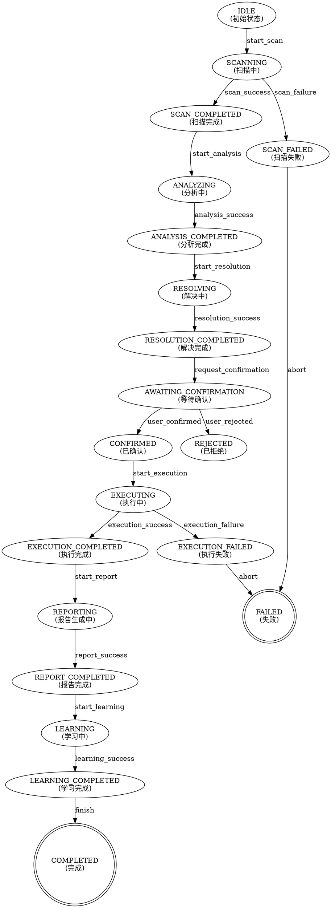

# 方案C：智能代理设计（学习参考）

**创建时间**: 2026-03-22
**用途**: 学习Agent Teams和多代理协作模式
**状态**: 学习参考文档

---

## 一、整体架构

```
┌─────────────────────────────────────────────────────────────────┐
│                    GitHub Manager Orchestrator                   │
│                      (主编排器 - 状态机)                          │
└─────────────────────────────────────────────────────────────────┘
                                │
        ┌───────────────────────┼───────────────────────┐
        │                       │                       │
        ▼                       ▼                       ▼
┌───────────────┐     ┌───────────────┐     ┌───────────────┐
│ ScannerAgent  │     │ AnalyzerAgent │     │ ResolverAgent │
│   扫描代理     │     │   分析代理     │     │   解决代理     │
└───────────────┘     └───────────────┘     └───────────────┘
        │                       │                       │
        ▼                       ▼                       ▼
┌───────────────┐     ┌───────────────┐     ┌───────────────┐
│ ExecutorAgent │     │ ReporterAgent │     │ LearnerAgent  │
│   执行代理     │     │   报告代理     │     │   学习代理     │
└───────────────┘     └───────────────┘     └───────────────┘
        │                       │                       │
        └───────────────────────┴───────────────────────┘
                                │
                                ▼
                    ┌───────────────────────┐
                    │   Shared Knowledge    │
                    │   共享知识库           │
                    └───────────────────────┘
```

---

## 二、状态机设计

### 2.1 状态定义

```python
from enum import Enum
from typing import Optional, Dict, Any
from dataclasses import dataclass
from datetime import datetime

class ManagerState(Enum):
    """管理器状态"""
    
    # 初始状态
    IDLE = "idle"
    
    # 扫描阶段
    SCANNING = "scanning"
    SCAN_COMPLETED = "scan_completed"
    SCAN_FAILED = "scan_failed"
    
    # 分析阶段
    ANALYZING = "analyzing"
    ANALYSIS_COMPLETED = "analysis_completed"
    ANALYSIS_FAILED = "analysis_failed"
    
    # 解决阶段
    RESOLVING = "resolving"
    RESOLUTION_COMPLETED = "resolution_completed"
    RESOLUTION_FAILED = "resolution_failed"
    
    # 确认阶段
    AWAITING_CONFIRMATION = "awaiting_confirmation"
    CONFIRMED = "confirmed"
    REJECTED = "rejected"
    
    # 执行阶段
    EXECUTING = "executing"
    EXECUTION_COMPLETED = "execution_completed"
    EXECUTION_FAILED = "execution_failed"
    EXECUTION_ABORTED = "execution_aborted"
    
    # 报告阶段
    REPORTING = "reporting"
    REPORT_COMPLETED = "report_completed"
    
    # 学习阶段
    LEARNING = "learning"
    LEARNING_COMPLETED = "learning_completed"
    
    # 终态
    COMPLETED = "completed"
    FAILED = "failed"
```

### 2.2 状态转换

```python
class StateTransition:
    """状态转换"""
    
    from_state: ManagerState
    to_state: ManagerState
    trigger: str
    action: callable
    guard: Optional[callable]  # 转换条件


# 状态转换表
STATE_TRANSITIONS = [
    # 扫描阶段
    StateTransition(
        from_state=ManagerState.IDLE,
        to_state=ManagerState.SCANNING,
        trigger="start_scan",
        action=lambda: ScannerAgent().scan()
    ),
    StateTransition(
        from_state=ManagerState.SCANNING,
        to_state=ManagerState.SCAN_COMPLETED,
        trigger="scan_success",
        action=lambda: None
    ),
    StateTransition(
        from_state=ManagerState.SCANNING,
        to_state=ManagerState.SCAN_FAILED,
        trigger="scan_failure",
        action=lambda: None
    ),
    
    # 分析阶段
    StateTransition(
        from_state=ManagerState.SCAN_COMPLETED,
        to_state=ManagerState.ANALYZING,
        trigger="start_analysis",
        action=lambda: AnalyzerAgent().analyze()
    ),
    StateTransition(
        from_state=ManagerState.ANALYZING,
        to_state=ManagerState.ANALYSIS_COMPLETED,
        trigger="analysis_success",
        action=lambda: None
    ),
    
    # 解决阶段
    StateTransition(
        from_state=ManagerState.ANALYSIS_COMPLETED,
        to_state=ManagerState.RESOLVING,
        trigger="start_resolution",
        action=lambda: ResolverAgent().resolve()
    ),
    StateTransition(
        from_state=ManagerState.RESOLVING,
        to_state=ManagerState.RESOLUTION_COMPLETED,
        trigger="resolution_success",
        action=lambda: None
    ),
    
    # 确认阶段
    StateTransition(
        from_state=ManagerState.RESOLUTION_COMPLETED,
        to_state=ManagerState.AWAITING_CONFIRMATION,
        trigger="request_confirmation",
        action=lambda: request_user_confirmation()
    ),
    StateTransition(
        from_state=ManagerState.AWAITING_CONFIRMATION,
        to_state=ManagerState.CONFIRMED,
        trigger="user_confirmed",
        action=lambda: None
    ),
    StateTransition(
        from_state=ManagerState.AWAITING_CONFIRMATION,
        to_state=ManagerState.REJECTED,
        trigger="user_rejected",
        action=lambda: None
    ),
    
    # 执行阶段
    StateTransition(
        from_state=ManagerState.CONFIRMED,
        to_state=ManagerState.EXECUTING,
        trigger="start_execution",
        action=lambda: ExecutorAgent().execute()
    ),
    StateTransition(
        from_state=ManagerState.EXECUTING,
        to_state=ManagerState.EXECUTION_COMPLETED,
        trigger="execution_success",
        action=lambda: None
    ),
    StateTransition(
        from_state=ManagerState.EXECUTING,
        to_state=ManagerState.EXECUTION_FAILED,
        trigger="execution_failure",
        action=lambda: None
    ),
    
    # 报告阶段
    StateTransition(
        from_state=ManagerState.EXECUTION_COMPLETED,
        to_state=ManagerState.REPORTING,
        trigger="start_report",
        action=lambda: ReporterAgent().report()
    ),
    StateTransition(
        from_state=ManagerState.REPORTING,
        to_state=ManagerState.REPORT_COMPLETED,
        trigger="report_success",
        action=lambda: None
    ),
    
    # 学习阶段
    StateTransition(
        from_state=ManagerState.REPORT_COMPLETED,
        to_state=ManagerState.LEARNING,
        trigger="start_learning",
        action=lambda: LearnerAgent().learn()
    ),
    StateTransition(
        from_state=ManagerState.LEARNING,
        to_state=ManagerState.LEARNING_COMPLETED,
        trigger="learning_success",
        action=lambda: None
    ),
    
    # 终态
    StateTransition(
        from_state=ManagerState.LEARNING_COMPLETED,
        to_state=ManagerState.COMPLETED,
        trigger="finish",
        action=lambda: None
    ),
    StateTransition(
        from_state=ManagerState.SCAN_FAILED,
        to_state=ManagerState.FAILED,
        trigger="abort",
        action=lambda: None
    ),
    StateTransition(
        from_state=ManagerState.EXECUTION_FAILED,
        to_state=ManagerState.FAILED,
        trigger="abort",
        action=lambda: None
    ),
]
```

### 2.3 状态机实现

```python
class StateMachine:
    """状态机"""
    
    def __init__(self):
        self.current_state = ManagerState.IDLE
        self.history: List[StateRecord] = []
        self.context: Dict[str, Any] = {}
    
    def transition(self, trigger: str, **kwargs) -> bool:
        """
        执行状态转换
        
        Args:
            trigger: 触发器名称
            **kwargs: 上下文参数
            
        Returns:
            是否转换成功
        """
        
        # 查找匹配的转换
        transition = self._find_transition(trigger)
        if not transition:
            return False
        
        # 检查转换条件
        if transition.guard and not transition.guard(self.context):
            return False
        
        # 记录历史
        self.history.append(StateRecord(
            from_state=self.current_state,
            to_state=transition.to_state,
            trigger=trigger,
            timestamp=datetime.now()
        ))
        
        # 执行动作
        if transition.action:
            result = transition.action()
            self.context.update(result or {})
        
        # 更新状态
        self.current_state = transition.to_state
        
        return True
    
    def _find_transition(self, trigger: str) -> Optional[StateTransition]:
        """查找匹配的转换"""
        for transition in STATE_TRANSITIONS:
            if (transition.from_state == self.current_state and 
                transition.trigger == trigger):
                return transition
        return None
    
    def can_transition(self, trigger: str) -> bool:
        """检查是否可以转换"""
        transition = self._find_transition(trigger)
        if not transition:
            return False
        if transition.guard and not transition.guard(self.context):
            return False
        return True


class StateRecord:
    """状态记录"""
    
    from_state: ManagerState
    to_state: ManagerState
    trigger: str
    timestamp: datetime
```

### 2.4 状态转换图



---

## 三、决策引擎

### 3.1 决策引擎架构

```python
class DecisionEngine:
    """决策引擎"""
    
    def __init__(self):
        self.rules: List[DecisionRule] = []
        self.decision_history: List[Decision] = []
    
    def make_decision(self, context: 'DecisionContext') -> 'Decision':
        """
        基于上下文做出决策
        
        Args:
            context: 决策上下文
            
        Returns:
            决策结果
        """
        
        # 1. 收集所有适用的规则
        applicable_rules = [
            rule for rule in self.rules 
            if rule.matches(context)
        ]
        
        # 2. 按优先级排序
        applicable_rules.sort(key=lambda r: r.priority, reverse=True)
        
        # 3. 应用规则
        decision = None
        for rule in applicable_rules:
            decision = rule.apply(context)
            if decision:
                break
        
        # 4. 如果没有规则适用，使用默认决策
        if not decision:
            decision = self._make_default_decision(context)
        
        # 5. 记录决策历史
        self.decision_history.append(decision)
        
        return decision
    
    def _make_default_decision(self, context: 'DecisionContext') -> 'Decision':
        """默认决策"""
        return Decision(
            action="ask_user",
            reason="无法自动决策，需要用户确认",
            confidence=0.0
        )
    
    def learn_from_outcome(self, decision_id: str, outcome: 'DecisionOutcome'):
        """
        从决策结果中学习
        
        Args:
            decision_id: 决策ID
            outcome: 决策结果
        """
        
        # 查找决策
        decision = self._find_decision(decision_id)
        if not decision:
            return
        
        # 更新规则权重
        for rule in decision.rules_applied:
            if outcome.is_positive():
                rule.increase_weight()
            else:
                rule.decrease_weight()
```

### 3.2 决策规则

```python
class DecisionRule:
    """决策规则"""
    
    rule_id: str
    name: str
    description: str
    priority: int  # 优先级，越高越优先
    weight: float  # 权重，学习后调整
    
    # 条件
    conditions: List['Condition']
    
    # 动作
    action: str
    parameters: Dict[str, Any]
    
    def matches(self, context: 'DecisionContext') -> bool:
        """检查规则是否适用"""
        return all(condition.evaluate(context) for condition in self.conditions)
    
    def apply(self, context: 'DecisionContext') -> 'Decision':
        """应用规则"""
        return Decision(
            action=self.action,
            parameters=self.parameters,
            confidence=self.weight,
            rules_applied=[self.rule_id],
            reason=f"应用规则: {self.name}"
        )
    
    def increase_weight(self, delta: float = 0.1):
        """增加权重"""
        self.weight = min(1.0, self.weight + delta)
    
    def decrease_weight(self, delta: float = 0.1):
        """减少权重"""
        self.weight = max(0.0, self.weight - delta)


class Condition:
    """条件"""
    
    field: str
    operator: str  # eq, ne, gt, lt, gte, lte, in, contains, matches
    value: Any
    
    def evaluate(self, context: 'DecisionContext') -> bool:
        """评估条件"""
        
        # 获取字段值
        field_value = getattr(context, self.field, None)
        if field_value is None:
            return False
        
        # 根据操作符比较
        if self.operator == "eq":
            return field_value == self.value
        elif self.operator == "ne":
            return field_value != self.value
        elif self.operator == "gt":
            return field_value > self.value
        elif self.operator == "lt":
            return field_value < self.value
        elif self.operator == "gte":
            return field_value >= self.value
        elif self.operator == "lte":
            return field_value <= self.value
        elif self.operator == "in":
            return field_value in self.value
        elif self.operator == "contains":
            return self.value in field_value
        elif self.operator == "matches":
            import re
            return bool(re.match(self.value, field_value))
        
        return False
```

### 3.3 决策数据结构

```python
class Decision:
    """决策"""
    
    decision_id: str
    action: str
    parameters: Dict[str, Any]
    confidence: float
    rules_applied: List[str]
    reason: str
    timestamp: datetime


class DecisionContext:
    """决策上下文"""
    
    # 当前状态
    current_state: ManagerState
    
    # 扫描结果
    scan_result: Optional['ScanResult']
    
    # 问题列表
    problems: List['Problem']
    
    # 用户偏好
    user_preferences: 'UserPreferences'
    
    # 历史统计
    history_stats: 'HistoryStats'
    
    # 项目信息
    project_info: 'ProjectInfo'


class DecisionOutcome:
    """决策结果"""
    
    decision_id: str
    is_positive: bool
    feedback: str
    timestamp: datetime
```

---

## 四、多代理协作

### 4.1 代理基类

```python
from abc import ABC, abstractmethod
from typing import Dict, Any, Optional

class BaseAgent(ABC):
    """代理基类"""
    
    def __init__(self, agent_id: str, knowledge_base: 'KnowledgeBase'):
        self.agent_id = agent_id
        self.knowledge_base = knowledge_base
        self.state: Dict[str, Any] = {}
    
    @abstractmethod
    def execute(self, task: 'AgentTask') -> 'AgentResult':
        """执行任务"""
        pass
    
    def communicate(self, target_agent: str, message: 'AgentMessage') -> 'AgentMessage':
        """与其他代理通信"""
        return self.knowledge_base.route_message(self.agent_id, target_agent, message)
    
    def update_state(self, key: str, value: Any):
        """更新状态"""
        self.state[key] = value
    
    def get_shared_knowledge(self, key: str) -> Any:
        """获取共享知识"""
        return self.knowledge_base.get(key)
```

### 4.2 扫描代理

```python
class ScannerAgent(BaseAgent):
    """扫描代理"""
    
    def execute(self, task: 'AgentTask') -> 'AgentResult':
        """执行扫描任务"""
        
        # 1. 初始化扫描
        self.update_state('status', 'scanning')
        
        # 2. 执行本地扫描
        local_result = self._scan_local()
        
        # 3. 执行远程扫描
        remote_result = self._scan_remote()
        
        # 4. 执行配置扫描
        config_result = self._scan_config()
        
        # 5. 汇总结果
        scan_result = ScanResult(
            local_state=local_result,
            remote_state=remote_result,
            project_config=config_result
        )
        
        # 6. 更新共享知识
        self.knowledge_base.set('scan_result', scan_result)
        
        # 7. 通知其他代理
        self.communicate('analyzer', AgentMessage(
            type='scan_completed',
            data={'has_issues': scan_result.has_issues()}
        ))
        
        return AgentResult(
            success=True,
            data=scan_result
        )
    
    def _scan_local(self) -> LocalState:
        """扫描本地状态"""
        # 实现本地扫描逻辑
        pass
    
    def _scan_remote(self) -> RemoteState:
        """扫描远程状态"""
        # 实现远程扫描逻辑
        pass
    
    def _scan_config(self) -> ProjectConfig:
        """扫描项目配置"""
        # 实现配置扫描逻辑
        pass
```

### 4.3 分析代理

```python
class AnalyzerAgent(BaseAgent):
    """分析代理"""
    
    def execute(self, task: 'AgentTask') -> 'AgentResult':
        """执行分析任务"""
        
        # 1. 获取扫描结果
        scan_result = self.get_shared_knowledge('scan_result')
        if not scan_result:
            return AgentResult(success=False, error="无扫描结果")
        
        # 2. 应用问题规则
        problems = self._apply_rules(scan_result)
        
        # 3. 评估严重性
        for problem in problems:
            problem.severity = self._evaluate_severity(problem)
        
        # 4. 分析根本原因
        for problem in problems:
            problem.root_cause = self._analyze_root_cause(problem)
        
        # 5. 更新共享知识
        self.knowledge_base.set('problems', problems)
        
        # 6. 通知其他代理
        self.communicate('resolver', AgentMessage(
            type='analysis_completed',
            data={'problem_count': len(problems)}
        ))
        
        return AgentResult(
            success=True,
            data=AnalysisResult(problems=problems)
        )
    
    def _apply_rules(self, scan_result: ScanResult) -> List[Problem]:
        """应用问题规则"""
        # 实现规则应用逻辑
        pass
    
    def _evaluate_severity(self, problem: Problem) -> Severity:
        """评估严重性"""
        # 实现严重性评估逻辑
        pass
    
    def _analyze_root_cause(self, problem: Problem) -> str:
        """分析根本原因"""
        # 实现根因分析逻辑
        pass
```

### 4.4 解决代理

```python
class ResolverAgent(BaseAgent):
    """解决代理"""
    
    def execute(self, task: 'AgentTask') -> 'AgentResult':
        """执行解决任务"""
        
        # 1. 获取问题列表
        problems = self.get_shared_knowledge('problems')
        if not problems:
            return AgentResult(success=False, error="无问题列表")
        
        # 2. 为每个问题设计解决方案
        solutions = []
        for problem in problems:
            solution = self._design_solution(problem)
            solutions.append(solution)
        
        # 3. 验证最佳实践
        for solution in solutions:
            self._validate_best_practice(solution)
        
        # 4. 评估风险
        for solution in solutions:
            solution.risk_level = self._assess_risk(solution)
        
        # 5. 更新共享知识
        self.knowledge_base.set('solutions', solutions)
        
        # 6. 通知编排器
        self.communicate('orchestrator', AgentMessage(
            type='resolution_completed',
            data={'solution_count': len(solutions)}
        ))
        
        return AgentResult(
            success=True,
            data=SolutionPlan(solutions=solutions)
        )
    
    def _design_solution(self, problem: Problem) -> Solution:
        """设计解决方案"""
        # 实现方案设计逻辑
        pass
    
    def _validate_best_practice(self, solution: Solution):
        """验证最佳实践"""
        # 实现最佳实践验证逻辑
        pass
    
    def _assess_risk(self, solution: Solution) -> RiskLevel:
        """评估风险"""
        # 实现风险评估逻辑
        pass
```

### 4.5 执行代理

```python
class ExecutorAgent(BaseAgent):
    """执行代理"""
    
    def execute(self, task: 'AgentTask') -> 'AgentResult':
        """执行任务"""
        
        # 1. 获取解决方案
        solutions = self.get_shared_knowledge('solutions')
        if not solutions:
            return AgentResult(success=False, error="无解决方案")
        
        # 2. 按风险等级分类
        low_risk = [s for s in solutions if s.risk_level == RiskLevel.LOW]
        medium_risk = [s for s in solutions if s.risk_level == RiskLevel.MEDIUM]
        high_risk = [s for s in solutions if s.risk_level == RiskLevel.HIGH]
        
        # 3. 执行低风险方案
        for solution in low_risk:
            self._execute_solution(solution)
        
        # 4. 执行中风险方案（已确认）
        for solution in medium_risk:
            self._execute_solution(solution)
        
        # 5. 请求高风险确认
        for solution in high_risk:
            confirmation = self._request_confirmation(solution)
            if confirmation.approved:
                self._execute_solution(solution)
        
        # 6. 更新共享知识
        self.knowledge_base.set('execution_result', self.state)
        
        return AgentResult(
            success=True,
            data=ExecutionResult(**self.state)
        )
    
    def _execute_solution(self, solution: Solution):
        """执行解决方案"""
        # 实现方案执行逻辑
        pass
    
    def _request_confirmation(self, solution: Solution) -> 'Confirmation':
        """请求确认"""
        # 实现确认请求逻辑
        pass
```

### 4.6 学习代理

```python
class LearnerAgent(BaseAgent):
    """学习代理"""
    
    def execute(self, task: 'AgentTask') -> 'AgentResult':
        """执行学习任务"""
        
        # 1. 获取执行结果
        execution_result = self.get_shared_knowledge('execution_result')
        
        # 2. 提取模式
        patterns = self._extract_patterns(execution_result)
        
        # 3. 更新用户偏好
        preferences = self._update_preferences(execution_result)
        
        # 4. 优化策略
        optimizations = self._optimize_strategies(execution_result)
        
        # 5. 更新知识库
        self.knowledge_base.update('patterns', patterns)
        self.knowledge_base.update('preferences', preferences)
        self.knowledge_base.update('optimizations', optimizations)
        
        return AgentResult(
            success=True,
            data=LearningOutput(
                patterns=patterns,
                preferences=preferences,
                optimizations=optimizations
            )
        )
    
    def _extract_patterns(self, result: ExecutionResult) -> List['Pattern']:
        """提取模式"""
        # 实现模式提取逻辑
        pass
    
    def _update_preferences(self, result: ExecutionResult) -> 'UserPreferences':
        """更新用户偏好"""
        # 实现偏好更新逻辑
        pass
    
    def _optimize_strategies(self, result: ExecutionResult) -> List['Optimization']:
        """优化策略"""
        # 实现策略优化逻辑
        pass
```

---

## 五、共享知识库

```python
class KnowledgeBase:
    """共享知识库"""
    
    def __init__(self):
        self.data: Dict[str, Any] = {}
        self.message_queue: Dict[str, List['AgentMessage']] = {}
        self.subscriptions: Dict[str, List[str]] = {}  # topic -> agent_ids
    
    def set(self, key: str, value: Any):
        """设置知识"""
        self.data[key] = value
        self._notify_subscribers(key, value)
    
    def get(self, key: str, default: Any = None) -> Any:
        """获取知识"""
        return self.data.get(key, default)
    
    def update(self, key: str, value: Any):
        """更新知识（合并）"""
        if key in self.data and isinstance(self.data[key], dict):
            self.data[key].update(value)
        else:
            self.data[key] = value
        self._notify_subscribers(key, value)
    
    def subscribe(self, agent_id: str, topic: str):
        """订阅主题"""
        if topic not in self.subscriptions:
            self.subscriptions[topic] = []
        self.subscriptions[topic].append(agent_id)
    
    def _notify_subscribers(self, topic: str, data: Any):
        """通知订阅者"""
        if topic not in self.subscriptions:
            return
        
        for agent_id in self.subscriptions[topic]:
            if agent_id not in self.message_queue:
                self.message_queue[agent_id] = []
            
            self.message_queue[agent_id].append(AgentMessage(
                type='knowledge_update',
                topic=topic,
                data=data
            ))
    
    def route_message(self, from_agent: str, to_agent: str, message: 'AgentMessage') -> 'AgentMessage':
        """路由消息"""
        if to_agent not in self.message_queue:
            self.message_queue[to_agent] = []
        
        message.from_agent = from_agent
        message.timestamp = datetime.now()
        
        self.message_queue[to_agent].append(message)
        
        return message
    
    def get_messages(self, agent_id: str) -> List['AgentMessage']:
        """获取代理的消息"""
        messages = self.message_queue.get(agent_id, [])
        self.message_queue[agent_id] = []  # 清空消息队列
        return messages


class AgentMessage:
    """代理消息"""
    
    type: str
    from_agent: Optional[str]
    to_agent: Optional[str]
    topic: Optional[str]
    data: Any
    timestamp: Optional[datetime]
```

---

## 六、编排器

```python
class Orchestrator:
    """编排器 - 协调多个代理"""
    
    def __init__(self):
        self.state_machine = StateMachine()
        self.knowledge_base = KnowledgeBase()
        self.decision_engine = DecisionEngine()
        
        # 初始化代理
        self.agents = {
            'scanner': ScannerAgent('scanner', self.knowledge_base),
            'analyzer': AnalyzerAgent('analyzer', self.knowledge_base),
            'resolver': ResolverAgent('resolver', self.knowledge_base),
            'executor': ExecutorAgent('executor', self.knowledge_base),
            'reporter': ReporterAgent('reporter', self.knowledge_base),
            'learner': LearnerAgent('learner', self.knowledge_base),
        }
    
    def run(self) -> 'OrchestrationResult':
        """运行编排"""
        
        result = OrchestrationResult()
        
        # 1. 扫描阶段
        self.state_machine.transition('start_scan')
        scan_result = self.agents['scanner'].execute(AgentTask(type='scan'))
        result.scan_result = scan_result
        
        if not scan_result.success:
            self.state_machine.transition('scan_failure')
            return result
        
        self.state_machine.transition('scan_success')
        
        # 2. 分析阶段
        self.state_machine.transition('start_analysis')
        analysis_result = self.agents['analyzer'].execute(AgentTask(type='analyze'))
        result.analysis_result = analysis_result
        
        if not analysis_result.success:
            self.state_machine.transition('analysis_failure')
            return result
        
        self.state_machine.transition('analysis_success')
        
        # 3. 解决阶段
        self.state_machine.transition('start_resolution')
        resolution_result = self.agents['resolver'].execute(AgentTask(type='resolve'))
        result.resolution_result = resolution_result
        
        if not resolution_result.success:
            self.state_machine.transition('resolution_failure')
            return result
        
        self.state_machine.transition('resolution_success')
        
        # 4. 确认阶段
        self.state_machine.transition('request_confirmation')
        confirmation = self._request_user_confirmation(resolution_result.data)
        
        if confirmation.approved:
            self.state_machine.transition('user_confirmed')
        else:
            self.state_machine.transition('user_rejected')
            return result
        
        # 5. 执行阶段
        self.state_machine.transition('start_execution')
        execution_result = self.agents['executor'].execute(AgentTask(type='execute'))
        result.execution_result = execution_result
        
        if execution_result.success:
            self.state_machine.transition('execution_success')
        else:
            self.state_machine.transition('execution_failure')
            return result
        
        # 6. 报告阶段
        self.state_machine.transition('start_report')
        report_result = self.agents['reporter'].execute(AgentTask(type='report'))
        result.report = report_result.data
        
        self.state_machine.transition('report_success')
        
        # 7. 学习阶段
        self.state_machine.transition('start_learning')
        learning_result = self.agents['learner'].execute(AgentTask(type='learn'))
        result.learnings = learning_result.data
        
        self.state_machine.transition('learning_success')
        self.state_machine.transition('finish')
        
        return result
    
    def _request_user_confirmation(self, solution_plan: SolutionPlan) -> 'Confirmation':
        """请求用户确认"""
        # 实现用户确认逻辑
        pass


class OrchestrationResult:
    """编排结果"""
    
    scan_result: Optional[AgentResult]
    analysis_result: Optional[AgentResult]
    resolution_result: Optional[AgentResult]
    execution_result: Optional[AgentResult]
    report: Optional[Report]
    learnings: Optional[LearningOutput]
```

---

## 七、方案对比

### 7.1 方案B vs 方案C

| 维度 | 方案B（模块化） | 方案C（智能代理） |
|------|----------------|------------------|
| **架构复杂度** | 中等 | 高 |
| **状态管理** | 简单流程 | 状态机 |
| **决策机制** | 规则匹配 | 决策引擎 + 学习 |
| **代理协作** | 单一代理 | 多代理协作 |
| **知识共享** | 直接传递 | 共享知识库 |
| **学习能力** | 模式识别 | 深度学习 + 优化 |
| **可扩展性** | 良好 | 优秀 |
| **开发成本** | 中等 | 高 |
| **维护成本** | 中等 | 高 |
| **适用场景** | 中小型项目 | 大型企业项目 |

### 7.2 方案C优势

1. **状态机保证流程可控**
   - 每个状态明确
   - 转换条件清晰
   - 历史可追溯

2. **决策引擎支持复杂决策**
   - 多规则优先级
   - 权重学习
   - 置信度评估

3. **多代理协作支持并行处理**
   - 独立代理执行
   - 消息传递通信
   - 知识共享

4. **共享知识库支持知识积累**
   - 统一数据存储
   - 订阅通知机制
   - 持久化学习

### 7.3 方案C劣势

1. **架构复杂，开发成本高**
   - 需要设计状态机
   - 需要实现决策引擎
   - 需要协调多代理

2. **调试困难**
   - 状态转换难以追踪
   - 代理间通信复杂
   - 错误定位困难

3. **可能过度设计**
   - 对于简单场景过于复杂
   - 维护成本高
   - 学习曲线陡峭

---

## 八、学习要点

### 8.1 状态机模式

**适用场景**：
- 流程有明确的状态
- 状态转换有条件
- 需要追踪历史

**关键概念**：
- State（状态）
- Transition（转换）
- Trigger（触发器）
- Guard（守卫条件）
- Action（动作）

### 8.2 决策引擎模式

**适用场景**：
- 需要复杂决策逻辑
- 规则可配置
- 需要学习优化

**关键概念**：
- Rule（规则）
- Condition（条件）
- Action（动作）
- Weight（权重）
- Confidence（置信度）

### 8.3 多代理协作模式

**适用场景**：
- 任务可并行
- 需要专业化分工
- 需要知识共享

**关键概念**：
- Agent（代理）
- Message（消息）
- KnowledgeBase（知识库）
- Orchestrator（编排器）

### 8.4 共享知识库模式

**适用场景**：
- 多组件需要共享数据
- 需要订阅通知机制
- 需要持久化

**关键概念**：
- Data Store（数据存储）
- Subscription（订阅）
- Notification（通知）
- Message Queue（消息队列）

---

**文档版本**: 1.0.0
**最后更新**: 2026-03-22
**用途**: 学习Agent Teams和多代理协作模式
