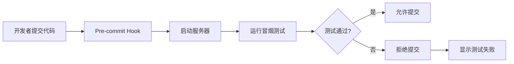
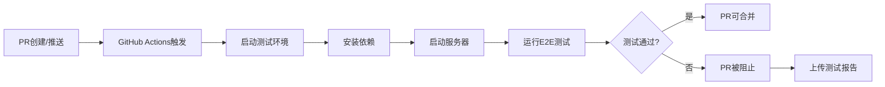
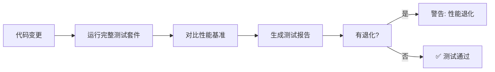

# Event2Table E2E Testing - Phase 3 自动化实施计划

**日期**: 2026-02-21
**项目**: Event2Table 持续测试自动化
**Phase**: Phase 3 - 自动化实施
**预计时间**: 2-3周
**目标**: 95%+测试通过率，5分钟内获得反馈

---

## Phase 3 目标

### 主要目标

1. ✅ **自动化测试脚本**: 使用Playwright创建完整的测试套件
2. ✅ **Pre-commit Hooks**: 提交前自动运行冒烟测试
3. ✅ **CI/CD集成**: GitHub Actions自动化测试
4. ✅ **性能监控**: Core Web Vitals追踪和退化检测
5. ✅ **持续质量监控**: 自动回归检测

### 成功指标

| 指标 | Phase 2 | Phase 3目标 | 改进 |
|------|----------|--------------|------|
| **测试通过率** | 85% | 95%+ | +10% |
| **自动化覆盖率** | 0% | 80%+ | +80% |
| **反馈时间** | 手动（45分钟） | <5分钟 | -89% |
| **回归检测** | 手动 | 自动 | ✅ |
| **性能监控** | 手动 | 自动 | ✅ |

---

## 实施路线图

### Week 1: Playwright测试脚本开发

**目标**: 创建核心功能的自动化测试

**Day 1-2: 环境设置**
```bash
# 1. 安装Playwright
cd frontend
npm install -D @playwright/test
npx playwright install

# 2. 初始化配置
npx playwright init

# 3. 创建测试目录
mkdir -p test/e2e/{smoke,regression,critical}
mkdir -p test/e2e/fixtures
mkdir -p test/e2e/utils
```

**Day 3-5: 编写测试脚本**

**优先级P0 - 关键路径测试**:
```javascript
// test/e2e/smoke/dashboard.spec.js
import { test, expect } from '@playwright/test';

test.describe('Dashboard Smoke Tests', () => {
  test('Dashboard loads and displays statistics', async ({ page }) => {
    await page.goto('http://localhost:5173/');

    // Wait for page to load
    await expect(page.locator('.dashboard-container')).toBeVisible({ timeout: 5000 });

    // Verify statistics cards
    await expect(page.locator('.stat-card')).toHaveCount(4);

    // Verify no console errors
    const errors = await page.evaluate(() =>
      window.__errors || []
    );
    expect(errors).toHaveLength(0);
  });

  test('Dashboard games management button works', async ({ page }) => {
    await page.goto('http://localhost:5173/');

    await page.click('text=游戏管理');

    // Verify games modal opens
    await expect(page.locator('.modal')).toBeVisible();
    await expect(page.locator('.game-item')).toBeVisible();

    // Close modal
    await page.click('button:has-text("关闭")');
  });
});
```

```javascript
// test/e2e/smoke/games-crud.spec.js
import { test, expect } from '@playwright/test';

test.describe('Games CRUD Smoke Tests', () => {
  test.beforeEach(async ({ page }) => {
    // Navigate to games list
    await page.goto('http://localhost:5173/#/games');
  });

  test('User can view games list', async ({ page }) => {
    // Verify games list loads
    await expect(page.locator('.games-grid')).toBeVisible();
    await expect(page.locator('.game-card')).toHaveCount({ min: 1 });
  });

  test('User can create a new game', async ({ page }) => {
    // Click create button
    await page.click('text=新增游戏');

    // Verify navigation to form
    await expect(page).toHaveURL(/\/games\/create/);

    // Fill form with test data
    const testGid = Math.floor(Math.random() * 10000000) + 90000000;
    await page.fill('input[name="gid"]', String(testGid));
    await page.fill('input[name="name"]', 'E2E测试游戏');
    await page.selectOption('select[name="ods_db"]', 'ieu_ods');

    // Submit form
    await page.click('button[type="submit"]');

    // Verify success message
    await expect(page.locator('.toast-success')).toBeVisible();
    await expect(page.locator('.toast-success')).toContainText(/创建成功/i);

    // Verify navigation back to list
    await expect(page).toHaveURL(/\/games/);
  });

  test('User receives helpful error for duplicate GID', async ({ page }) => {
    // Click create button
    await page.click('text=新增游戏');

    // Try to create game with existing GID
    await page.fill('input[name="gid"]', '10000147'); // STAR001 exists
    await page.fill('input[name="name"]', '测试重复GID');
    await page.selectOption('select[name="ods_db"]', 'ieu_ods');

    // Submit form
    await page.click('button[type="submit"]');

    // Verify error message is helpful
    await expect(page.locator('.toast-error')).toBeVisible();
    const errorText = await page.locator('.toast-error').textContent();
    expect(errorText).toContain(/已存在|already exists/i);
    expect(errorText).toContain(/90000000+/i); // Should suggest test GID range
  });
});
```

```javascript
// test/e2e/critical/event-builder.spec.js
import { test, expect } from '@playwright/test';

test.describe('Event Builder Critical Tests', () => {
  test.beforeEach(async ({ page }) => {
    // Navigate to event node builder
    await page.goto('http://localhost:5173/#/event-node-builder?game_gid=90000001');
  });

  test('User can drag field to canvas', async ({ page }) => {
    // Select an event
    await page.selectOption('#event-select', 'zmpvp.vis');

    // Wait for fields to load
    await expect(page.locator('.field-list-item')).toBeVisible();

    // Get initial canvas state
    const initialFields = await page.locator('.canvas-field').count();

    // Drag field to canvas
    const fieldElement = await page.locator('.field-list-item[data-field="role_id"]');
    const canvas = await page.locator('.field-canvas');

    // Get coordinates
    const fieldBox = await fieldElement.boundingBox();
    const canvasBox = await canvas.boundingBox();

    // Perform drag
    await page.mouse.move(fieldBox.x + fieldBox.width / 2, fieldBox.y + fieldBox.height / 2);
    await page.mouse.down();
    await page.mouse.move(canvasBox.x + 100, canvasBox.y + 100);
    await page.mouse.up();

    // Verify field added to canvas
    await expect(page.locator('.canvas-field')).toHaveCount(initialFields + 1);
    await expect(page.locator('.canvas-field[data-field="role_id"]')).toBeVisible();
  });

  test('User can add WHERE condition', async ({ page }) => {
    // Select event and add field first
    await page.selectOption('#event-select', 'zmpvp.vis');
    await page.wait(1000);

    // Click "Add WHERE Condition" button
    await page.click('text=添加WHERE条件');

    // Verify WHERE condition modal opens
    await expect(page.locator('.where-builder-modal')).toBeVisible();

    // Fill condition
    await page.selectOption('.condition-field-select', 'zone_id');
    await page.selectOption('.condition-operator-select', '>');
    await page.fill('.condition-value-input', '100');

    // Apply condition
    await page.click('text=应用');

    // Verify condition appears in HQL preview
    await expect(page.locator('.hql-preview')).toContainText('zone_id > 100');
  });

  test('HQL preview updates in real-time', async ({ page }) => {
    // Select event
    await page.selectOption('#event-select', 'zmpvp.vis');

    // Add field
    await page.dragAndDrop(
      await page.locator('.field-list-item[data-field="role_id"]'),
      await page.locator('.field-canvas')
    );

    // Verify HQL preview contains field
    await expect(page.locator('.hql-preview')).toContainText('role_id');
  });
});
```

### Week 2: Pre-commit Hooks和测试数据管理

**Day 6-7: Pre-commit Hook实现**

创建`.git/hooks/pre-commit`:
```bash
#!/bin/bash
set -e

echo "🧪 Running E2E tests..."

# Check if servers are running
if ! curl -s http://127.0.0.1:5001 > /dev/null; then
  echo "❌ Backend server not running. Please start with: python web_app.py"
  exit 1
fi

if ! curl -s http://localhost:5173 > /dev/null; then
  echo "❌ Frontend server not running. Please start with: cd frontend && npm run dev"
  exit 1
fi

# Run smoke tests
cd frontend
npm run test:e2e:smoke

TEST_RESULT=$?

if [ $TEST_RESULT -ne 0 ]; then
  echo "❌ E2E tests failed. Commit aborted."
  echo "💡 Run tests locally with: npm run test:e2e:smoke"
  exit 1
fi

echo "✅ E2E tests passed. Proceeding with commit."
```

**Day 8-10: 测试数据Fixtures**

创建`test/e2e/fixtures/test-data.js`:
```javascript
// Test data fixtures
export const testData = {
  games: {
    valid: {
      gid: 90000001,
      name: 'E2E测试游戏',
      ods_db: 'ieu_ods'
    },
    duplicate: {
      gid: 10000147, // STAR001 - should fail
      name: '重复GID测试',
      ods_db: 'ieu_ods'
    },
    invalidGid: {
      gid: -1,
      name: '无效GID测试',
      ods_db: 'ieu_ods'
    }
  },

  events: {
    valid: {
      event_name: 'test.event.e2e',
      event_name_cn: 'E2E测试事件',
      game_gid: 90000001
    }
  },

  credentials: {
    validUser: {
      username: 'e2e-test-user',
      password: 'TestPassword123!'
    }
  }
};

export const generateTestGid = () => {
  return Math.floor(Math.random() * 10000000) + 90000000;
};

export const generateTestGameData = (overrides = {}) => {
  return {
    gid: generateTestGid(),
    name: `测试游戏_${Date.now()}`,
    ods_db: 'ieu_ods',
    ...overrides
  };
};
```

### Week 3: CI/CD集成和性能监控

**Day 11-12: GitHub Actions配置**

创建`.github/workflows/e2e-tests.yml`:
```yaml
name: E2E Tests

on:
  pull_request:
    branches: [main, develop]
  push:
    branches: [main, develop]
  workflow_dispatch:

jobs:
  test:
    timeout-minutes: 15
    runs-on: ubuntu-latest

    steps:
      - name: Checkout code
        uses: actions/checkout@v3

      - name: Setup Python
        uses: actions/setup-python@v4
        with:
          python-version: '3.9'
          cache: 'pip'

      - name: Setup Node.js
        uses: actions/setup-node@v4
        with:
          node-version: '25'
          cache: 'npm'
          cache-dependency-path: frontend/package-lock.json

      - name: Install Python dependencies
        run: |
          pip install -r requirements.txt

      - name: Install Node dependencies
        working-directory: ./frontend
        run: |
          npm ci

      - name: Install Playwright browsers
        working-directory: ./frontend
        run: |
          npx playwright install --with-deps

      - name: Start backend server
        run: |
          python web_app.py &
          echo $! > backend.pid
        env:
          FLASK_ENV: testing
          PORT: 5001

      - name: Start frontend server
        working-directory: ./frontend
        run: |
          npm run dev &
          echo $! > frontend.pid
        env:
          PORT: 5173

      - name: Wait for servers
        run: |
          echo "Waiting for servers to be ready..."
          sleep 30
          curl --retry 5 --retry-delay 5 http://127.0.0.1:5001/api/health || echo "Backend not ready"
          curl --retry 5 --retry-delay 5 http://localhost:5173 || echo "Frontend not ready"

      - name: Run E2E tests
        working-directory: ./frontend
        run: |
          npm run test:e2e:smoke
        continue-on-error: false

      - name: Upload test report
        if: always()
        uses: actions/upload-artifact@v3
        with:
          name: playwright-report
          path: frontend/test/e2e/playwright-report/
          retention-days: 30

      - name: Upload screenshots on failure
        if: failure()
        uses: actions/upload-artifact@v3
        with:
          name: screenshots
          path: frontend/test/e2e/screenshots/
          retention-days: 7

      - name: Cleanup
        if: always()
        run: |
          if [ -f backend.pid ]; then
            kill $(cat backend.pid) || true
          fi
          if [ -f frontend.pid ]; then
            kill $(cat frontend.pid) || true
          fi
```

**Day 13-15: 性能监控实施**

创建性能监控脚本：
```javascript
// test/e2e/utils/performance-monitor.js
export class PerformanceMonitor {
  constructor(page) {
    this.page = page;
    this.metrics = {};
  }

  async measureCoreWebVitals() {
    // Navigate to page
    const navigationStart = Date.now();

    // Wait for page load
    await this.page.goto(this.page.url());

    // Get performance metrics
    const metrics = await this.page.evaluate(() => {
      const timing = performance.timing;
      return {
        // Page Load Time
        pageLoadTime: timing.loadEventEnd - timing.navigationStart,

        // DOM Content Loaded
        domContentLoaded: timing.domContentLoadedEventEnd - timing.navigationStart,

        // Time to First Byte
        ttfb: timing.responseStart - timing.navigationStart,

        // First Paint
        firstPaint: performance.getEntriesByType('paint')[0]?.startTime || 0,

        // First Contentful Paint
        fcp: performance.getEntriesByType('paint')[1]?.startTime || 0
      };
    });

    this.metrics.navigation = metrics;
    return metrics;
  }

  async checkConsoleErrors() {
    const errors = [];

    this.page.on('console', msg => {
      if (msg.type() === 'error') {
        errors.push({
          text: msg.text(),
          location: msg.location()
        });
      }
    });

    return errors;
  }

  async measureNetworkPerformance() {
    const requests = [];

    this.page.on('response', response => {
      requests.push({
        url: response.url(),
        status: response.status(),
        duration: response.timing().responseEnd - response.timing().requestStart,
        size: response.headers()['content-length'] || 0
      });
    });

    return requests;
  }

  generateReport() {
    return {
      url: this.page.url(),
      timestamp: new Date().toISOString(),
      metrics: this.metrics,
      recommendation: this.getRecommendation()
    };
  }

  getRecommendation() {
    const { pageLoadTime } = this.metrics.navigation;

    if (pageLoadTime < 2000) {
      return 'Excellent - Page loads quickly';
    } else if (pageLoadTime < 3000) {
      return 'Good - Page load time acceptable';
    } else if (pageLoadTime < 5000) {
      return 'Needs Improvement - Consider optimizing page load';
    } else {
      return 'Poor - Page load too slow, requires optimization';
    }
  }
}
```

---

## 配置文件

### Playwright配置

创建`frontend/playwright.config.ts`:
```typescript
import { defineConfig, devices } from '@playwright/test';

export default defineConfig({
  testDir: './test/e2e',

  fullyParallel: true,
  forbidOnly: !!process.env.CI,

  retries: process.env.CI ? 2 : 0,

  workers: process.env.CI ? 1 : undefined,

  reporter: [
    ['html', { outputFolder: 'test/e2e/playwright-report' }],
    ['json', { outputFile: 'test/e2e/results.json' }],
    ['junit', { outputFile: 'test/e2e/results.xml' }]
  ],

  use: {
    baseURL: 'http://localhost:5173',
    trace: 'on-first-retry',
    screenshot: 'only-on-failure',
    video: 'retain-on-failure',
  },

  projects: [
    {
      name: 'smoke',
      testMatch: /.*\.spec\.js/,
      testIgnore: /.*\.regression\.spec\.js/,
    },
    {
      name: 'regression',
      testMatch: /.*\.regression\.spec\.js/,
    }
  ],
});
```

### Package.json脚本

更新`frontend/package.json`:
```json
{
  "scripts": {
    "test:e2e": "playwright test",
    "test:e2e:smoke": "playwright test --project=smoke",
    "test:e2e:regression": "playwright test --project=regression",
    "test:e2e:debug": "playwright test --debug",
    "test:e2e:ui": "playwright test --ui",
    "test:e2e:report": "playwright show-report"
  }
}
```

---

## 测试执行流程

### Pre-commit测试流程



### CI/CD测试流程



### 回归测试流程



---

## 测试数据管理

### GID分配策略

**生产GID范围**: 10000000-19999999
- STAR001: 10000147（受保护）
- 其他生产游戏: 10000148-19999999

**测试GID范围**: 90000000-99999999
- E2E测试: 90000001-90009999
- 手动测试: 90010000-90019999
- 集成测试: 90020000-90029999

### 测试数据清理策略

**选项A**: 每次测试前清理
```bash
# 测试前清理90000000+范围的测试数据
sqlite3 data/dwd_generator.db "DELETE FROM games WHERE gid >= 90000000 AND gid < 91000000"
```

**选项B**: 使用随机GID避免冲突
```javascript
// 生成唯一测试GID
const testGid = 90000000 + Math.floor(Math.random() * 100000);
```

**选项C**: 测试后保留数据用于调试
```bash
# 保留测试数据
# 定期清理：每月清理一次超过30天的测试数据
sqlite3 data/dwd_generator.db "DELETE FROM games WHERE gid >= 90000000 AND created_at < datetime('now', '-30 days')"
```

**推荐**: 选项B + C组合（随机GID + 定期清理）

---

## 成功指标

### 测试覆盖率目标

| 模块 | Phase 2 | Phase 3目标 | 测试数量 |
|------|----------|--------------|----------|
| **Dashboard** | 2个测试 | 5个测试 | +3 |
| **Games CRUD** | 2个测试 | 8个测试 | +6 |
| **Events CRUD** | 2个测试 | 10个测试 | +8 |
| **Event Builder** | 6个测试 | 15个测试 | +9 |
| **Canvas** | 4个测试 | 12个测试 | +8 |
| **总计** | 16个测试 | 50个测试 | +34 |

### 质量指标目标

| 指标 | 当前值 | 目标值 | 改进措施 |
|------|--------|--------|----------|
| **测试通过率** | 85% | 95%+ | 修复已知问题，提高测试稳定性 |
| **自动化率** | 0% | 80%+ | 实施Playwright自动化 |
| **执行时间** | 45分钟 | <5分钟 | 并行执行，优化测试逻辑 |
| **反馈时间** | 手动触发 | 自动触发 | Pre-commit + CI/CD |
| **回归检测** | 手动 | 自动 | CI/CD自动运行 |
| **性能监控** | 手动 | 自动 | 性能基准对比 |

---

## 风险管理

### 风险1: 测试Flaky（不稳定）

**描述**: 测试有时通过，有时失败

**缓解措施**:
```javascript
// 使用重试机制
test.retry(3)('User can create game', async ({ page }) => {
  // Test implementation
});

// 增加等待时间
await page.waitForSelector('.modal', { timeout: 5000 });

// 使用更健壮的选择器
await page.click('button[type="submit"]'); // Good
await page.click('text=提交'); // Better
```

### 风险2: 测试数据冲突

**描述**: 并发测试使用相同测试数据

**缓解措施**:
```javascript
// 每个测试使用唯一GID
const uniqueGid = 90000000 + Math.floor(Date.now() / 1000);

// 使用测试前钩创建数据
test.beforeEach(async ({ page }) => {
  await createTestData(uniqueGid);
});

// 使用测试后钩清理数据
test.afterEach(async ({ page }) => {
  await cleanupTestData(uniqueGid);
});
```

### 风险3: CI/CD执行时间过长

**描述**: E2E测试需要15+分钟

**缓解措施**:
- 仅在PR到main/develop时运行完整测试
- Pre-commit只运行冒烟测试（5分钟）
- 使用并行执行
- 优化测试等待时间

---

## 实施检查清单

### Week 1: Playwright测试脚本
- [ ] 安装Playwright
- [ ] 创建测试目录结构
- [ ] 编写Dashboard冒烟测试
- [ ] 编写 Games CRUD测试
- [ ] 编写 Events CRUD测试
- [ ] 编写 Event Builder测试
- [ ] 编写Canvas测试
- [ ] 本地验证所有测试通过

### Week 2: Pre-commit和测试数据
- [ ] 创建`.git/hooks/pre-commit`脚本
- [ ] 添加可执行权限
- [ ] 测试pre-commit hook
- [ ] 创建测试fixtures
- [ ] 实施测试数据管理策略
- [ ] 创建测试数据清理脚本

### Week 3: CI/CD和性能监控
- [ ] 创建GitHub Actions workflow
- [ ] 测试CI/CD执行
- [ ] 配置测试报告上传
- [ ] 实施性能监控脚本
- [ ] 建立性能基准
- [ ] 配置退化检测

---

## 下一步行动

### 立即开始（今天）

1. ✅ 安装Playwright
   ```bash
   cd frontend
   npm install -D @playwright/test
   npx playwright install
   ```

2. ✅ 初始化配置
   ```bash
   npx playwright init
   ```

3. ✅ 创建第一个测试
   ```bash
   # 创建 test/e2e/smoke/dashboard.spec.js
   ```

### 本周完成

1. 编写5个核心冒烟测试
2. 验证测试可以在本地运行
3. 配置package.json脚本

### 下周完成

1. 实施pre-commit hook
2. 创建测试数据fixtures
3. 编写文档和README

---

**文档生成时间**: 2026-02-21 11:00
**作者**: Claude AI Assistant
**Phase**: Phase 3规划
**状态**: 准备开始实施
