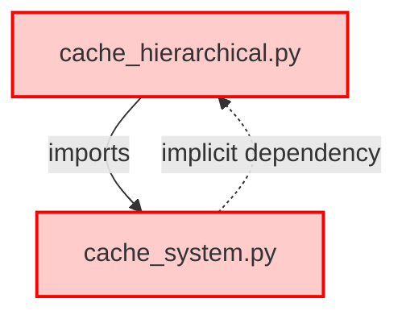
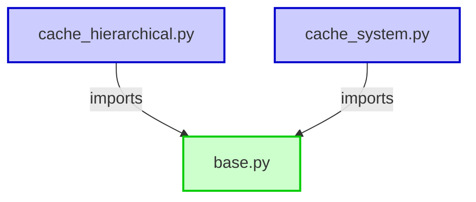
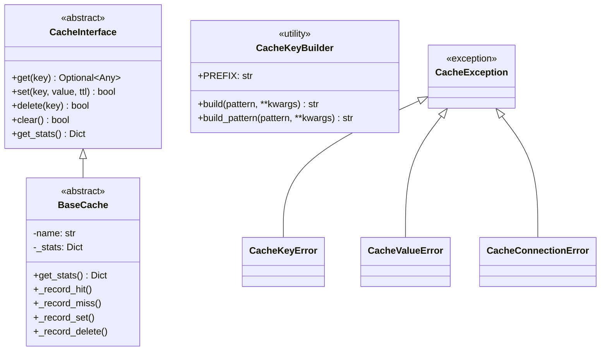
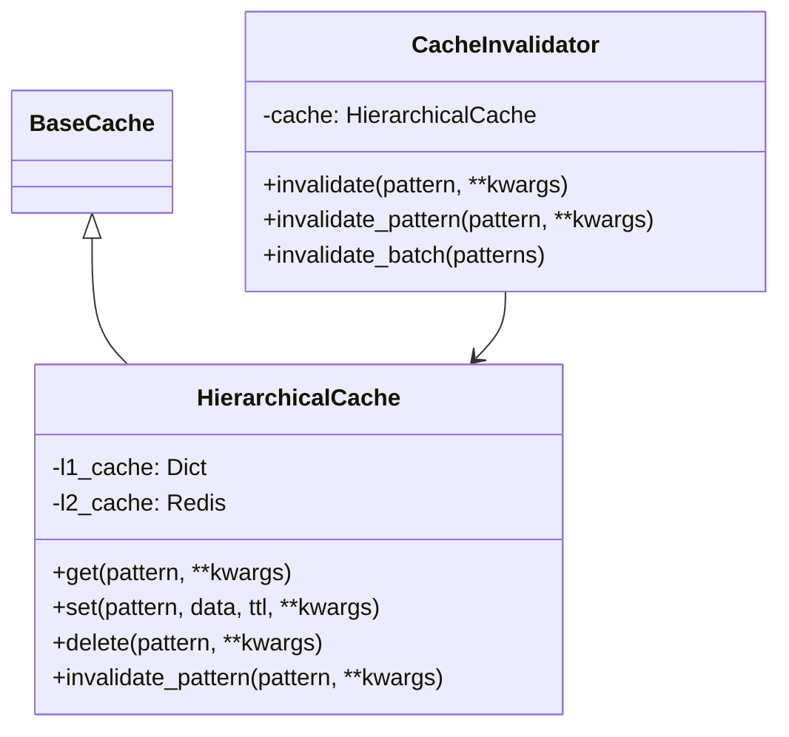
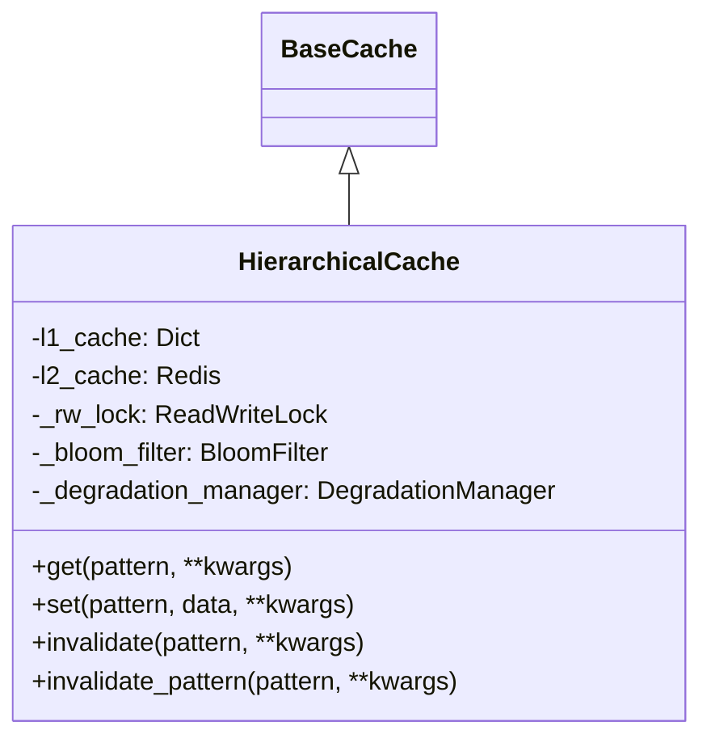
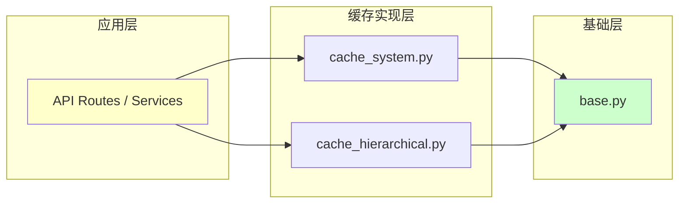
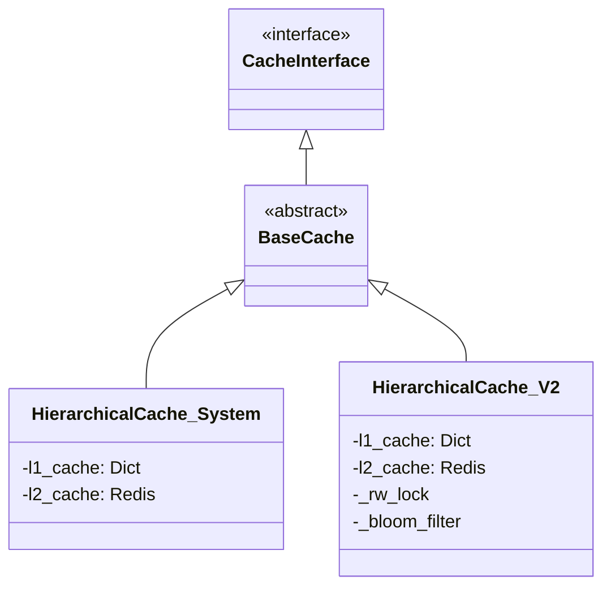

# 缓存系统架构图

## 修复前（循环依赖）



**问题**: 两个模块相互依赖，导致初始化顺序敏感

## 修复后（清晰分层）



**优势**:
- 清晰的依赖方向（高层→低层）
- 无循环依赖
- 符合依赖倒置原则

## 模块职责

### Level 0: base.py (基础层)



### Level 1: cache_system.py (实现层)



### Level 2: cache_hierarchical.py (高级实现层)



## 依赖关系图



## 导入示例

### 推荐方式（从base导入）

```python
# ✅ 推荐：从base.py导入工具类
from backend.core.cache.base import CacheKeyBuilder, get_cache

# ✅ 推荐：从具体模块导入实现
from backend.core.cache.cache_system import HierarchicalCache
from backend.core.cache.cache_hierarchical import cached_hierarchical

# ✅ 推荐：从包导入（使用__init__.py）
from backend.core.cache import (
    CacheKeyBuilder,
    HierarchicalCache,
    cached_hierarchical,
    get_cache,
)
```

### 不推荐方式（跨模块导入）

```python
# ❌ 不推荐：从cache_system导入（可能造成混淆）
from backend.core.cache.cache_system import CacheKeyBuilder

# ❌ 禁止：cache_system和cache_hierarchical互相导入
# from backend.core.cache.cache_hierarchical import XXX  # 在cache_system.py中
```

## 类继承关系



## 模块大小对比

| 模块 | 行数 | 类数量 | 函数数量 | 职责 |
|------|------|--------|----------|------|
| base.py | ~150 | 5 | 2 | 基础类和工具 |
| cache_system.py | ~850 | 2 | 8 | 标准实现 |
| cache_hierarchical.py | ~585 | 2 | 6 | 高级实现 |

## 扩展指南

### 添加新的缓存实现

```python
# 1. 创建新文件 backend/core/cache/my_cache.py
from backend.core.cache.base import BaseCache

class MyCustomCache(BaseCache):
    def __init__(self, name: str):
        super().__init__(name)
        # 自定义初始化

    def get(self, key: str):
        self._record_hit()
        # 实现获取逻辑

    def set(self, key: str, value: Any, ttl: Optional[int] = None):
        self._record_set()
        # 实现设置逻辑

    # ... 实现其他抽象方法

# 2. 更新 __init__.py
from .my_cache import MyCustomCache

__all__ = [..., 'MyCustomCache']
```

### 添加新的工具函数

```python
# 在 base.py 中添加
def validate_cache_key(key: str) -> bool:
    """验证缓存键是否合法"""
    if not key:
        return False
    if len(key) > 250:
        return False
    return True

# 导出
__all__ = [..., 'validate_cache_key']
```

---

**文档版本**: 1.0.0
**最后更新**: 2026-02-24
**维护者**: Event2Table Development Team
